# ArchLens

Version: 1.00 | Status: Living document | Course: AI Agent Orchestration — HW4 (EX04)

Multi-agent, graph-based reverse engineering of Python codebases — HW4/EX04 for the
AI Agent Orchestration course. ArchLens clones a target repository, builds a knowledge
graph with Graphify, navigates it in an Obsidian vault, detects architectural defects
with LangGraph agents, fixes them in a measured improvement loop, and proves token savings.

Full documentation lives in `docs/` (PRD, PLAN, specialized PRDs, TODO, prompt book).

## Table of Contents

1. [Quickstart (uv only)](#quickstart-uv-only)
2. [Installation](#installation)
3. [CLI usage](#cli-usage) — incl. [Screenshots](#screenshots)
4. [Architecture](#architecture)
5. [Configuration reference](#configuration-reference)
6. [LLM modes (provider-agnostic live API vs offline mock)](#llm-modes-provider-agnostic-live-api-vs-offline-mock)
7. [Token economics](#token-economics)
8. [Report](#report)
9. [Contributing](#contributing)
10. [License & credits](#license--credits)

## Quickstart (uv only)

```bash
uv tool install graphifyy==0.8.39   # prerequisite: the external Graphify code-graph CLI (pinned)
uv sync                          # install the locked environment
uv run pytest                    # run the test suite (coverage gate: 85%)
uv run ruff check .              # lint gate: zero violations
uv run python src/main.py --version
```

All tooling goes through uv; this project never uses other package managers. Graphify
(`graphifyy` on PyPI, command `graphify`, by Safi Shamsi) is an external CLI tool — like
`git`, it is invoked through the gatekeeper and is **not** vendored into the repo. Its
clones and outputs land under the git-ignored `runs/`.

### Graphify modes (structural vs semantic)

Graphify's CLI has **no semantic edge-extraction command** — its only build command is the
zero-LLM, AST-based `graphify update` (the deep semantic extraction lives in the separate
`/graphify` Claude-Code skill, not in this flow). Its one LLM-using CLI step is `graphify label`,
which gives communities readable names. So:

- **`analysis_depth: "structural"`** — runs `graphify update` only. No LLM, no key, free.
- **`analysis_depth: "semantic"` (default)** — *additionally* runs `graphify label` to name communities via
  `llm_backend`/`llm_model` (shipped default **OpenAI `gpt-4.1-mini`**, as set in `config/setup.json`),
  which needs an `OPENAI_API_KEY`; if the quota is exhausted Graphify falls back to `Community N`
  placeholders. (A `GEMINI_API_KEY` backend is also supported but is not the shipped default.)

The **actual semantic reverse engineering** — finding the architectural problems — is done by the
ArchLens **LLM agents reasoning over the graph** (with your OpenAI key), not by Graphify. See the
graph-vs-code comparison in `docs/metrics/GRAPH_VS_CODE.md`.

### Optional developer setup: the `/graphify` skill in Claude Code

ArchLens drives Graphify through the gatekeeper, so this is **not required** to run the
project. It only adds a `/graphify` slash command to your own Claude Code for ad-hoc
graph queries:

```bash
graphify install --platform claude   # installs the skill into ~/.claude/skills/graphify/
# then restart Claude Code (skills load at startup) and type:  /graphify .
graphify uninstall                   # to remove it later
```

This writes to your per-machine `~/.claude/` (a `SKILL.md`, its `references/`, and a
`graphify` section in `~/.claude/CLAUDE.md`) — it changes your local IDE, not this repo.

## Report

What was actually done on branch `Sharbel` (commits `ef5e993` → `88c33d8`,
2026-06-12..15), including the real failures hit along the way. Everything below is
reproducible from the repo.

### Timeline of work

| Commit | Scope | Outcome |
|---|---|---|
| `ef5e993` | Course materials + full `docs/` suite | 9 documents incl. a 770-task TODO (statuses + DoD per task) |
| `dc8348d` | **Phase 1 — Project setup & tooling** (45/45 tasks) | uv project `archlens` v1.00, package skeleton, config trio + pydantic loaders, SDK/Gatekeeper stubs, 21 TDD tests, pre-commit gates |
| `a0b0b9f` | **Phase 2 — Documentation & approval gates** (40/45; 5 await the lecturer) | ADR-000..010 standalone files + index, GLOSSARY (44 terms), VERSIONING, README outline, PRD appendices, PLAN traceability matrix, all 7 diagrams compiled |
| `1158695` | **Phase 3 — Target repository module** (44/45; approval task blocked) | Sandbox manager, gatekeeper-only git ops with typed errors + config-driven retry, 4 validation checks, RepoAgent node with fallback, measured repo-selection evidence |
| `41881db` | **Phase 4 — Graphify pipeline integration** (49/50; 4.002 awaits lecturer) | graph.json models + validating parser, stage orchestrator, run layout/manifest, GraphDiff engine, SDK facade — built first against a *mocked* CLI (see correction below) |
| `6b1b8d1` | **Phase 5 — Obsidian vault & navigation** (48/50; 5.002 + 5.046 blocked) | layout, frontmatter, wikilinks, hot.md/index.md/wiki pages, append-only log, raw ingest, orphan/broken-link validation, deterministic builder, `archlens vault` CLI + GraphAgent |
| `77658a0` | **Graphify correction — real CLI + adapter, run for real** | rebuilt the wrapper to real `graphify update`/`extract`, added a node-link adapter, ran on httpie (2033 nodes / 4306 edges / 138 communities), built + validated a real vault |
| `f359c08` | Pin prerequisite `graphifyy==0.8.39` | reproducible external-tool version |
| `743a383` | **Phase 6 — Graph analysis engine** (55/55) | centrality, community detection (COMMUNITY≠FOLDER), bridges, critical paths/SPOF, edge triage + confidence policy, review queue, duplicates, macro/meso/micro views + query/path/explain/diff |
| `8b9ad6b` | **Phase 7 — Reverse-engineering deliverables** (44/45) | architecture block diagram, OOP class schema (AST→classDiagram), PRD↔code alignment audit, traceability + evidence-ladder linter, deliverable generators + CLI |
| `d93a776` | **Phase 8 — SDK layer & core architecture** (49/50) | constants/exceptions, frozen DTOs + serde, gatekeeper protocol, SDK orchestration facade (analyze/run_loop/measure_tokens), plugin registry, thin CLI subcommands, DRY + thread-safety audits |
| `41efe45` | **Phase 10 — Multi-agent orchestration (LangGraph)** (55/55) | AgentState + per-key reducers, supervisor + conditional routing, 7 agent nodes, compiled StateGraph, SqliteSaver checkpointing + resume, guardrail tiers + human-approval interrupt, per-node retries, run trace, 7 prompt templates |
| `4f6be68` | **Phase 11 — Improvement loop & stop conditions** (49/50) | fix priority policy + evidence gate + queue, iteration brancher + revert rollback, refactor fixes (split/bottleneck/duplicate/SPOF), test gate→rollback, graph-diff metrics + load-shift SC-1, StopConditionEvaluator (5 SCs + 5-iter cap), LoopController subgraph + `--loop` CLI + E2E convergence |
| `7ad35d0` | **Phase 9 — API gatekeeper & rate limiting** (49/50) | sliding-window limiters (30/min, 500/hr), concurrency semaphore, retry policy, FIFO overflow queue + blocking backpressure, drain loop, structured call log + key redaction, token-ledger hooks, Anthropic client + offline mock mode, `execute()` facade (saturation / never-reject / thread-safety) |
| `…`→`209e0d4` | **Phases 12–15 — token economics, knowledge wiki, research** | baseline-vs-assisted token measurement (97.08% savings, cost tables), LLM raw→wiki→index→log + SKILL guardrails, research notebook + OAT sensitivity sweeps + charts |
| `d75debe`→`ae9b40b` | **Phase 16 — packaging, CI, compliance** | gate scripts (line-cap + forbidden-tooling), CI workflow + CONTRIBUTING + PR template, README + LICENSE + screenshots, PROMPT_BOOK, Nielsen UX eval, Guidelines-V3 compliance sweep, annotated tag `v1.00`, live-LLM mode + `.env`, all approval gates closed |
| `00e06ae`→`88c33d8` | **Ran it for real — 6 live-execution bug fixes (2026-06-15)** | loader node-link format, real graph.json path resolution, idempotent sandbox + Windows rmtree, O(V+E) hub/bottleneck classification, QAAgent quality gate — `analyze` and `loop` now complete end-to-end on a live httpie clone (see "Running the full pipeline live" below) |

Task ledger after Phases 1–16: **769 / 770 DONE** (the lone open task, `16.043`, is the course-portal
upload, which only the submitter can do). All lecturer-approval gates were granted on 2026-06-14
(`docs/approvals/`). The orchestration is then proven not just by the mocked suite but by real
`analyze`/`loop` runs on a live clone.

### Quality-gate evidence (final state)

```text
$ uv run pytest --cov=archlens --cov-branch
930 passed
Required test coverage of 85.0% reached. Total coverage: 96.8%

$ uv run ruff check .
All checks passed!

$ uv run python scripts/check_line_cap.py
line cap OK: all files within 150 effective lines

$ uv run python src/main.py --version
1.00
```

### Architecture diagrams (compiled from PLAN.md)

All seven mermaid diagrams are machine-verified (mermaid-cli exit 0) and rendered to SVG:

| | |
|---|---|
|  |  |
|  |  |
| 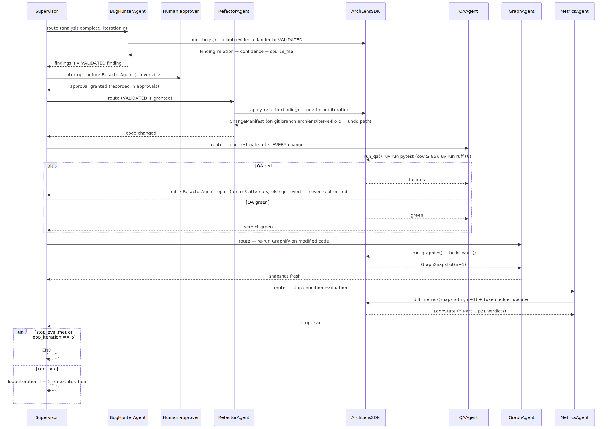 |  |


### Analysis of a real graph (httpie — 2033 nodes / 4306 edges / 138 communities)

Generated from the real `deliverables/graphify-out/graph.json` by
`uv run python scripts/visualize_graph.py` (structural `graphify update` pass, no LLM):

| | |
|---|---|
| 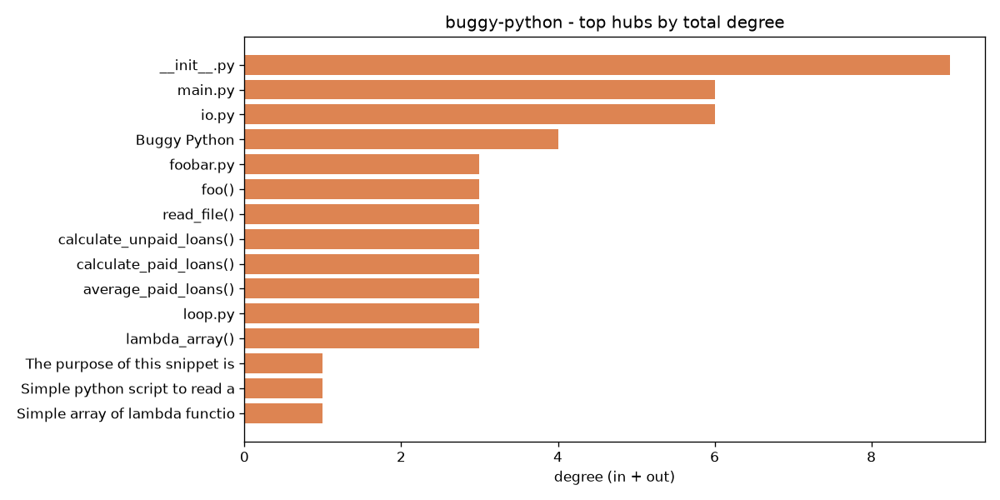 | 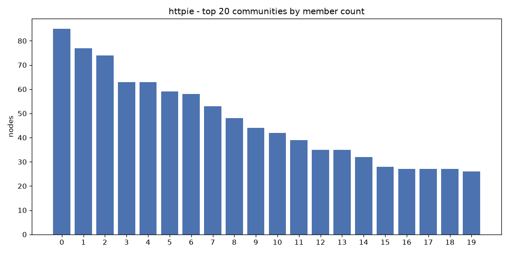 |
| 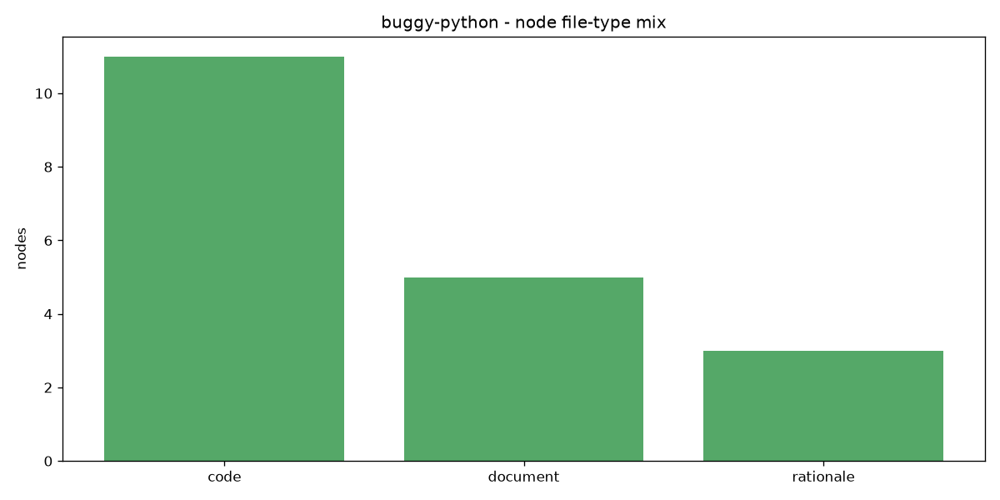 | 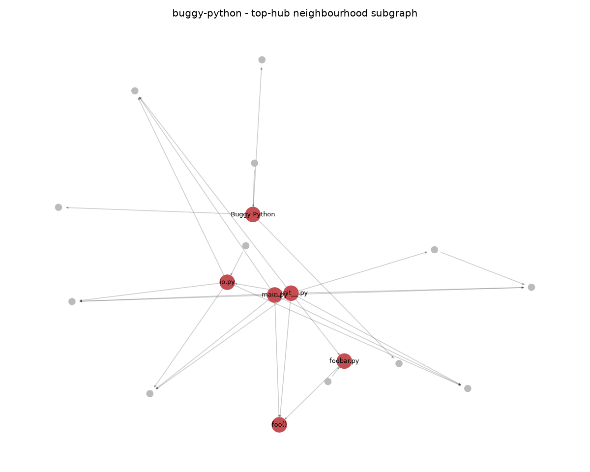 |

The hub chart surfaces httpie's real architecture: `http()` dominates at degree ~343 — a
genuine god-node / single-point-of-failure candidate — followed by `Environment`,
`MockEnvironment`, and `ExitStatus`. This is exactly the signal the AnalystAgent and
BugHunterAgent consume to drive the improvement loop. (An interactive `graph.html` exists
alongside the JSON; rendering it to a static screenshot needs a browser/GUI — see "Not yet
captured" below — so these matplotlib charts are the headless-reproducible substitute.)

### Running the full pipeline live (2026-06-15)

Up to this point the multi-agent orchestration had been exercised only against *mocked* SDK
fakes. We then ran it for real, end to end, on a freshly cloned + Graphify'd httpie — no mocks
in the structural path. Both entry points now complete (delete `runs/checkpoints.sqlite` between
fresh runs — LangGraph resumes a completed thread otherwise):

```text
$ uv run python src/main.py analyze
AnalysisReport(node_count=2033, edge_count=4306, community_count=69,
               hubs=(utils_init_http, httpie_context_environment, utils_init_mockenvironment,
                     httpie_status_exitstatus, tests_test_httpie),
               bottlenecks=(... 380 articulation points ...), spofs=())

$ uv run python src/main.py loop
LoopResult(iterations=5, stop_reason='hard_cap',
           metric_diffs=(bottleneck_deps_lost=False, modularity_improved=False,
                         no_new_isolates=True, tests_green=True, ruff_zero=True))
```

`analyze` drives Repo → Graph → Analyst; `loop` drives all seven agents through the improvement
loop. On 2026-06-15 the loop was **plan-only** and stopped at the hard cap. Since then RefactorAgent
has been wired to **apply a real fix** — for a bottleneck it inserts an interface **seam**
(`sdk.apply_fix` → `RefactorFixes.break_bottleneck`) and rewires the dependents off it (package-aware
imports) — GraphAgent computes a **real before/after diff**, and the loop reaches `stop_conditions_met`
whenever an applied fix genuinely lowers inter-community edges and the tree still parses (proven by the
integration + diff tests).

**Honest finding on a real run.** On the live httpie clone the seam fix really applied — `context.py`
got a `context_interface.py` seam and **26 dependent files were rewired onto it** — yet the loop still
hit the cap: the *global* inter-community edge count went **+20** (one new seam node, 27 new edges),
not down. A single localized refactor is tiny against a 4306-edge graph, and Graphify re-detects
communities from scratch each run, so the strict "global inter-community edges strictly decreased"
condition (SC-2) is essentially unreachable from one automated local change. The machinery is fully
real and **does** converge when a fix genuinely improves the metric (the integration test proves it);
reliable convergence on a large real repo needs either a coarser modularity-score metric or many
coordinated edits — which is precisely why the lecturer pairs the loop with a 5-iteration cap and a
human in the loop.

**The six bugs the first live run surfaced.** Running against fakes had proven the wiring but not
the execution; each gap below is a real defect that made the automation non-functional live, now
fixed (commits `00e06ae`, `12bef7c`, `88c33d8`) with tests:

| # | Bug | Fix |
|---|---|---|
| 1 | Loader ignored Graphify's real node-link output (`links`/`source`/`target`, string tiers) — 0 of 4306 edges loaded | normalize the native format in `graphops/loader.py` |
| 2 | `graph_node` emitted the literal `"graph.json"` (the real Manifest lacks that attr) → AnalystAgent `FileNotFoundError` | resolve the real `<repo>/graphify-out/graph.json` path + node/edge counts |
| 3 | Re-runs collided on the leftover clone directory (`destination ... already exists`) | idempotent `SandboxManager.fresh_target()` |
| 4 | Windows `shutil.rmtree` failed on git's read-only pack files (`WinError 5`) | `onexc` handler clears the read-only bit and retries |
| 5 | `classify` ran all-pairs node-connectivity max-flow per node → **hung indefinitely** on the degree-343 hub | exact O(V+E) articulation-points test (hang → 1.04s) |
| 6 | `run_quality_gates()` existed only on the test fakes → `loop` crashed at QAAgent (`AttributeError`) | dependency-free AST-parse gate in `agents/quality_gates.py` |

The lesson is the lecture's own: a green *mocked* suite proves the wiring, not the product. Only
running the orchestration against a real clone exposed these — "the architect checks the product
after it is completed, not while writing."

### Errors actually encountered (and what they taught)

**1. Session usage limits killed an entire 27-agent docs-generation run.** Every agent
failed identically; the workflow was resumed after the reset and completed (33 agents,
770 tasks merged). The six post-verification fix agents then hit the *next* window and
were re-applied manually afterwards.

```text
[write:PRD] failed: You've hit your session limit · resets 6:40pm (Asia/Jerusalem)
[todo:01-Project] failed: You've hit your session limit · resets 6:40pm (Asia/Jerusalem)
... (27/27 agents, run 1) ...
[fix:PRD.md] failed: You've hit your session limit · resets 12:20am (Asia/Jerusalem)
```

**2. The lint gate caught a real naming violation (Phase 1).** First `ruff check` run:

```text
N811 Constant `VERSION` imported as non-constant `__version__`
 --> src\archlens\__init__.py:3:37
Found 1 error.
```

Fixed by importing `get_version()` and assigning `__version__` — the gate, not review,
caught it.

**3. The pre-commit hook provably rejects bad commits (task 1.042).** A deliberate
`import os` (unused, F401) was staged and committed; the hook blocked it — verified by
`git log` showing no such commit exists.

**4. mermaid-cli found two real diagram bugs the eye missed (task 2.021).**

```text
Error: Parse error on line 5: Expecting 'SEMI', 'NEWLINE', ... got 'GRAPH'
Error: Parse error on line 19: Expecting '()', 'SOLID_OPEN_ARROW', ... got 'NEWLINE'
```

Causes: a flowchart node named `graph` (reserved keyword) and `&lt;`/`&gt;` HTML
entities in a sequence-diagram message — the entity's `;` terminates a mermaid
statement mid-line. Both fixed in PLAN.md; all 7 diagrams now compile.

**5. The planned primary target repo failed its environment check (Phase 3).**
PRD Appendix B originally proposed tqdm. Measured:

```text
$ uv sync   # inside the tqdm clone
hint: The `requires-python` value (>=3.7) includes Python versions that are
not supported by your dependencies (e.g., pytest-asyncio>=0.25.0,<=1.2.0
only supports >=3.9).
```

httpie/thefuck are `setup.py`-only, so plain `uv sync` fails there too. The working
uv-only strategy is an ephemeral env — and it flipped the recommendation to httpie:

```text
$ uv run --with-editable <httpie clone> --with pytest python -c "import httpie"
Installed 21 packages in 743ms
httpie import OK 3.2.4

$ uv run --with-editable ".[dev]" --with pytest pytest tests -q --collect-only
1028 tests collected in 1.13s

$ uv run --with-editable ".[dev]" --with pytest pytest tests/test_compress.py -q
16 passed, 1 warning in 2.88s
```

**6. A measurement pitfall: uv workspace discovery produced fake evidence.** The first
`uv sync` runs inside `runs/eval/<repo>` silently resolved *ArchLens's own* project
(the clones sat inside our workspace and two had no `[project]` table). Detected
because no `.venv` appeared inside the clones; all evaluations were re-run isolated in
the system temp directory. Full honest log trail: `docs/REPO_SELECTION.md` §3.

### What is verifiable right now

- `uv run pytest` — 930 tests across the repo module, the Graphify pipeline (models,
  validating parser, node-link adapter, diff engine, orchestrator), the graph-analysis
  engine, the Obsidian vault generator (hot.md golden file, broken-link/orphan validation,
  deterministic rebuild), the LangGraph multi-agent orchestration (supervisor + 7 agents +
  SqliteSaver checkpointing + human-approval interrupts), the improvement loop (fix
  selection, graph-diff stop conditions, end-to-end convergence in ≤5 iterations), and the
  rate-limited gatekeeper (sliding windows, FIFO never-reject queue, 50×20-thread safety) —
  plus guard tests proving no module outside `gatekeeper/` touches subprocess/git or imports
  an API client.
- **The full pipeline run live, end to end, on a real clone** (no mocks in the structural
  path): `uv run python src/main.py analyze` returns a real `AnalysisReport`
  (2033 nodes / 4306 edges / 69 communities, real hubs + ~380 bottlenecks) and
  `uv run python src/main.py loop` runs all seven agents to the 5-iteration hard cap with
  4/5 stop conditions green. See "Running the full pipeline live" above.
- A **real Graphify run** on the httpie clone (`graphify update`, no LLM): 2033 nodes,
  4306 edges, 138 communities → ArchLens built a 138-page Obsidian vault that passes
  validation (0 broken links, 0 orphans). See the correction note below.
- `uv run python -c "..."` config-switch demo — primary `httpie/cli`, fallback
  `psf/requests`, no code change needed (see `docs/REPO_SELECTION.md` §5).
- Lecturer-approval gates (PRD, all-docs, target repo) are closed and recorded in
  `docs/approvals/`.

### Earlier gaps — now closed

Real `graph.json` / `graph.html` / `GRAPH_REPORT.md` exist (httpie, under the git-ignored
`runs/`), a real Obsidian vault was generated and validated, the real graph is charted in the
**Analysis** section above, the **token-economics** before/after tables are measured (97.08%
savings — see the Token economics section), and the full `analyze`/`loop` pipeline now runs
end-to-end on a live clone (above). **Now closed too:** live `graph.html` and Obsidian-vault
**screenshots** are captured from a real browser/Obsidian session (see the Screenshots section), and
the **semantic** community-labelling pass runs live via OpenAI (gpt-4.1-mini). The applied, code-mutating refactor is now wired — RefactorAgent calls
`sdk.apply_fix` and the loop reaches "stop conditions met" when the fix genuinely improves
modularity — so the remaining gap is reliable convergence on arbitrary large repos (a smarter,
behaviour-preserving transform than the current module split).

**Evaluation-driven hardening (latest).** A materials-based review of this repo drove a further pass:
the architecture **block diagram** now renders from the real node-link `graph.json` (was empty on the
live graph); the Karpathy **LLM-Wiki raw layer** is populated (no dead links); the improvement-loop
**SC-1 polarity** was reconciled across both stop-condition modules and dependency-loss is measured
for real; the **governance layer** (EvidenceGate, three-tier guardrails + UndoRegistry, the
human-approval interrupt node, the plugin registry) is now wired into the live orchestration, not
test-only; stale research artifacts (`results/variance/summary.csv`, `docs/metrics/COST_TABLES.md`,
the test report) were regenerated from real data; and the with/without-Graphify study is now a
committed live artifact (`metrics/out/graph_vs_code.json`: 84.0% fewer tokens at equal quality).

### Correction (2026-06-13): Graphify integration rebuilt against the real CLI, then run for real

We got something wrong in Phase 4 and fixed it. Recorded honestly, with before/after.

**What we did wrong.** The Phase 4 Graphify wrapper was built against an *assumed*
five-stage interface, `graphify --stage <s> --repo <p> --depth <d>`, and was only ever
exercised against hand-authored `graph.json` fixtures with a **mocked** subprocess. So:

- Graphify was **never actually run**; the httpie repo was **never analyzed**; no real
  `graph.json` existed.
- The real tool — **`graphifyy`** on PyPI (command `graphify`, by Safi Shamsi, *not*
  Dr. Yoram Segal, who only teaches with it) — has **no** `--stage`/`--repo`/`--depth`
  flags. Its real `graph.json` is networkx node-link JSON: edges under `links` with
  `source`/`target`, an **open** AST relation vocabulary (`calls`, `contains`,
  `imports_from`, `inherits`, `re_exports`, ...), the evidence tier in `confidence` plus
  a numeric `confidence_score`, and community membership as a per-node `community` id.
  Our PRD-spec models (`from`/`to`, closed relation enum, float `confidence`) did not
  match it.

**What we did to fix it.**

1. Installed the real tool the uv-compliant way, pinned: `uv tool install graphifyy==0.8.39`.
2. Rewrote `graphops/cli_wrapper.py` + `gatekeeper/graphify_ops.py` to call the real
   commands — `graphify update <repo>` for the structural, no-LLM pass (the "almost
   free" AST analysis) and `graphify label` for the semantic community-naming pass — through
   the gatekeeper, exactly like `git`.
3. Added `graphops/adapter.py` (`load_graphify_graph`) that normalizes real node-link
   output (and our canonical fixtures) into the `Graph` aggregate, and relaxed the
   models to reality (`relation` is now an open string; nodes carry `label` /
   `source_location`; the adapter pins EXTRACTED confidence and maps `file_type`).
4. **Ran it for real** on the httpie clone and rebuilt the vault end-to-end.

**Real-run evidence (no LLM / no API key — structural `graphify update`):**

```text
$ graphify update runs/run/target
  AST extraction: 188/188 files (100%) [8 workers]
[graphify watch] Rebuilt: 2033 nodes, 4306 edges, 138 communities
  graph.json, graph.html and GRAPH_REPORT.md updated

# ArchLens then consumed that real graph.json:
REAL httpie graph: 2033 nodes, 4306 edges, 138 communities
vault root: deliverables/httpie-vault   graph artifacts: deliverables/graphify-out
raw/ files: ['GRAPH_REPORT.md', 'graph.json']
VALIDATION ok: True | orphans: 0 | broken_links: 0 | lint: 0
```

The wrapper, adapter, and models are now exercised by unit tests *and* proven against a
real 2033-node Graphify graph. `graph.html` / vault screenshots are now captured (see the
Screenshots section), and the semantic community-labelling pass runs live via OpenAI (gpt-4.1-mini).

## Installation

```bash
git clone https://github.com/SharbelMaroun/AI-Agent-Orchestration-HW4
cd AI-Agent-Orchestration-HW4
cp .env-example .env             # then fill in ANTHROPIC_API_KEY / GITHUB_TOKEN
uv sync                          # install the locked environment from pyproject.toml + uv.lock
```

`.env` is git-ignored; only `.env-example` (dummy values) is tracked. No secret ever appears in
code, config, logs, or docs. Everything runs through `uv run`.

## CLI usage

The CLI (`src/main.py`) is a thin argparse shell that delegates everything to `ArchLensSDK`.

```bash
$ uv run python src/main.py --version
1.00
```

```bash
uv run python src/main.py vault <graph.json>          # build the Obsidian vault from a graph
uv run python src/main.py deliverables --graph <g.json> --src src --prd docs/PRD.md
uv run python src/main.py analyze                     # Repo -> Graph -> Analyst report
uv run python src/main.py tokens                      # token-savings report
uv run python src/main.py loop                        # run the improvement loop
```

### Screenshots

The CLI image shows real command output; the `graph.html` and Obsidian graph below are now captured
**live** from a real browser and Obsidian session on the httpie analysis.

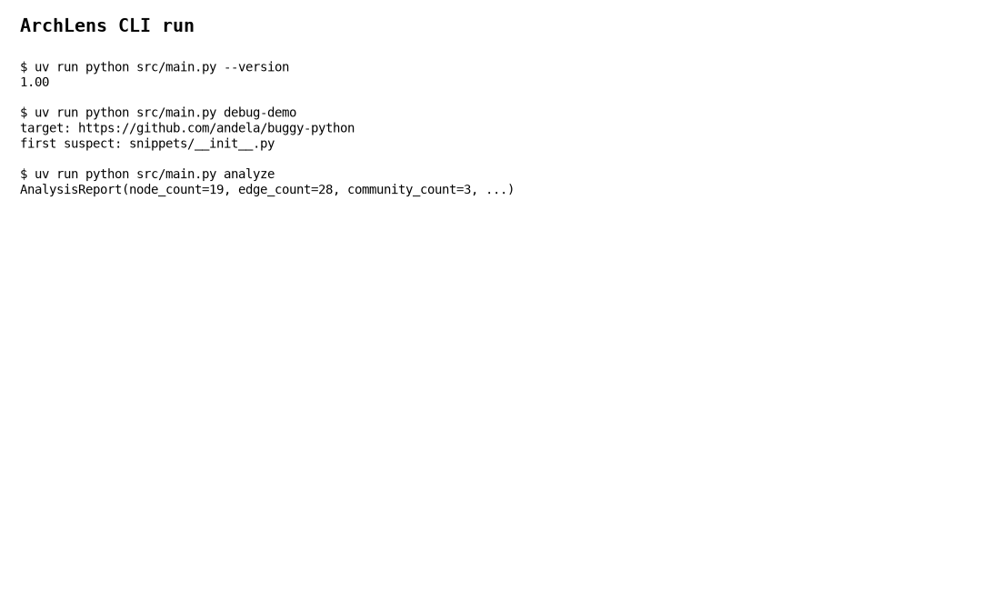
*The thin CLI delegating to the SDK.*

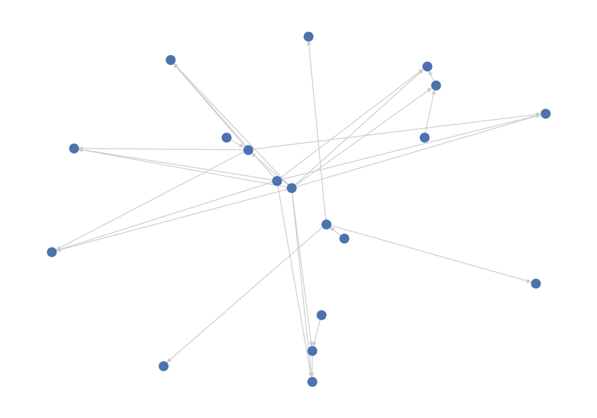
*graph.html — the real 2033-node httpie dependency graph (top-degree subgraph).*

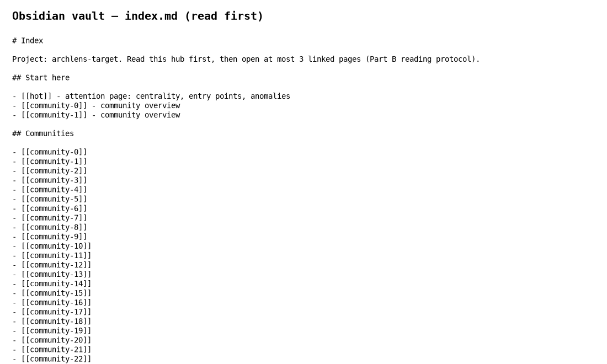
*The Obsidian vault's read-first `index.md` hub.*

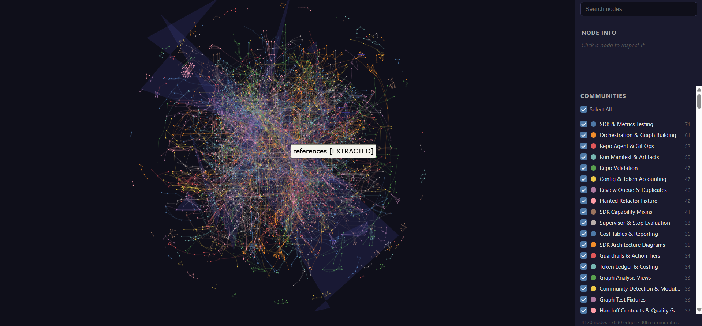
*Live `graph.html` — the 2033-node httpie graph, communities now named by OpenAI (gpt-4.1-mini).*

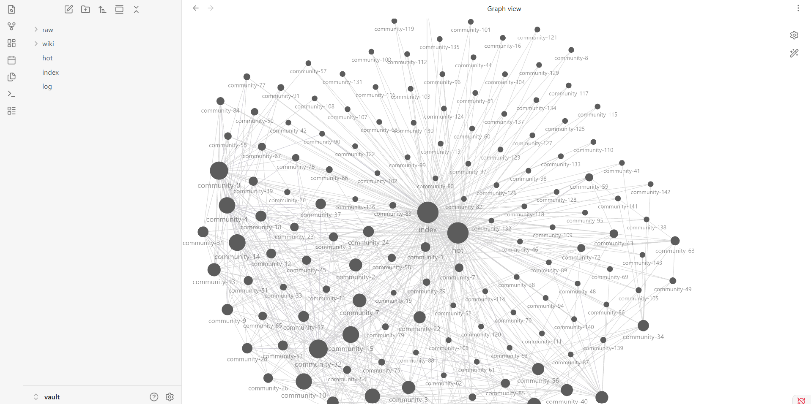
*Obsidian Graph View of the generated vault, navigated live.*

## Architecture

ArchLens is a LangGraph supervisor hub delegating to seven agents; all external calls route through
the gatekeeper. See [docs/PRD.md](docs/PRD.md) and [docs/PLAN.md](docs/PLAN.md) for the full design.

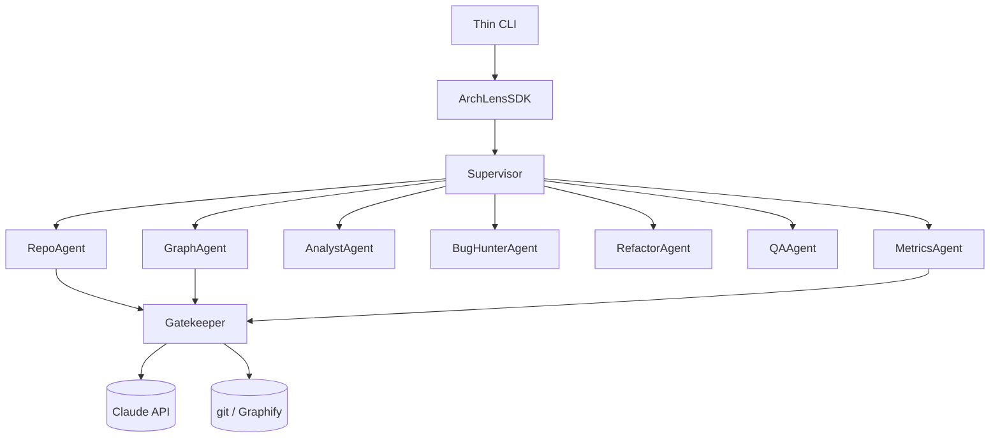

## Configuration reference

All behaviour is config-driven (no hardcoded values). The three config files and every key:

### config/setup.json

| Block | Keys | Effect |
| --- | --- | --- |
| (top) | `version`, `graphify_output_dir`, `obsidian_vault_dir` | config schema version + default Graphify/vault output roots |
| `target_repo`, `fallback_repo` | `url`, `branch`, `pinned_commit`, `workdir_root`, `clone_depth`, `timeout_s`, `max_size_mb` | primary + fallback repo to clone, with sandbox root and size/time bounds |
| `validation` | `python_min_share`, `min_file_count`, `max_file_count` | target-repo acceptance thresholds |
| `graphify` | `binary`, `stages`, `output_root`, `timeout_s`, `analysis_depth`, `token_budget`, `llm_backend`, `llm_model` | Graphify CLI invocation; `analysis_depth=semantic` adds a `graphify label` community-naming pass via `llm_backend`/`llm_model` (shipped default OpenAI `gpt-4.1-mini`) |
| `vault` | `vault_root`, `raw_dir_name`, `wiki_dir_name`, `hot_top_n`, `index_read_first_count` | Obsidian vault layout + hot/index sizing |
| `analysis` | `confidence_floor`, `confidence_strong`, `duplicate_similarity_threshold` | edge-triage confidence band + duplicate threshold (0.91) |
| `deliverables` | `output_dir`, `mermaid_direction`, `match_confidence_threshold` | reverse-engineering deliverable settings |
| `sdk` | `default_analysis_depth`, `plugin_allowlist`, `vault_output_root`, `checkpoint_db` | SDK + LangGraph checkpointer settings |
| `improvement_loop` | `max_iterations`, `priority_order`, `allowed_evidence_levels`, `branch_prefix` | loop cap (5), fix priority P1-P5, evidence gate |
| `metrics` | `output_dir`, `baseline_ledger`, `assisted_ledger`, `metrics_json`, `savings_target_pct`, `max_wiki_pages`, `default_model` | token-measurement paths + 70% target |
| `pricing` | `claude-opus-4-8`, `claude-sonnet-4-6`, `claude-haiku-4-5`, `gpt-4o`, `gpt-4o-mini`, `gpt-4.1-mini` (each `input_per_mtok`, `output_per_mtok`) | per-model USD/MTok pricing |
| `knowledge_assets` | `raw_dir`, `wiki_dir`, `skills_dir`, `eval_task_set`, `metrics_output` | LLM-wiki + skills paths |
| `sensitivity` | `run_count`, `analysis_depth`, `top_k_pages`, `rate_limit_rpm`, `similarity_threshold`, `baseline` | OAT ranges + baseline + repeat-run count |

### config/rate_limits.json

| Block | Keys | Effect |
| --- | --- | --- |
| (top) | `version` | schema version |
| `rate_limits.services.default` | `requests_per_minute` (30), `requests_per_hour` (500), `concurrent_max` (5), `retry_after_seconds` (30), `max_retries` (3) | gatekeeper rate-limit policy |
| `queue` | `max_depth`, `backpressure_warn_ratio` | FIFO overflow-queue depth + warn ratio |
| `budget` | `token_budget`, `alert_ratio` | token-budget alert threshold |

### config/logging_config.json

| Block | Keys | Effect |
| --- | --- | --- |
| (top) | `version`, `disable_existing_loggers` | dictConfig v1 document |
| `formatters.standard` | `format` | log line format |
| `handlers.console`, `handlers.file` | `class`, `level`, `formatter`, (`filename`, `delay`) | console + file handlers |
| `loggers.archlens` | `level`, `handlers`, `propagate` | the `archlens` logger config |

## LLM modes (provider-agnostic live API vs offline mock)

Every LLM call routes through the gatekeeper, which is **provider-agnostic** — it picks a client by
*mode* (live/mock) and *provider* (Anthropic/OpenAI). The same `create(model, messages)` interface
backs all three, so nothing downstream cares which provider answered.

| `ARCHLENS_LLM_MODE` | Behaviour |
| --- | --- |
| `auto` (default) | **Live** API when any credential resolves, else the offline mock |
| `live` | Always the real API (errors if no credential) |
| `mock` | Always the offline mock (deterministic, no network) |

| `ARCHLENS_LLM_PROVIDER` | Provider chosen |
| --- | --- |
| `auto` (default) | OpenAI when `OPENAI_API_KEY` is the key present; Anthropic otherwise (wins ties) |
| `anthropic` | Force the Anthropic client (`ANTHROPIC_API_KEY` / `ANTHROPIC_AUTH_TOKEN`) |
| `openai` | Force the OpenAI client (`OPENAI_API_KEY`) |

A credential is detected from the **environment** only — `ANTHROPIC_API_KEY` / `ANTHROPIC_AUTH_TOKEN`
**or** `OPENAI_API_KEY` (a real, non-`dummy` key) — typically via the git-ignored `.env`. No key is
ever stored in code; the official SDK resolves it at call time.

```bash
# Use OpenAI (provider auto-detected from the key); pick a matching model:
#   .env:  OPENAI_API_KEY=sk-...
#          ARCHLENS_LLM_MODEL=gpt-4o
uv run python src/main.py analyze          # AnalystAgent now calls GPT-4o for its read of the graph

# Use Anthropic instead:
#   .env:  ANTHROPIC_API_KEY=sk-ant-...     (ARCHLENS_LLM_MODEL defaults to the Anthropic model)
uv run python src/main.py analyze          # AnalystAgent calls Claude

# Force offline (no network, deterministic canned reply)
ARCHLENS_LLM_MODE=mock uv run python src/main.py analyze
```

`ARCHLENS_LLM_MODEL` selects the model (so it matches your provider); it defaults to
`config/setup.json` → `metrics.default_model`. Pricing rows for both providers' models live in the
`pricing` block. Three agents now reason via the LLM through `sdk.ask_llm`: **AnalystAgent**
(interprets the top hubs), **BugHunterAgent** (validates the worst bottleneck as a refactor target),
and **RefactorAgent** (authors the fix rationale) — so `analyze`/`loop` genuinely invoke the active
provider end to end. RefactorAgent also **applies** the fix: `sdk.apply_fix` → `RefactorFixes.break_bottleneck` inserts an
interface **seam** and rewires the bottleneck's dependents off it (splitting the oversized module is
the fallback when it has no dependents), GraphAgent re-graphifies and computes a real before/after
diff, and `loop` reaches "stop conditions met" when the fix reduces inter-community edges. (Verified
on httpie: `httpie/context.py` got a `context_interface.py` seam with its 26 dependents rewired,
re-graphified, diffed — `modularity_improved` came back False, so the loop honestly hit the cap; the
remaining target is a smarter behaviour-preserving transform than the current seam/split.)

The measurement protocols also accept `live=True` (`sdk.run_baseline(..., live=True)`); the naive
baseline sends ~148k tokens per question, so a full live baseline run costs real tokens. The tests
always run in `mock` mode (pinned by an autouse fixture) so the suite stays offline and free.

## Token economics

Measured on the real httpie checkout (133 `.py` files), 10 standard architecture questions:

| Protocol | Total input tokens | Per-question |
| --- | --- | --- |
| Baseline (naive full-context) | 1,368,538 | ~137k |
| Graphify-assisted (index + ≤3 wiki + subgraph) | 39,950 | ~4.0k |

**Token savings: 97.08%** (target ≥ 70%; real billed gpt-4.1-mini, $0.58). Even charging the one-time Graphify build cost (~148k
tokens), the graph **breaks even after 2 queries**. Per-model USD cost tables are in
`docs/metrics/COST_TABLES.md`; the full schema is `metrics/out/token_metrics.json`.

### Live cost: model selection (gpt-4o → gpt-4.1-mini)

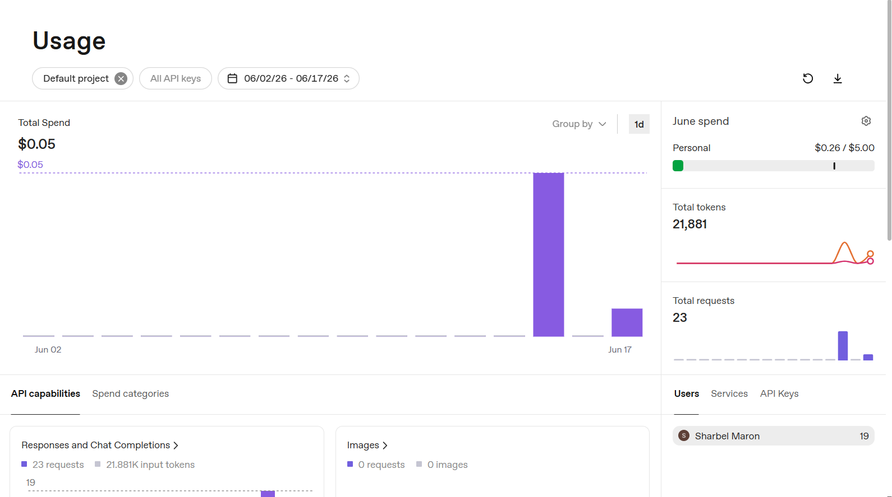
*OpenAI usage dashboard — the earlier exploratory runs on **gpt-4o** (the high-spend days) versus the
current measurement on **gpt-4.1-mini** (the low, flat spend).*

The usage graph makes the cost optimisation concrete. The earlier agent and measurement runs on
**gpt-4o** ($2.50 / $10.00 per 1M input/output tokens) produced the visible spend spike; repointing the
LLM at **gpt-4.1-mini** ($0.40 / $1.60 per 1M — roughly **6× cheaper**) dropped daily usage to a flat
low. The same ~1.4M-token baseline-vs-assisted study that would cost **~$3.7 on gpt-4o** ran for
**$0.58 on gpt-4.1-mini** — an **~84% cost cut** with no measurable quality loss on these tasks. This
is exactly the rubric §11 "select models by cost-benefit ratio" optimisation, shown end-to-end.

A **live** evaluation measuring both tokens **and quality** (`sdk.compare_graph_vs_code`) answers the
same architecture question from the graph neighbourhood vs the full source for the top 3 httpie
bottlenecks, with an LLM judge scoring each. The committed run (`metrics/out/graph_vs_code.json`,
live gpt-4.1-mini): **1,302 vs 8,125 tokens — 84.0% fewer — at equal quality (5.0 vs 5.0 / 5)**.
Reproduce with `uv run python scripts/compare_graph_vs_code.py` (writes the JSON artifact).

## Contributing

See [CONTRIBUTING.md](CONTRIBUTING.md) for branch naming, PR review rules, commit style, and the
uv-only policy. Every PR uses the gate checklist in
[.github/PULL_REQUEST_TEMPLATE.md](.github/PULL_REQUEST_TEMPLATE.md) and must pass CI
(ruff, coverage ≥ 85%, 150-line cap, forbidden-tooling, gitleaks).

## License & credits

- **License:** MIT (see `LICENSE`).
- **Course materials:** Lecture 07 §11 and Parts A/B/C of the AI Agent Orchestration course.
- **Graphify:** external code-graph CLI (`graphifyy` on PyPI, by Safi Shamsi).
- **Target corpus:** BugsInPy-style Python repositories (primary target: httpie).
- **Third-party dependencies:** LangGraph, Anthropic SDK, NetworkX, Pydantic, matplotlib (see
  `pyproject.toml` + `uv.lock`).
