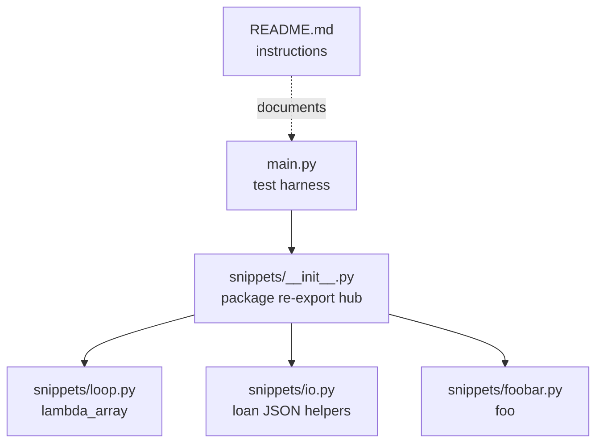

# Architecture Report - andela/buggy-python

Version: 1.00 | Course: AI Agent Orchestration - HW4 / EX04

## Scope

This report describes the submitted target repository:

`https://github.com/andela/buggy-python`

Evidence:

- Graph: `artifacts/buggy-python-graph.json`
- Graph report: `artifacts/buggy-python-GRAPH_REPORT.md`
- Obsidian vault: `obsidian/`
- Bug report: `deliverables/BUG_REPORT.md`

## Graph Summary

| Metric | Value |
|---|---:|
| Nodes | 19 |
| Edges | 28 |
| Graphify communities | 4 |
| ArchLens density communities | 3 |
| Extraction evidence | 100% extracted |

## Block Diagram



## Main Architectural Finding

The project is small, but it has a clear cross-module dependency shape:

```text
entry point -> package hub -> leaf modules
```

The package hub, `snippets/__init__.py`, is the central architectural risk. Every import from
`main.py` passes through it, so missing re-exports can break the whole test harness before any leaf
module code is executed.

## Central Components

| Component | Role | Risk |
|---|---|---|
| `main.py` | Test harness / entry point | Cannot be modified; failures define expected behavior |
| `snippets/__init__.py` | Re-export hub | Single point for package imports; first bug site |
| `snippets/loop.py` | Lambda snippet | Contains JS-style Python mistakes |
| `snippets/io.py` | Loan calculation helpers | Contains dict-access, comparison, and typo bugs |
| `snippets/foobar.py` | Default-argument snippet | Contains mutable default argument bug |

## OOP View

The target is procedural. It has functions and modules, but no classes. The honest OOP class schema
is therefore empty; see `deliverables/CLASS_SCHEMA.md`.

```mermaid
classDiagram
```

## Reverse-Engineering Conclusion

The graph makes the bug easier to localize because it shows that the import failure is not primarily
inside `loop.py`; the failure must first pass through the package hub. That narrows the first repair
step to `snippets/__init__.py`, then guides the investigation into the gated leaf modules.
