# Architecture

Version: 1.00

## Block Diagram

_Showing the 25 largest of 246 communities; full inventory in the table below._

```mermaid
flowchart TD
    httpie__c28_["httpie (c28) (90)"]
    tests__c0_["tests (c0) (87)"]
    cli__c1_["cli (c1) (84)"]
    tests__c3_["tests (c3) (73)"]
    tests__c4_["tests (c4) (62)"]
    utils__c14_["utils (c14) (54)"]
    tests__c19_["tests (c19) (50)"]
    root__c5_["root (c5) (48)"]
    httpie__c59_["httpie (c59) (46)"]
    tasks__c13_["tasks (c13) (45)"]
    matching__c6_["matching (c6) (42)"]
    httpie__c25_["httpie (c25) (41)"]
    cli__c12_["cli (c12) (35)"]
    output__c11_["output (c11) (33)"]
    tasks__c51_["tasks (c51) (33)"]
    contributors__c7_["contributors (c7) (31)"]
    cli__c17_["cli (c17) (30)"]
    tests__c48_["tests (c48) (30)"]
    cli__c8_["cli (c8) (29)"]
    internal__c10_["internal (c10) (29)"]
    cli__c15_["cli (c15) (28)"]
    httpie__c18_["httpie (c18) (28)"]
    profiling__c22_["profiling (c22) (28)"]
    tests__c44_["tests (c44) (28)"]
    httpie__c50_["httpie (c50) (26)"]
    cli__c1_ -->|10| cli__c12_
    cli__c1_ -->|1| cli__c15_
    cli__c1_ -->|3| httpie__c25_
    cli__c1_ -->|1| tasks__c13_
    cli__c12_ -->|1| cli__c1_
    cli__c12_ -->|10| cli__c15_
    cli__c12_ -->|1| cli__c17_
    cli__c12_ -->|1| cli__c8_
    cli__c12_ -->|2| tests__c48_
    cli__c15_ -->|3| cli__c12_
    cli__c15_ -->|7| cli__c17_
    cli__c15_ -->|6| cli__c8_
    cli__c15_ -->|1| httpie__c18_
    cli__c15_ -->|1| httpie__c25_
    cli__c15_ -->|1| internal__c10_
    cli__c15_ -->|2| tasks__c13_
    cli__c15_ -->|7| tests__c48_
    cli__c17_ -->|5| cli__c1_
    cli__c17_ -->|6| cli__c15_
    cli__c17_ -->|1| httpie__c25_
    cli__c17_ -->|1| httpie__c50_
    cli__c17_ -->|1| httpie__c59_
    cli__c17_ -->|5| tests__c48_
    cli__c8_ -->|5| cli__c15_
    cli__c8_ -->|5| tests__c48_
    contributors__c7_ -->|1| httpie__c18_
    contributors__c7_ -->|1| tasks__c13_
    contributors__c7_ -->|1| utils__c14_
    httpie__c18_ -->|1| contributors__c7_
    httpie__c18_ -->|5| httpie__c25_
    httpie__c18_ -->|1| tests__c0_
    httpie__c18_ -->|4| utils__c14_
    httpie__c25_ -->|1| cli__c1_
    httpie__c25_ -->|1| cli__c15_
    httpie__c25_ -->|1| contributors__c7_
    httpie__c25_ -->|10| httpie__c18_
    httpie__c25_ -->|11| httpie__c28_
    httpie__c25_ -->|3| httpie__c50_
    httpie__c25_ -->|1| httpie__c59_
    httpie__c25_ -->|6| internal__c10_
    httpie__c25_ -->|8| output__c11_
    httpie__c25_ -->|19| tasks__c13_
    httpie__c25_ -->|1| utils__c14_
    httpie__c28_ -->|21| httpie__c18_
    httpie__c28_ -->|16| httpie__c25_
    httpie__c28_ -->|1| internal__c10_
    httpie__c28_ -->|1| matching__c6_
    httpie__c28_ -->|1| output__c11_
    httpie__c28_ -->|4| tasks__c13_
    httpie__c28_ -->|3| tests__c0_
    httpie__c28_ -->|2| tests__c4_
    httpie__c50_ -->|1| cli__c12_
    httpie__c50_ -->|2| cli__c8_
    httpie__c50_ -->|9| httpie__c18_
    httpie__c50_ -->|1| httpie__c25_
    httpie__c50_ -->|1| tasks__c13_
    httpie__c59_ -->|2| cli__c8_
    httpie__c59_ -->|11| httpie__c18_
    httpie__c59_ -->|11| httpie__c25_
    httpie__c59_ -->|1| internal__c10_
    httpie__c59_ -->|3| tasks__c13_
    httpie__c59_ -->|5| utils__c14_
    internal__c10_ -->|1| cli__c12_
    internal__c10_ -->|6| httpie__c18_
    internal__c10_ -->|7| httpie__c25_
    internal__c10_ -->|1| httpie__c59_
    internal__c10_ -->|1| matching__c6_
    internal__c10_ -->|2| tasks__c13_
    internal__c10_ -->|2| tests__c19_
    internal__c10_ -->|2| tests__c3_
    matching__c6_ -->|1| httpie__c25_
    output__c11_ -->|3| cli__c8_
    output__c11_ -->|2| httpie__c18_
    output__c11_ -->|3| httpie__c25_
    output__c11_ -->|1| httpie__c28_
    output__c11_ -->|1| httpie__c50_
    output__c11_ -->|1| internal__c10_
    output__c11_ -->|3| tasks__c13_
    tasks__c13_ -->|4| cli__c1_
    tasks__c13_ -->|1| cli__c15_
    tasks__c13_ -->|1| contributors__c7_
    tasks__c13_ -->|30| httpie__c18_
    tasks__c13_ -->|9| httpie__c25_
    tasks__c13_ -->|4| httpie__c59_
    tasks__c13_ -->|7| internal__c10_
    tasks__c13_ -->|3| output__c11_
    tasks__c13_ -->|5| tasks__c51_
    tasks__c13_ -->|2| tests__c0_
    tasks__c13_ -->|3| tests__c19_
    tasks__c13_ -->|1| tests__c3_
    tasks__c13_ -->|6| tests__c4_
    tasks__c13_ -->|11| utils__c14_
    tasks__c51_ -->|2| cli__c17_
    tasks__c51_ -->|1| contributors__c7_
    tasks__c51_ -->|7| httpie__c18_
    tasks__c51_ -->|1| internal__c10_
    tasks__c51_ -->|11| tasks__c13_
    tasks__c51_ -->|1| tests__c0_
    tasks__c51_ -->|1| tests__c4_
    tests__c0_ -->|1| contributors__c7_
    tests__c0_ -->|1| httpie__c18_
    tests__c0_ -->|2| matching__c6_
    tests__c0_ -->|9| tasks__c13_
    tests__c0_ -->|1| tests__c19_
    tests__c0_ -->|10| tests__c4_
    tests__c0_ -->|5| utils__c14_
    tests__c19_ -->|1| httpie__c18_
    tests__c19_ -->|4| httpie__c25_
    tests__c19_ -->|1| httpie__c59_
    tests__c19_ -->|7| tasks__c13_
    tests__c19_ -->|8| tests__c0_
    tests__c19_ -->|3| tests__c4_
    tests__c19_ -->|4| utils__c14_
    tests__c3_ -->|14| httpie__c18_
    tests__c3_ -->|2| httpie__c59_
    tests__c3_ -->|2| internal__c10_
    tests__c3_ -->|4| tasks__c13_
    tests__c3_ -->|26| tests__c0_
    tests__c3_ -->|2| tests__c4_
    tests__c3_ -->|2| utils__c14_
    tests__c4_ -->|2| cli__c8_
    tests__c4_ -->|3| httpie__c18_
    tests__c4_ -->|1| httpie__c25_
    tests__c4_ -->|5| tasks__c13_
    tests__c4_ -->|26| tests__c0_
    tests__c4_ -->|2| tests__c3_
    tests__c4_ -->|4| tests__c48_
    tests__c4_ -->|3| utils__c14_
    tests__c44_ -->|5| tasks__c13_
    tests__c44_ -->|21| tests__c0_
    tests__c44_ -->|1| tests__c19_
    tests__c44_ -->|7| tests__c4_
    tests__c48_ -->|5| cli__c17_
    tests__c48_ -->|6| cli__c8_
    tests__c48_ -->|1| internal__c10_
    tests__c48_ -->|7| tasks__c13_
    tests__c48_ -->|12| tests__c0_
    tests__c48_ -->|7| tests__c4_
    utils__c14_ -->|9| httpie__c18_
    utils__c14_ -->|2| httpie__c59_
    utils__c14_ -->|10| tasks__c13_
    utils__c14_ -->|5| tests__c0_
    utils__c14_ -->|1| tests__c3_
    utils__c14_ -->|6| tests__c4_
```

## Communities

| Community | Members |
| --- | --- |
| httpie (c28) | 90 |
| tests (c0) | 87 |
| cli (c1) | 84 |
| tests (c3) | 73 |
| tests (c4) | 62 |
| utils (c14) | 54 |
| tests (c19) | 50 |
| root (c5) | 48 |
| httpie (c59) | 46 |
| tasks (c13) | 45 |
| matching (c6) | 42 |
| httpie (c25) | 41 |
| cli (c12) | 35 |
| output (c11) | 33 |
| tasks (c51) | 33 |
| contributors (c7) | 31 |
| cli (c17) | 30 |
| tests (c48) | 30 |
| cli (c8) | 29 |
| internal (c10) | 29 |
| cli (c15) | 28 |
| httpie (c18) | 28 |
| profiling (c22) | 28 |
| tests (c44) | 28 |
| httpie (c50) | 26 |
| httpie (c21) | 25 |
| nested_json (c26) | 25 |
| plugins (c38) | 25 |
| cli (c47) | 23 |
| docs (c23) | 23 |
| httpie (c24) | 23 |
| old (c29) | 23 |
| tests (c30) | 22 |
| tests (c32) | 22 |
| tests (c33) | 22 |
| formatters (c35) | 21 |
| old (c36) | 21 |
| old (c37) | 21 |
| old (c39) | 20 |
| output (c20) | 20 |
| output (c52) | 20 |
| plugins (c34) | 20 |
| docs (c72) | 19 |
| profiling (c40) | 19 |
| tests (c41) | 19 |
| httpie (c9) | 18 |
| tests (c43) | 18 |
| formatters (c2) | 17 |
| output (c54) | 17 |
| tests (c16) | 17 |
| tests (c49) | 17 |
| ui (c58) | 16 |
| plugins (c55) | 15 |
| plugins (c56) | 15 |
| root (c57) | 14 |
| ui (c27) | 14 |
| docs (c60) | 13 |
| formatters (c67) | 13 |
| lexers (c64) | 13 |
| old (c61) | 13 |
| output (c42) | 13 |
| tasks (c66) | 13 |
| tests (c62) | 13 |
| tests (c63) | 13 |
| docs (c65) | 12 |
| old (c69) | 12 |
| tests (c68) | 12 |
| utils (c53) | 12 |
| installation (c71) | 11 |
| manager (c73) | 11 |
| new (c74) | 11 |
| new (c75) | 11 |
| new (c76) | 11 |
| new (c77) | 11 |
| new (c78) | 11 |
| new (c79) | 11 |
| new (c80) | 11 |
| new (c81) | 11 |
| new (c82) | 11 |
| old (c83) | 11 |
| old (c84) | 11 |
| old (c85) | 11 |
| old (c86) | 11 |
| old (c87) | 11 |
| tests (c70) | 11 |
| new (c88) | 10 |
| new (c89) | 10 |
| tests (c90) | 10 |
| tests (c91) | 10 |
| docs (c93) | 9 |
| docs (c94) | 9 |
| legacy (c96) | 9 |
| ui (c92) | 9 |
| docs (c100) | 8 |
| docs (c102) | 8 |
| httpie (c103) | 8 |
| httpie (c46) | 8 |
| root (c99) | 8 |
| tests (c104) | 8 |
| tests (c98) | 8 |
| utils (c101) | 8 |
| ISSUE_TEMPLATE (c107) | 7 |
| httpie (c106) | 7 |
| httpie (c31) | 7 |
| linux (c108) | 7 |
| root (c109) | 7 |
| tests (c110) | 7 |
| utils (c111) | 7 |
| contributors (c112) | 6 |
| docs (c113) | 6 |
| docs (c114) | 6 |
| docs (c115) | 6 |
| docs (c116) | 6 |
| legacy (c97) | 6 |
| linux (c117) | 6 |
| output (c105) | 6 |
| tests (c118) | 6 |
| ISSUE_TEMPLATE (c204) | 5 |
| brew (c119) | 5 |
| contributors (c120) | 5 |
| contributors (c121) | 5 |
| contributors (c122) | 5 |
| contributors (c123) | 5 |
| contributors (c124) | 5 |
| contributors (c125) | 5 |
| contributors (c126) | 5 |
| contributors (c127) | 5 |
| contributors (c128) | 5 |
| contributors (c129) | 5 |
| contributors (c130) | 5 |
| contributors (c131) | 5 |
| contributors (c132) | 5 |
| contributors (c133) | 5 |
| contributors (c134) | 5 |
| contributors (c135) | 5 |
| contributors (c136) | 5 |
| contributors (c137) | 5 |
| contributors (c138) | 5 |
| contributors (c139) | 5 |
| contributors (c140) | 5 |
| contributors (c141) | 5 |
| contributors (c142) | 5 |
| contributors (c143) | 5 |
| contributors (c144) | 5 |
| contributors (c145) | 5 |
| contributors (c146) | 5 |
| contributors (c147) | 5 |
| contributors (c148) | 5 |
| contributors (c149) | 5 |
| contributors (c150) | 5 |
| contributors (c151) | 5 |
| contributors (c152) | 5 |
| contributors (c153) | 5 |
| contributors (c154) | 5 |
| contributors (c155) | 5 |
| contributors (c156) | 5 |
| contributors (c157) | 5 |
| contributors (c158) | 5 |
| contributors (c159) | 5 |
| contributors (c160) | 5 |
| contributors (c161) | 5 |
| contributors (c162) | 5 |
| contributors (c163) | 5 |
| contributors (c164) | 5 |
| contributors (c165) | 5 |
| contributors (c166) | 5 |
| contributors (c167) | 5 |
| contributors (c168) | 5 |
| contributors (c169) | 5 |
| contributors (c170) | 5 |
| contributors (c171) | 5 |
| contributors (c172) | 5 |
| contributors (c173) | 5 |
| contributors (c174) | 5 |
| contributors (c175) | 5 |
| contributors (c176) | 5 |
| contributors (c177) | 5 |
| contributors (c178) | 5 |
| contributors (c179) | 5 |
| contributors (c180) | 5 |
| contributors (c181) | 5 |
| contributors (c182) | 5 |
| contributors (c183) | 5 |
| contributors (c184) | 5 |
| contributors (c185) | 5 |
| contributors (c186) | 5 |
| contributors (c187) | 5 |
| contributors (c188) | 5 |
| contributors (c189) | 5 |
| contributors (c190) | 5 |
| contributors (c191) | 5 |
| contributors (c192) | 5 |
| contributors (c193) | 5 |
| contributors (c194) | 5 |
| contributors (c195) | 5 |
| contributors (c196) | 5 |
| contributors (c197) | 5 |
| contributors (c198) | 5 |
| contributors (c199) | 5 |
| docs (c200) | 5 |
| docs (c201) | 5 |
| httpie (c45) | 5 |
| linux-arch (c205) | 5 |
| linux-centos (c206) | 5 |
| linux-fedora (c207) | 5 |
| mac-ports (c208) | 5 |
| packaging (c209) | 5 |
| snapcraft (c210) | 5 |
| windows-chocolatey (c211) | 5 |
| docs (c202) | 4 |
| docs (c215) | 4 |
| extras (c212) | 4 |
| linux-debian (c217) | 4 |
| tests (c218) | 4 |
| tests (c95) | 4 |
| brew (c220) | 3 |
| docs (c203) | 3 |
| docs (c221) | 3 |
| fixtures (c223) | 3 |
| httpie (c225) | 3 |
| profiling (c226) | 3 |
| root (c219) | 3 |
| root (c227) | 3 |
| brew (c228) | 2 |
| fixtures (c231) | 2 |
| hooks (c232) | 2 |
| linux (c230) | 2 |
| linux-fedora (c229) | 2 |
| tests (c233) | 2 |
| ISSUE_TEMPLATE (c241) | 1 |
| cli (c234) | 1 |
| contributors (c235) | 1 |
| docs (c236) | 1 |
| formatters (c237) | 1 |
| installation (c238) | 1 |
| internal (c239) | 1 |
| internal (c240) | 1 |
| legacy (c242) | 1 |
| lexers (c243) | 1 |
| manager (c244) | 1 |
| output (c245) | 1 |
| root (c246) | 1 |
| tests (c247) | 1 |
| tools (c248) | 1 |
| tools (c249) | 1 |
| ui (c250) | 1 |

## Narrative

- The codebase clusters into 246 communities [EXTRACTED].
- Inter-block dependencies mark the architecture's coupling points [INFERRED].