# Class Schema

Version: 1.00

## Class Diagram

```mermaid
classDiagram
    class HTTPieHTTPAdapter {
      +build_response()
    }
    class HTTPieHelpFormatter {
      +__init__()
      +_split_lines()
      +add_usage()
    }
    class BaseHTTPieArgumentParser {
      +__init__()
      +parse_args()
      +_print_message()
    }
    class HTTPieManagerArgumentParser {
      +parse_known_args()
    }
    class HTTPieArgumentParser {
      +__init__()
      +parse_args()
      +_process_request_type()
      +_process_url()
      +_setup_standard_streams()
      +_process_ssl_cert()
      +_process_auth()
      +_apply_no_options()
      +_body_from_file()
      +_body_from_input()
      +_ensure_one_data_source()
      +_guess_method()
      +_parse_items()
      +_process_output_options()
      +_process_pretty_options()
      +_process_download_options()
      +_process_format_options()
      +print_manual()
      +print_usage()
      +error()
    }
    class KeyValueArg {
      +__init__()
      +__eq__()
      +__repr__()
    }
    class SessionNameValidator {
      +__init__()
      +__call__()
    }
    class Escaped {
      +__repr__()
    }
    class KeyValueArgType {
      +__init__()
      +__call__()
      +tokenize()
    }
    class PromptMixin {
      +_prompt_password()
      +_getpass()
    }
    class SSLCredentials {
      +__init__()
      +prompt_password()
    }
    class AuthCredentials {
      +has_password()
      +prompt_password()
    }
    class AuthCredentialsArgType {
      +__call__()
    }
    class PrettyOptions {
    }
    class RequestType {
    }
    class BaseMultiDict {
    }
    class HTTPHeadersDict {
      +add()
      +remove_item()
    }
    class RequestJSONDataDict {
    }
    class MultiValueOrderedDict {
      +__setitem__()
      +items()
    }
    class RequestQueryParamsDict {
    }
    class RequestDataDict {
    }
    class MultipartRequestDataDict {
    }
    class RequestFilesDict {
    }
    class ParseError {
    }
    class NestedJSONSyntaxError {
      +__init__()
      +__str__()
    }
    class TokenKind {
      +to_name()
    }
    class Token {
    }
    class PathAction {
      +to_string()
    }
    class Path {
      +__init__()
      +reconstruct()
    }
    class NestedJSONArray {
    }
    class Qualifiers {
    }
    class ParserSpec {
      +finalize()
      +add_group()
      +serialize()
    }
    class Group {
      +finalize()
      +add_argument()
      +serialize()
    }
    class Argument {
      +post_init()
      +serialize()
      +is_positional()
      +is_hidden()
      +__getattr__()
    }
    class RequestItems {
      +__init__()
      +from_args()
    }
    class Manual {
      +__init__()
      +__call__()
    }
    class LazyChoices {
      +__init__()
      +load()
      +help()
      +help()
      +__contains__()
      +__iter__()
      +__call__()
    }
    class ConfigFileError {
    }
    class BaseConfigDict {
      +__init__()
      +ensure_directory()
      +is_new()
      +pre_process_data()
      +post_process_data()
      +load()
      +save()
      +version()
    }
    class Config {
      +__init__()
      +default_options()
      +_configured_path()
      +plugins_dir()
      +version_info_file()
      +developer_mode()
    }
    class LogLevel {
    }
    class Environment {
      +__init__()
      +__str__()
      +__repr__()
      +config()
      +devnull()
      +as_silent()
      +log_error()
      +apply_warnings_filter()
      +_make_rich_console()
      +rich_console()
      +rich_error_console()
    }
    class HTTPieCookiePolicy {
      +return_ok_secure()
      +_is_local_host()
    }
    class ContentRangeError {
    }
    class Downloader {
      +__init__()
      +pre_request()
      +start()
      +finish()
      +failed()
      +interrupted()
      +chunk_downloaded()
      +_get_output_file_from_response()
    }
    class DownloadStatus {
      +__init__()
      +started()
      +start_display()
      +chunk_downloaded()
      +has_finished()
      +time_spent()
      +finished()
      +terminate()
    }
    class PipError {
      +__init__()
    }
    class PluginInstaller {
      +__init__()
      +setup_plugins_dir()
      +fail()
      +_install()
      +install()
      +_clear_metadata()
      +upgrade()
      +_uninstall()
      +uninstall()
      +list()
      +run()
    }
    class HTTPMessage {
      +__init__()
      +iter_body()
      +iter_lines()
      +headers()
      +metadata()
      +encoding()
      +content_type()
    }
    class HTTPResponse {
      +iter_body()
      +iter_lines()
      +headers()
      +metadata()
      +version()
    }
    class HTTPRequest {
      +iter_body()
      +iter_lines()
      +headers()
      +body()
    }
    class RequestsMessageKind {
    }
    class OutputOptions {
      +any()
      +from_message()
    }
    class ColorFormatter {
      +__init__()
      +format_headers()
      +format_body()
      +format_metadata()
      +get_lexer_for_body()
      +get_formatters()
      +get_style_class()
    }
    class Solarized256Style {
    }
    class HeadersFormatter {
      +__init__()
      +format_headers()
    }
    class JSONFormatter {
      +__init__()
      +format_body()
    }
    class XMLFormatter {
      +__init__()
      +format_body()
    }
    class SimplifiedHTTPLexer {
    }
    class EnhancedJsonLexer {
    }
    class MetadataLexer {
    }
    class ProcessingOptions {
      +get_prettify()
      +from_raw_args()
      +show_traceback()
    }
    class Conversion {
      +get_converter()
    }
    class Formatting {
      +__init__()
      +format_headers()
      +format_body()
      +format_metadata()
    }
    class DataSuppressedError {
    }
    class BinarySuppressedError {
    }
    class BaseStream {
      +__init__()
      +get_headers()
      +get_metadata()
      +iter_body()
      +__iter__()
    }
    class RawStream {
      +__init__()
      +iter_body()
    }
    class EncodedStream {
      +__init__()
      +iter_body()
      +decode_chunk()
      +encoding()
      +encoding()
    }
    class PrettyStream {
      +__init__()
      +get_headers()
      +get_metadata()
      +iter_body()
      +process_body()
    }
    class BufferedPrettyStream {
      +iter_body()
    }
    class Styles {
    }
    class PieStyle {
    }
    class ColorString {
      +__or__()
    }
    class PieColor {
    }
    class GenericColor {
      +apply_style()
    }
    class _StyledGenericColor {
    }
    class OptionsHighlighter {
    }
    class _GenericColorCaster {
      +_translate()
      +__getitem__()
      +get()
    }
    class BaseDisplay {
      +start()
      +update()
      +stop()
      +console()
      +_print_summary()
    }
    class DummyDisplay {
    }
    class StatusDisplay {
      +start()
      +update()
      +stop()
    }
    class ProgressDisplay {
      +start()
      +update()
      +stop()
    }
    class BasePlugin {
    }
    class AuthPlugin {
      +get_auth()
    }
    class TransportPlugin {
      +get_adapter()
    }
    class ConverterPlugin {
      +__init__()
      +convert()
      +supports()
    }
    class FormatterPlugin {
      +__init__()
      +format_headers()
      +format_body()
      +format_metadata()
    }
    class BuiltinAuthPlugin {
    }
    class HTTPBasicAuth {
      +__call__()
      +make_header()
    }
    class HTTPBearerAuth {
      +__init__()
      +__call__()
    }
    class BasicAuthPlugin {
      +get_auth()
    }
    class DigestAuthPlugin {
      +get_auth()
    }
    class BearerAuthPlugin {
      +get_auth()
    }
    class PluginManager {
      +register()
      +unregister()
      +filter()
      +iter_entry_points()
      +load_installed_plugins()
      +get_auth_plugins()
      +get_auth_plugin_mapping()
      +get_auth_plugin()
      +get_formatters()
      +get_formatters_grouped()
      +get_converters()
      +get_transport_plugins()
      +__str__()
      +__repr__()
    }
    class Session {
      +__init__()
      +_add_cookies()
      +pre_process_data()
      +post_process_data()
      +_compute_new_headers()
      +update_headers()
      +headers()
      +cookies()
      +cookies()
      +remove_cookies()
      +auth()
      +auth()
      +is_anonymous()
      +warn_legacy_usage()
    }
    class HTTPieCertificate {
      +to_raw_cert()
    }
    class HTTPieHTTPSAdapter {
      +__init__()
      +init_poolmanager()
      +proxy_manager_for()
      +cert_verify()
      +_create_ssl_context()
      +get_default_ciphers_names()
    }
    class ExitStatus {
    }
    class ChunkedStream {
      +__iter__()
    }
    class ChunkedUploadStream {
      +__init__()
      +__iter__()
    }
    class ChunkedMultipartUploadStream {
      +__init__()
      +__iter__()
    }
    class JsonDictPreservingDuplicateKeys {
      +__init__()
      +_ensure_items_used()
      +items()
    }
    class ExplicitNullAuth {
      +__call__()
    }
    class LockFileError {
    }
    BaseHTTPieArgumentParser <|-- HTTPieManagerArgumentParser
    BaseHTTPieArgumentParser <|-- HTTPieArgumentParser
    PromptMixin <|-- SSLCredentials
    KeyValueArg <|-- AuthCredentials
    PromptMixin <|-- AuthCredentials
    KeyValueArgType <|-- AuthCredentialsArgType
    BaseMultiDict <|-- HTTPHeadersDict
    MultiValueOrderedDict <|-- RequestQueryParamsDict
    MultiValueOrderedDict <|-- RequestDataDict
    MultiValueOrderedDict <|-- MultipartRequestDataDict
    RequestDataDict <|-- RequestFilesDict
    BaseConfigDict <|-- Config
    HTTPMessage <|-- HTTPResponse
    HTTPMessage <|-- HTTPRequest
    FormatterPlugin <|-- ColorFormatter
    FormatterPlugin <|-- HeadersFormatter
    FormatterPlugin <|-- JSONFormatter
    FormatterPlugin <|-- XMLFormatter
    DataSuppressedError <|-- BinarySuppressedError
    BaseStream <|-- RawStream
    BaseStream <|-- EncodedStream
    EncodedStream <|-- PrettyStream
    PrettyStream <|-- BufferedPrettyStream
    ColorString <|-- PieColor
    BaseDisplay <|-- DummyDisplay
    BaseDisplay <|-- StatusDisplay
    BaseDisplay <|-- ProgressDisplay
    BasePlugin <|-- AuthPlugin
    BasePlugin <|-- TransportPlugin
    BasePlugin <|-- ConverterPlugin
    BasePlugin <|-- FormatterPlugin
    AuthPlugin <|-- BuiltinAuthPlugin
    HTTPBasicAuth <|-- HTTPBasicAuth
    BuiltinAuthPlugin <|-- BasicAuthPlugin
    BuiltinAuthPlugin <|-- DigestAuthPlugin
    BuiltinAuthPlugin <|-- BearerAuthPlugin
    BaseConfigDict <|-- Session
    ChunkedStream <|-- ChunkedUploadStream
    ChunkedStream <|-- ChunkedMultipartUploadStream
    HTTPieHTTPAdapter *-- HTTPHeadersDict
    HTTPieArgumentParser *-- AuthCredentials
    HTTPieArgumentParser *-- ExplicitNullAuth
    HTTPieArgumentParser *-- KeyValueArgType
    HTTPieArgumentParser *-- SSLCredentials
    KeyValueArgType *-- Escaped
    Token *-- TokenKind
    ParserSpec *-- Group
    Group *-- Argument
    Argument *-- LazyChoices
    RequestItems *-- HTTPHeadersDict
    RequestItems *-- MultipartRequestDataDict
    RequestItems *-- RequestDataDict
    RequestItems *-- RequestFilesDict
    RequestItems *-- RequestJSONDataDict
    RequestItems *-- RequestQueryParamsDict
    Config *-- Path
    Environment *-- Config
    Environment *-- Path
    Downloader *-- DownloadStatus
    Downloader *-- HTTPResponse
    Downloader *-- RawStream
    DownloadStatus *-- DummyDisplay
    DownloadStatus *-- ProgressDisplay
    DownloadStatus *-- StatusDisplay
    PluginInstaller *-- ExitStatus
    PluginInstaller *-- Path
    OutputOptions *-- RequestsMessageKind
    ColorFormatter *-- MetadataLexer
    ColorFormatter *-- SimplifiedHTTPLexer
    Formatting *-- Environment
    EncodedStream *-- BinarySuppressedError
    EncodedStream *-- Environment
    PrettyStream *-- BinarySuppressedError
    BufferedPrettyStream *-- BinarySuppressedError
    ColorString *-- _StyledGenericColor
    GenericColor *-- PieStyle
    BaseDisplay *-- Environment
    BasicAuthPlugin *-- HTTPBasicAuth
    BearerAuthPlugin *-- HTTPBearerAuth
    Session *-- HTTPHeadersDict
    Session *-- HTTPieCookiePolicy
    Session *-- Path
```

## Inheritance

| Base | Derived |
| --- | --- |
| BaseHTTPieArgumentParser | HTTPieManagerArgumentParser |
| BaseHTTPieArgumentParser | HTTPieArgumentParser |
| PromptMixin | SSLCredentials |
| KeyValueArg | AuthCredentials |
| PromptMixin | AuthCredentials |
| KeyValueArgType | AuthCredentialsArgType |
| BaseMultiDict | HTTPHeadersDict |
| MultiValueOrderedDict | RequestQueryParamsDict |
| MultiValueOrderedDict | RequestDataDict |
| MultiValueOrderedDict | MultipartRequestDataDict |
| RequestDataDict | RequestFilesDict |
| BaseConfigDict | Config |
| HTTPMessage | HTTPResponse |
| HTTPMessage | HTTPRequest |
| FormatterPlugin | ColorFormatter |
| FormatterPlugin | HeadersFormatter |
| FormatterPlugin | JSONFormatter |
| FormatterPlugin | XMLFormatter |
| DataSuppressedError | BinarySuppressedError |
| BaseStream | RawStream |
| BaseStream | EncodedStream |
| EncodedStream | PrettyStream |
| PrettyStream | BufferedPrettyStream |
| ColorString | PieColor |
| BaseDisplay | DummyDisplay |
| BaseDisplay | StatusDisplay |
| BaseDisplay | ProgressDisplay |
| BasePlugin | AuthPlugin |
| BasePlugin | TransportPlugin |
| BasePlugin | ConverterPlugin |
| BasePlugin | FormatterPlugin |
| AuthPlugin | BuiltinAuthPlugin |
| HTTPBasicAuth | HTTPBasicAuth |
| BuiltinAuthPlugin | BasicAuthPlugin |
| BuiltinAuthPlugin | DigestAuthPlugin |
| BuiltinAuthPlugin | BearerAuthPlugin |
| BaseConfigDict | Session |
| ChunkedStream | ChunkedUploadStream |
| ChunkedStream | ChunkedMultipartUploadStream |

## Composition

| Owner | Part |
| --- | --- |
| HTTPieHTTPAdapter | HTTPHeadersDict |
| HTTPieArgumentParser | AuthCredentials |
| HTTPieArgumentParser | ExplicitNullAuth |
| HTTPieArgumentParser | KeyValueArgType |
| HTTPieArgumentParser | SSLCredentials |
| KeyValueArgType | Escaped |
| Token | TokenKind |
| ParserSpec | Group |
| Group | Argument |
| Argument | LazyChoices |
| RequestItems | HTTPHeadersDict |
| RequestItems | MultipartRequestDataDict |
| RequestItems | RequestDataDict |
| RequestItems | RequestFilesDict |
| RequestItems | RequestJSONDataDict |
| RequestItems | RequestQueryParamsDict |
| Config | Path |
| Environment | Config |
| Environment | Path |
| Downloader | DownloadStatus |
| Downloader | HTTPResponse |
| Downloader | RawStream |
| DownloadStatus | DummyDisplay |
| DownloadStatus | ProgressDisplay |
| DownloadStatus | StatusDisplay |
| PluginInstaller | ExitStatus |
| PluginInstaller | Path |
| OutputOptions | RequestsMessageKind |
| ColorFormatter | MetadataLexer |
| ColorFormatter | SimplifiedHTTPLexer |
| Formatting | Environment |
| EncodedStream | BinarySuppressedError |
| EncodedStream | Environment |
| PrettyStream | BinarySuppressedError |
| BufferedPrettyStream | BinarySuppressedError |
| ColorString | _StyledGenericColor |
| GenericColor | PieStyle |
| BaseDisplay | Environment |
| BasicAuthPlugin | HTTPBasicAuth |
| BearerAuthPlugin | HTTPBearerAuth |
| Session | HTTPHeadersDict |
| Session | HTTPieCookiePolicy |
| Session | Path |