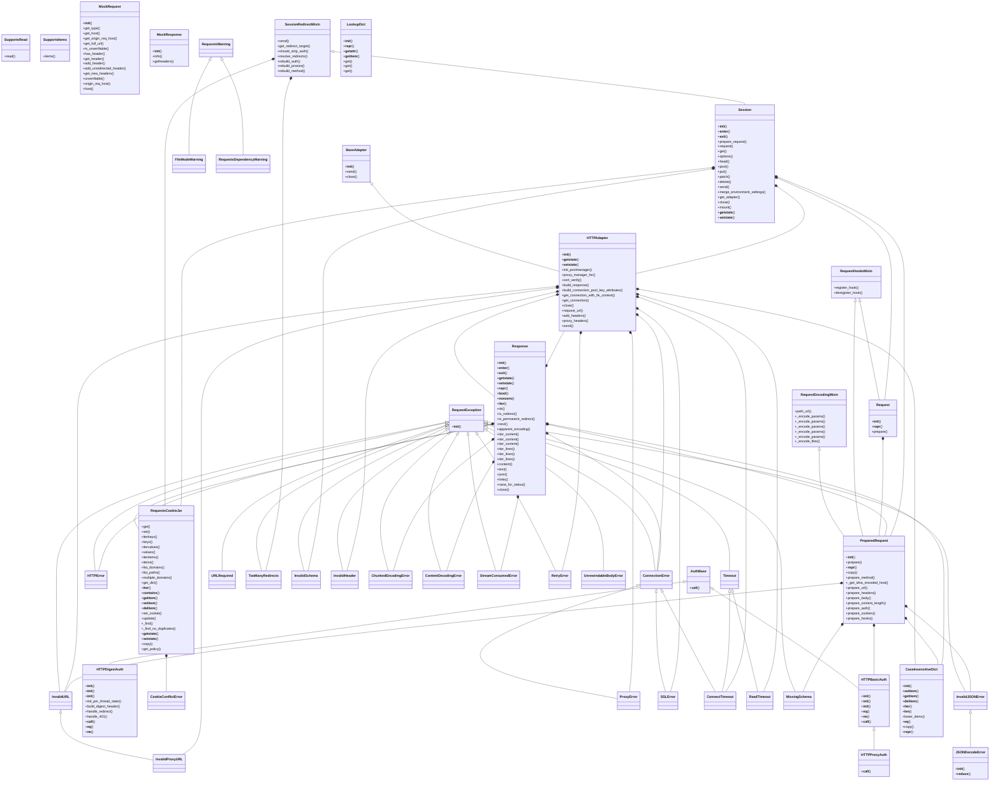

# OOP Class Schema - psf/requests (EX04 §5.2 secondary, class-bearing target)

Version: 1.00 | Course: AI Agent Orchestration - HW4 (EX04)

> **Provenance.** Auto-generated by `scripts/gen_requests_oop.py` via `sdk.extract_class_schema` (pure-AST `extract_classes` + `class_relations` + `render_class_diagram`; no LLM, no tokens) over a `psf/requests` clone at `runs/requests/src/requests`. The primary debugging target `andela/buggy-python` is procedural (empty class diagram, honestly); this class-bearing secondary target demonstrates the OOP-extraction the §5.2 rubric asks for. The assignment permits integrating several repositories.

## Summary

- Classes extracted: **46**
- Inheritance edges (`<|--`): **32**
- Composition edges (`*--`): **34**

Representative inheritance hierarchies (verified in the extracted relations):
- `BaseAdapter` <|-- `HTTPAdapter`
- `AuthBase` <|-- `HTTPBasicAuth`
- `HTTPBasicAuth` <|-- `HTTPProxyAuth`
- `RequestException` <|-- `HTTPError`
- `InvalidJSONError` <|-- `JSONDecodeError`

## Class Diagram (full, auto-extracted)

