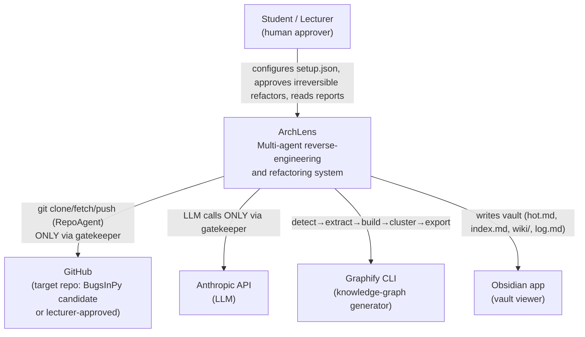
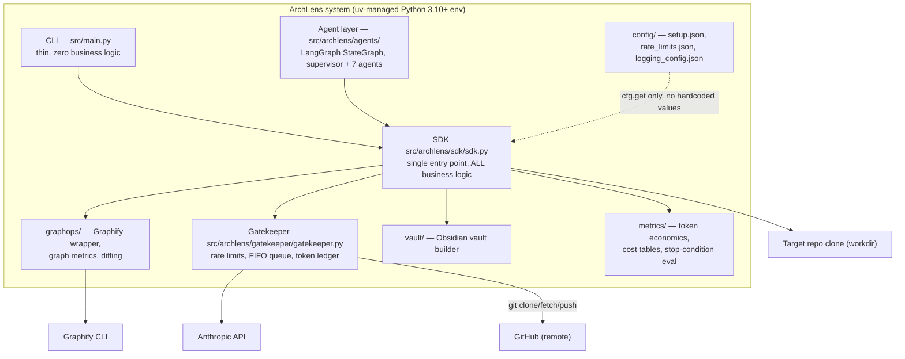
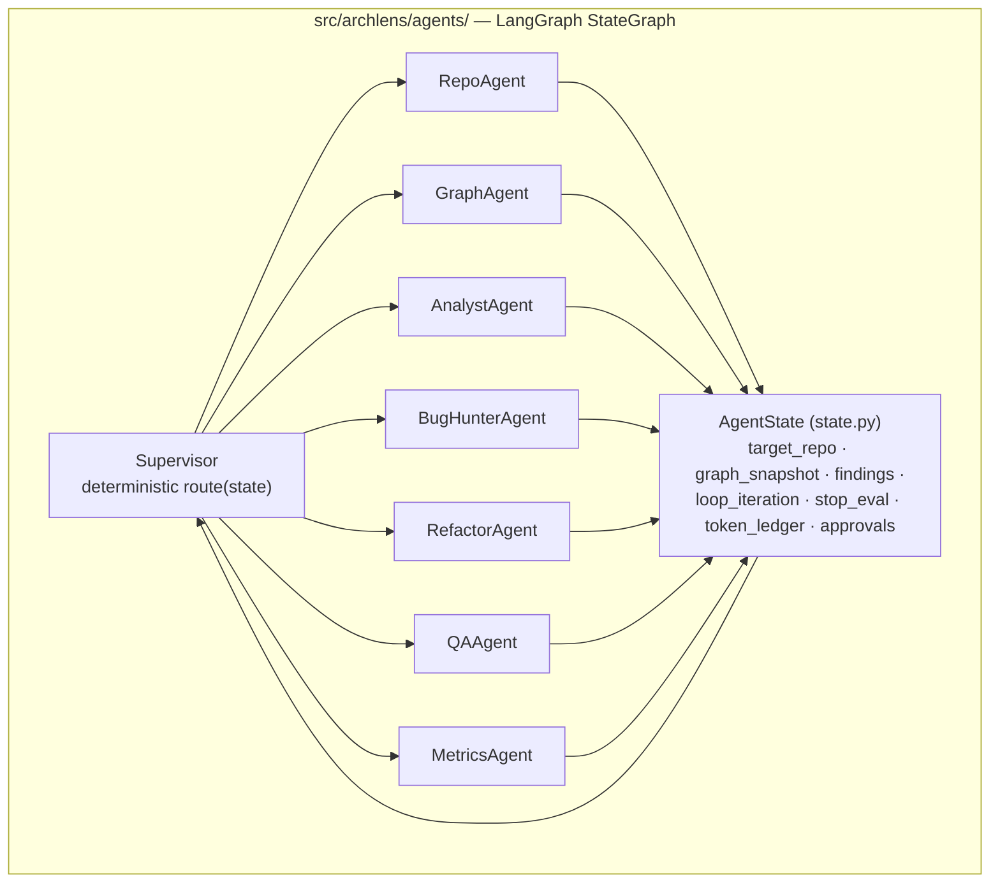
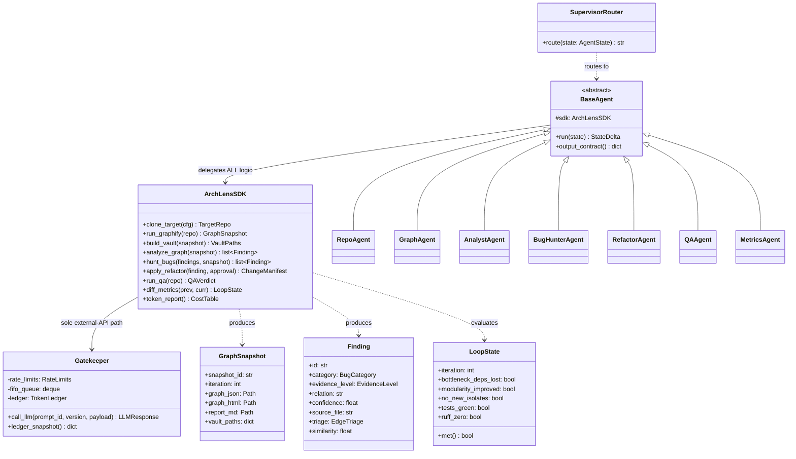
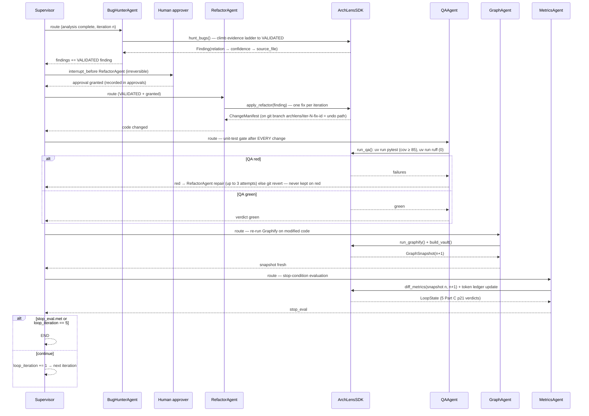
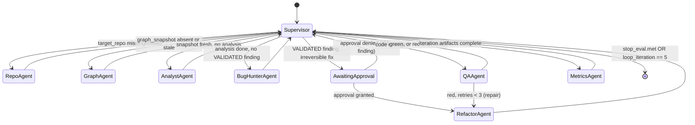
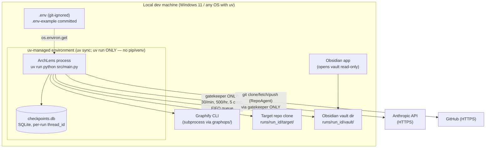

# PLAN.md — ArchLens Architecture & Implementation Plan

Version: 1.00 | Status: Draft — awaiting lecturer approval | Course: AI Agent Orchestration — HW4 (EX04)

---

## 1. Document Control

| Field | Value |
|---|---|
| Document | Architecture & implementation plan (C4 + UML + deployment + ADRs) |
| Project | ArchLens (`archlens` Python package, version 1.00, `src/archlens/shared/version.py`) |
| Owner | HW4 submission team |
| Source references | Lecture 07 §11 (EX04 tasks), Part A (token-economics reality check), Part B (knowledge assets, guardrails), Part C p21 (diff metrics / stop conditions), Software Submission Guidelines V3 |
| Related docs | `docs/PRD.md`, `docs/PRD_agent_orchestration.md`, `docs/PRD_api_gatekeeper.md`, `docs/PRD_graph_pipeline.md`, `docs/PRD_improvement_loop.md`, `docs/PRD_token_metrics.md`, `docs/TODO.md`, `docs/PROMPT_BOOK.md` |
| Change log | 1.00 — initial draft |

**Approval gate (Guidelines V3):** this PLAN can be approved only AFTER `docs/PRD.md` is approved, and ALL docs (PRD, PLAN, TODO, specialized PRDs, PROMPT_BOOK) must be approved before any development starts. TDD red-green-refactor begins only after that gate.

---

## 2. Architecture Overview

ArchLens implements the course's three-layer knowledge model (Part A/B) and maps each layer onto a concrete component:

| Knowledge layer (course) | Artifact | ArchLens component responsible |
|---|---|---|
| Layer 1 — Raw files | Target repo source (`*.py`), cloned per `config/setup.json` | `RepoAgent` (clone/validate, uv-managed env) |
| Layer 2 — Structured graph | Graphify pipeline detect → extract → build → cluster → export ⇒ `graph.json`, `graph.html`, `REPORT.md` | `GraphAgent` + `graphops/` |
| Layer 3 — Navigable knowledge | Obsidian vault: `hot.md`, `index.md`, `wiki/`, `log.md` (LLM Wiki: index hub read first, then 2–3 pages) | `GraphAgent` + `vault/` |

On top of the three layers sits the LangGraph supervisor orchestration (7 agents — RepoAgent, GraphAgent, AnalystAgent, BugHunterAgent, RefactorAgent, QAAgent, MetricsAgent) that drives: reverse engineering (block diagram, OOP class schema, PRD-vs-code audit), architectural-bug detection (SPOF, god nodes, hub-vs-bottleneck, bridges, duplicates ≥ 0.91), and the improvement loop (fix → re-run Graphify → diff metrics vs Part C p21 stop conditions → unit tests after EVERY change, hard cap 5 iterations), with full token accounting proving ≥ 70% savings (or a written Part A amortization explanation).

Two architectural invariants govern everything (Guidelines V3):
1. **SDK single entry point** — ALL business logic lives behind `src/archlens/sdk/sdk.py`; agents and the CLI are thin callers.
2. **Gatekeeper** — ALL external network operations — Anthropic LLM calls AND git remote operations (clone/fetch/push) — pass through `src/archlens/gatekeeper/gatekeeper.py`; nothing else touches the network. The gatekeeper enforces `config/rate_limits.json` (30 req/min, 500 req/hr, 5 concurrent, retry_after 30 s, max_retries 3, FIFO overflow queue — queue, never reject or crash) and writes the token ledger.

---

## 3. C4 Model

### 3.1 Level 1 — System Context



ArchLens is operated by one human (student; lecturer as grader). External systems: GitHub (source of the target repo) and the Anthropic API — both reached exclusively through the gatekeeper — plus the Graphify CLI (subprocess) and Obsidian (passive consumer of the generated vault). No other network dependency exists.

### 3.2 Level 2 — Container



The CLI parses arguments and calls the SDK — nothing else. The LangGraph agent layer holds prompts and routing but delegates every operation (clone, Graphify run, vault build, metric diff, file edit, test run) to the SDK. Only the gatekeeper imports the Anthropic client and performs git remote operations (clone/fetch/push); an import-boundary test enforces this.

### 3.3 Level 3 — Component (agent layer)



Workers never call each other; handoffs are state deltas routed by the Supervisor (PRD_agent_orchestration FR-AO-05). Responsibilities: RepoAgent (clone/validate, uv env), GraphAgent (Graphify pipeline + vault), AnalystAgent (degree/betweenness centrality, community detection, hub-vs-bottleneck, bridges, edge triage EXTRACTED/INFERRED/AMBIGUOUS with confidence 0.55–0.95), BugHunterAgent (evidence ladder OBSERVED → INFERRED → EXTRACTED → VALIDATED; every claim cites relation → confidence → source_file), RefactorAgent (split > 150-line modules, break bottlenecks, merge duplicates ≥ 0.91 — irreversible ⇒ human approval), QAAgent (`uv run pytest` coverage ≥ 85, `uv run ruff` 0), MetricsAgent (token ledger, cost tables, Part C p21 diff verdicts).

---

## 4. UML Class Diagram



`BaseAgent` exists per the DRY rule (same method in 3+ classes → base class): shared prompt loading, contract declaration, and handoff-trace logging live there. DTOs (`GraphSnapshot`, `Finding`, `LoopState`) are dataclasses in `shared/`; enums (`BugCategory`, `EvidenceLevel`, `EdgeTriage`) are the only permitted non-config constants besides `shared/constants.py`.

---

## 5. Sequence Diagram — One Improvement-Loop Iteration



The unit-test gate is unconditional: QAAgent runs after every RefactorAgent change; on red, RefactorAgent repairs (up to 3 attempts), after which the fix is rolled back via `git revert` — no fix is ever kept on red. Each iteration's change is applied on a per-iteration git feature branch `archlens/iter-<N>-<fix-id>`, which is the undo mechanism; the `runs/<run_id>/iter_<n>/` snapshot directories are report artifacts only, not the undo path.

---

## 6. State Machine — LangGraph Supervisor Routing



Routing is a deterministic pure function `route(state) -> str` (no LLM), unit-testable table-driven. `AwaitingApproval` is realized as a LangGraph `interrupt_before=["RefactorAgent"]` checkpoint; the run suspends in SQLite and resumes after a human decision — approvals are never timed out into auto-grant.

---

## 7. Deployment Diagram



Everything runs on one developer machine. The only two network egress points are GitHub (clone/fetch/push) and the Anthropic API — both exclusively through the gatekeeper, with the API key sourced from the git-ignored `.env` (a `.env-example` with dummy values is committed, mandatory per Guidelines V3). Obsidian merely opens the generated vault directory; ArchLens never automates the Obsidian app.

---

## 8. Data Flow & Artifacts

| Artifact | Producer | Consumer(s) | Location | Content |
|---|---|---|---|---|
| `graph.json` | GraphAgent (Graphify export) | AnalystAgent, MetricsAgent diffing | `runs/<run_id>/iter_<n>/` | Nodes/edges of the target's knowledge graph; basis for centrality, communities, triage |
| `graph.html` | GraphAgent (Graphify export) | Human reviewer | `runs/<run_id>/iter_<n>/` | Interactive graph visualization |
| `REPORT.md` | GraphAgent (Graphify export) | BugHunterAgent, human | `runs/<run_id>/iter_<n>/` | Graphify pipeline report |
| `hot.md` | GraphAgent (vault builder) | LLM context loading, human | `runs/<run_id>/vault/` | Top-centrality nodes + entry points (ADR-008) |
| `index.md` | GraphAgent (vault builder) | LLM (read FIRST, then 2–3 wiki pages) | `runs/<run_id>/vault/` | Hub page linking all wiki pages (Part B LLM Wiki) |
| `wiki/` | GraphAgent (vault builder) | LLM targeted reads, human in Obsidian | `runs/<run_id>/vault/wiki/` | One page per module/community, wikilinked |
| `log.md` | GraphAgent + Supervisor trace | Grader, before/after measurement | `runs/<run_id>/vault/` | Ingestion journal: raw/ → wiki/ provenance, handoff records |
| Metrics JSON (`metrics.json`, `token_ledger.json`) | MetricsAgent / gatekeeper | Cost tables, ≥ 70% savings proof, stop_eval | `runs/<run_id>/` | Per-agent/per-model input/output tokens, $ cost, Part C p21 diff verdicts per iteration |
| Iteration snapshots / diffs | RefactorAgent via SDK | MetricsAgent, grader | `runs/<run_id>/iter_<n>/` | Report artifacts ONLY — the undo path is the per-iteration git feature branch `archlens/iter-<N>-<fix-id>` rolled back via `git revert` |

---

## 9. Directory Tree (target layout)

```text
AI-Agent-Orchestration-HW4/
├── pyproject.toml            # single source of truth (NO requirements.txt)
├── uv.lock                   # committed
├── .env                      # git-ignored (real keys)
├── .env-example              # committed, dummy values (mandatory)
├── .gitignore
├── config/
│   ├── setup.json            # target repo URL, paths, thresholds wiring
│   ├── rate_limits.json      # 30/min, 500/hr, 5 conc, retry_after 30, max_retries 3, queue depth
│   └── logging_config.json
├── docs/
│   ├── PRD.md
│   ├── PLAN.md               # this document
│   ├── TODO.md               # 16 phases, statuses + DoD
│   ├── PRD_agent_orchestration.md
│   ├── PRD_api_gatekeeper.md
│   ├── PRD_graph_pipeline.md
│   ├── PRD_improvement_loop.md
│   ├── PRD_token_metrics.md
│   └── PROMPT_BOOK.md
├── skills/
│   └── graph-navigation/SKILL.md   # YAML frontmatter, guardrail levels
├── src/
│   ├── main.py               # thin CLI, zero business logic
│   └── archlens/
│       ├── sdk/sdk.py        # single SDK entry point
│       ├── gatekeeper/gatekeeper.py
│       ├── agents/           # supervisor.py, state.py, base.py, 7 agent files
│       ├── graphops/         # graphify runner, metrics, diff
│       ├── vault/            # hot/index/wiki/log builders
│       ├── metrics/          # token ledger, cost tables, stop_eval
│       └── shared/
│           ├── version.py    # 1.00
│           └── constants.py  # 0.91, 0.55–0.95, 150, 85, 5, 70% ...
└── tests/
    ├── conftest.py
    ├── fixtures/             # synthetic target repo (planted bottleneck + duplicate)
    ├── unit/                 # per-module, ≤ 150 code lines each
    └── integration/          # full-loop, hard-cap, resume tests
```

Every code file (tests included) respects the 150-code-line cap (blank/comment lines excluded) — files are split, never compressed.

---

## 10. Architecture Decision Records

### ADR-001 — LangGraph over CrewAI
**Context.** EX04 mandates an agent framework; candidates were LangGraph and CrewAI. We need deterministic routing, durable checkpoints, and a human-approval interrupt for irreversible refactors.
**Decision.** LangGraph `StateGraph` with a supervisor pattern; routing is a pure function over typed state.
**Consequences.** + Checkpointer gives crash-resume and `interrupt_before` approval gates for free; routing is unit-testable without an LLM. − More boilerplate than CrewAI's role abstraction; mitigated by `BaseAgent`.

### ADR-002 — uv over pip/venv
**Context.** Guidelines V3 forbids pip, virtualenv, venv, and `python -m` everywhere — code, docs, CI.
**Decision.** uv exclusively: `uv sync` for envs, `uv run` for every execution (`uv run pytest`, `uv run ruff check`), `pyproject.toml` + committed `uv.lock` as the single dependency source; no `requirements.txt` anywhere.
**Consequences.** + Reproducible env, machine-checkable compliance, fast installs. − Contributors must install uv first; documented in README. Any pip mention in docs is a graded violation, so docs are linted by grep in CI.

### ADR-003 — SDK single entry point
**Context.** Guidelines V3: ALL business logic only via the SDK; the CLI must be thin.
**Decision.** `src/archlens/sdk/sdk.py` exposes the complete public surface (§4 class diagram). CLI and agent nodes contain zero business logic; agents are prompt+contract shells delegating to SDK methods.
**Consequences.** + One seam to mock in tests; import-boundary test (`agents/`/`main.py` may not import `graphops/`, `vault/`, `metrics/` directly) enforces it. − SDK facade risks exceeding 150 lines; it delegates to internal modules and keeps only dispatch.

### ADR-004 — Gatekeeper FIFO queue, never reject
**Context.** Rate limits (30 req/min, 500 req/hr, 5 concurrent) with retry_after 30 s and max_retries 3; the system must never crash or reject on overflow.
**Decision.** Over-limit calls enter a FIFO queue with config-driven max depth (`config/rate_limits.json`); the queue blocks producers when full rather than dropping; retries are gatekeeper-internal; every call (including failures) is ledgered.
**Consequences.** + No lost work, honest token accounting (Part A: failed calls still cost). − Latency under burst; acceptable for a batch pipeline. Queue depth is config, never hardcoded.

### ADR-005 — Stop conditions from Part C p21 diff metrics
**Context.** The improvement loop needs objective termination, not LLM self-assessment.
**Decision.** `LoopState` computes five verdicts by diffing consecutive `graph.json` snapshots plus QA output: (1) bottleneck node actually lost dependencies — not merely moved load, (2) improved modularity (fewer inter-community edges) — or unchanged, for fixes that do not target coupling (P3/P5), (3) no new isolated components, (4) all unit tests green, (5) ruff 0 violations. The five conditions are PER-FIX acceptance criteria: ALL five must hold for a fix to be accepted. The RUN itself terminates on convergence, an empty fix queue, or the 5-iteration hard cap.
**Consequences.** + Deterministic, reproducible from persisted snapshots; prevents "load shuffling" being counted as improvement. − Requires keeping every iteration's graph.json (disk cost accepted).

### ADR-006 — Token-measurement methodology (baseline definition)
**Context.** Must prove ≥ 70% token savings (course cites 70–95%; community 5.1x) or explain why not.
**Decision.** Baseline = a naive full-context run: the same analysis questions answered by stuffing raw target files into the prompt (capped at model context, chunked if needed), token counts taken from API usage fields. Treatment = Graphify-assisted run: `index.md` hub first, then 2–3 wiki pages / `hot.md`. MetricsAgent emits per-model cost tables (input/output tokens, $) and the savings ratio; the baseline run's one-off graph-scan cost is reported separately and amortized per Part A's reality check. If savings < 70%, a written explanation is mandatory in the metrics report.
**Consequences.** + Apples-to-apples comparison, audit-ready ledger. − Baseline run itself costs tokens; bounded by running it once on a fixed question set.

### ADR-007 — Evidence-ladder enforcement in BugHunter output
**Context.** Findings must be trustworthy enough to justify irreversible refactors.
**Decision.** Every `Finding` carries an `EvidenceLevel` (OBSERVED → INFERRED → EXTRACTED → VALIDATED) and the citation triple relation → confidence → source_file; the SDK rejects (schema validation) any finding lacking the triple, and the Supervisor routes to RefactorAgent only at VALIDATED. Edge triage labels (EXTRACTED/INFERRED/AMBIGUOUS) carry confidence values with 0.55–0.95 enforced for every edge; EXTRACTED edges carry fixed confidence 0.95; duplicate-logic findings require similarity ≥ 0.91.
**Consequences.** + No uncited claim can trigger a code change; graders can trace every fix to a graph edge and source file. − Some real bugs stall below VALIDATED; they are reported as findings without fixes.

### ADR-008 — `vault/hot.md` content definition
**Context.** The course mandates `hot.md` in the vault but leaves its content undefined. The authoritative spec is `PRD_graph_pipeline.md` §7.1.
**Decision.** `hot.md` contains exactly three sections: (1) the Top-10 nodes ranked by betweenness centrality with degree as tiebreaker, with wikilinks into `wiki/`; (2) the detected entry points (`__main__`, CLI scripts, exported APIs); (3) anomalies/AMBIGUOUS edges needing review. The whole file respects a ≤ 120-line budget. It is regenerated every Graphify run and ordered so an LLM reading only `index.md` + `hot.md` sees the architecture's load-bearing elements first.
**Consequences.** + Directly serves the token-economy goal (smallest high-signal context) and the before/after metric "correct-file identification". − Definition is ours, not the course's; this ADR documents the rationale for the grader.

### ADR-009 — SQLite checkpointer + interrupt-based human approval
**Context.** Irreversible refactors need explicit human approval (Part B guardrails) and runs must survive restarts.
**Decision.** LangGraph SQLite checkpointer (`checkpoints.db`, thread_id = run id) with `interrupt_before=["RefactorAgent"]`; approvals append to state and persist across sessions; denied → skip finding; no timeout auto-grant.
**Consequences.** + Kill/resume demo is possible (acceptance criterion); approval audit trail. − Single-writer SQLite is fine locally but would need swapping for multi-user deployment (out of scope).

### ADR-010 — One refactor per iteration
**Context.** Diff metrics must attribute graph changes to a specific fix.
**Decision.** RefactorAgent applies exactly one VALIDATED finding per loop iteration; QA and Graphify re-run before the next fix.
**Consequences.** + Clean causal attribution in stop_eval, simple revert. − More iterations consumed within the cap of 5; finding selection follows the ordered fix taxonomy: P1 SPOF > P2 bottleneck split (god node only when classified bottleneck) > P3 >150-line module split > P4 validated duplicates ≥ 0.91 > P5 PRD-vs-code misalignment.

---

## 11. Milestones (mapped to the 16 TODO phases)

| Milestone | Scope | TODO phases | Definition of Done |
|---|---|---|---|
| M1 — Docs & approval gate | PRD, PLAN, TODO, PRD_agent_orchestration, PROMPT_BOOK drafts; lecturer approval | P1–P2 | All docs approved; zero development started before approval |
| M2 — Skeleton & tooling | Repo layout (§9), pyproject + uv.lock, config files, .env-example, ruff/coverage gates, CI grep audits | P3–P4 | `uv run ruff check` = 0 on empty skeleton; `uv run pytest` runs; layout matches §9 |
| M3 — SDK + Gatekeeper | SDK facade, gatekeeper with rate limits/FIFO/ledger (mock mode), shared DTOs/constants | P5–P6 | Gatekeeper unit tests green incl. queue-at-max-depth; import-boundary test passes |
| M4 — Repo & Graph layers | RepoAgent, GraphAgent, graphops Graphify wrapper, vault builder (hot/index/wiki/log) | P7–P8 | Graphify runs on fixture repo; vault opens in Obsidian; artifacts table §8 produced |
| M5 — Analysis & bug hunting | AnalystAgent (centrality, communities, triage 0.55–0.95), BugHunterAgent (evidence ladder, ≥ 0.91 duplicates) | P9–P10 | Findings carry citation triples; planted fixture bugs detected |
| M6 — Loop & refactoring | Supervisor routing, RefactorAgent + approval interrupt, QAAgent gate, MetricsAgent stop_eval, checkpoint resume | P11–P13 | Full-loop, hard-cap, and resume integration tests green; coverage ≥ 85% |
| M7 — Token economics & knowledge assets | Baseline vs Graphify measurement (ADR-006), cost tables, SKILL.md, before/after 4-metric report | P14–P15 | ≥ 70% savings shown or written Part A explanation; SKILL.md guardrails complete |
| M8 — Run on real target & submission | Run on configured target repo, reverse-engineering deliverables (block diagram, OOP schema, PRD-vs-code audit), final report, demo | P16 | All acceptance criteria of both PRDs met; submission package complete |

---

## 12. Testing Strategy

- **TDD red-green-refactor** for every module: failing test first, minimal pass, refactor under green. Test files obey the 150-code-line cap (split by concern).
- **Mocks, no external services in tests:** the gatekeeper ships a config-driven mock mode (canned LLM responses, synthetic token counts, deterministic ledger); git operations are stubbed with local fixture repos; Graphify is invoked for real only in integration tests against the tiny `tests/fixtures/` repo (planted bottleneck + duplicate pair ≥ 0.91). No test ever reaches the Anthropic API or GitHub.
- **Unit tier:** state schema/reducers, table-driven `route(state)` (every rule incl. hard cap, pending approval, QA-red repair), per-agent contracts, gatekeeper retry/queue (clock mocked, retry_after 30 s, max_retries 3, FIFO never rejects), stop_eval verdicts on synthetic before/after graphs (deps lost vs load moved; inter-community edge count; isolate detection), vault builder output, 150-line and import-boundary audits.
- **Integration tier:** `test_full_loop_happy_path` (auto-grant test flag, ends via stop_eval.met, QA ran after every change), `test_hard_cap` (exit at iteration 5), `test_resume_from_checkpoint` (kill at approval interrupt, resume, no repeated side effects).
- **Gates (CI + local, all via `uv run`):** coverage ≥ 85% with `fail_under=85` (statement + branch + path; excludes `src/main.py`, tests, GUI); `uv run ruff check` = 0 (line-length 100, target py310, select E,F,W,I,N,UP,B,C4,SIM, ignore E501); grep audits for forbidden words (pip, venv, requirements.txt) and for direct Anthropic imports outside the gatekeeper.

---

## 13. Compliance Matrix (Guidelines V3 hard rules)

| # | Hard rule | Where this plan satisfies it |
|---|---|---|
| 1 | SDK single entry point, all business logic via SDK | §3.2 container, §4 `ArchLensSDK`, ADR-003, import-boundary test (§12) |
| 2 | All external API calls through gatekeeper | §3.2, §7 deployment (single egress), ADR-004, grep audit (§12) |
| 3 | Thin CLI, zero business logic in `src/main.py` | §3.2, §9 tree, ADR-003 |
| 4 | 150-line max per code file (tests included; split, never compress) | §9 note, §4 BaseAgent split, automated audit (§12), RefactorAgent applies the same rule to the target |
| 5 | Coverage ≥ 85%, fail_under=85, statement+branch+path, exclusions | §12 gates, M6 DoD |
| 6 | Ruff 0 violations (config as specified) | §12 gates; also a loop stop condition (ADR-005) |
| 7 | No hardcoded values (cfg.get / os.environ.get; exceptions constants.py, Enums, math constants) | §4 note, ADR-004/ADR-008 (config-driven), `shared/constants.py` in §9 |
| 8 | uv only; pip/virtualenv/venv/`python -m` forbidden incl. docs and CI | ADR-002, §7 deployment, §12 grep audit, this doc uses `uv run` exclusively |
| 9 | pyproject.toml single source + committed uv.lock; no requirements.txt | §9 tree, ADR-002 |
| 10 | config/ with setup.json, rate_limits.json (exact limits, FIFO never-reject), logging_config.json | §9 tree, ADR-004 |
| 11 | .env git-ignored + .env-example with dummy values | §7 deployment, §9 tree |
| 12 | DRY thresholds (2+ files → shared module; 3+ try/except → wrapper; 3+ classes → base) | §4 BaseAgent, shared/ DTOs, gatekeeper as the single retry wrapper |
| 13 | TDD red-green-refactor | §12, M1 gate (no code before doc approval) |
| 14 | Docs set: PRD, PLAN (C4+UML+deployment+ADRs), TODO (statuses+DoD), PRD_<mechanism>, PROMPT_BOOK; PRD approved first, all docs before dev | §1 approval gate, §11 M1, this document provides C4 (§3), UML (§4–6), deployment (§7), ADRs (§10) |
| 15 | Knowledge assets: SKILL.md with guardrail levels; LLM Wiki (index hub, 2–3 pages, log.md); before/after 4 metrics | §8 artifacts, §9 `skills/`, §11 M7, ADR-008 |
| 16 | Token economics: baseline vs Graphify, ≥ 70% target, cost tables, written explanation if missed | ADR-006, §8 metrics JSON, §11 M7 |
| 17 | Versions start at 1.00 (`shared/version.py`) | §1 header, §9 tree |
| 18 | Rate limits 30/min, 500/hr, 5 concurrent, retry_after 30 s, max_retries 3, FIFO queue never reject/crash | ADR-004, §7, §12 gatekeeper tests |

---

## 14. Requirement Traceability (PRD → PLAN/TODO)

Cross-document check (TODO 2.041): every PRD requirement ID maps to a PLAN milestone
and a TODO phase. **0 orphan requirement IDs.**

| PRD requirement IDs | Subject | PLAN milestone (§11) | TODO phase |
|---|---|---|---|
| FR-01, FR-02, FR-03, FR-04 | Target-repo management | M2 | Phase 3 |
| FR-05, FR-06, FR-07, FR-08 | Graphify pipeline | M3 | Phase 4 |
| FR-09, FR-10, FR-11, FR-12 | Obsidian vault generation | M3 | Phase 5 |
| FR-13, FR-14, FR-15, FR-16, FR-17, FR-18, FR-19 | Graph analysis & findings | M4 | Phase 6 |
| FR-20, FR-21, FR-22 | Reverse-engineering deliverables | M4 | Phase 7 |
| FR-23, FR-24, FR-25, FR-26, FR-27 | Multi-agent orchestration, SDK, gatekeeper boundaries | M5 | Phases 8, 9, 10 |
| FR-28, FR-29, FR-30, FR-31, FR-32 | Improvement loop & stop conditions | M6 | Phase 11 |
| FR-33, FR-34, FR-35 | Token measurement | M7 | Phase 12 |
| FR-36, FR-37, FR-38, FR-39 | Knowledge assets (SKILL.md, LLM Wiki, 4 metrics) | M7 | Phase 14 |
| NFR-01 (coverage ≥ 85), NFR-02 (ruff 0), NFR-03 (150-line cap) | Quality gates | M1, M8 | Phases 1, 13 |
| NFR-04 (uv-only), NFR-07 (secrets), NFR-08 (no hardcoding), NFR-12 (versioning 1.00), NFR-13 (layout) | Setup & compliance | M1 | Phase 1 |
| NFR-05 (SDK single entry), NFR-11 (DRY thresholds) | SDK architecture | M5 | Phase 8 |
| NFR-06 (gatekeeper-only egress), NFR-10 (thread safety) | Gatekeeper | M5 | Phase 9 |
| NFR-09 (local-only execution) | Runtime posture | M8 | Phases 15, 16 |

---

*End of PLAN.md — Version 1.00. Approved only after `docs/PRD.md` approval; development starts only after ALL docs are approved (Guidelines V3 workflow gates).*
