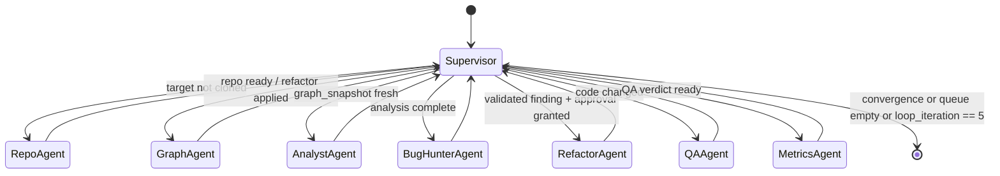

# PRD_agent_orchestration.md — Multi-Agent Orchestration Mechanism (ArchLens)

Version: 1.00 | Status: Draft — awaiting lecturer approval | Course: AI Agent Orchestration — HW4 (EX04)

---

## 1. Document Control

| Field | Value |
|---|---|
| Document | Specialized PRD — Agent Orchestration mechanism (`PRD_<mechanism>.md` per Guidelines V3) |
| Parent document | `docs/PRD.md` (approved before this document per Guidelines V3 workflow gates) |
| Project | ArchLens (`archlens` Python package, version 1.00, declared in `src/archlens/shared/version.py`) |
| Owner | HW4 submission team |
| Source references | Lecture 07 §11 (EX04 core tasks), Part A (token-economics reality check), Part B (knowledge assets, skill guardrails), Part C p21 (diff metrics / stop conditions), Software Submission Guidelines V3 |
| Related docs | `docs/PRD.md`, `docs/PLAN.md` (C4 + UML + deployment + ADRs), `docs/TODO.md`, `docs/PROMPT_BOOK.md` |
| Change log | 1.00 — initial draft |

Approval gate: this document, like all docs, MUST be approved before any development starts (Guidelines V3). Development then follows TDD red-green-refactor only.

---

## 2. Purpose

This PRD specifies the central mechanism of ArchLens: the **LangGraph-based multi-agent orchestration layer** that coordinates seven specialized agents in a supervisor pattern to (a) reverse-engineer a target Python repository using Graphify knowledge graphs navigated in Obsidian, (b) detect architectural bugs with cited evidence, and (c) drive the iterative improvement loop (RefactorAgent fix → Graphify re-run → metric diff vs stop conditions → unit tests after EVERY change, hard cap 5 iterations), while enforcing autonomy guardrails (read-only = auto, reversible = undo path required, irreversible = explicit human approval) and full token accounting toward the ≥ 70% savings target.

In scope: state schema, routing, agent contracts, handoffs, persistence, failure handling, prompt versioning, and the test plan for the orchestration package.

Out of scope: graph-algorithm internals (parent `docs/PRD.md`), Obsidian vault content rules, CLI UX. This PRD covers only how agents are wired, routed, persisted, retried, and approved.

---

## 3. LangGraph StateGraph Design

### 3.1 Topology

The orchestration is a single LangGraph `StateGraph` defined under `src/archlens/agents/`. Every node is a thin wrapper that delegates ALL business logic to the SDK (`src/archlens/sdk/sdk.py` — the single SDK entry point); every LLM/external API call inside any node goes through the gatekeeper (`src/archlens/gatekeeper/gatekeeper.py`). No node calls an external API directly, and no node contains business logic of its own.

### 3.2 State Schema

The shared state is a typed dict (`AgentState`) declared in `src/archlens/agents/state.py`. Field names below are normative (FR-AO-02).

| Field | Type | Written by | Description |
|---|---|---|---|
| `target_repo` | `dict` | RepoAgent | Local path, remote URL, commit SHA, uv-managed env status; target selected via `config/setup.json` (BugsInPy candidate or lecturer-approved simpler repo). |
| `graph_snapshot` | `dict` | GraphAgent | Latest Graphify outputs: `graph.json` path, `graph.html`, `REPORT.md`, Obsidian vault paths (`hot.md`, `index.md`, `wiki/`, `log.md`), monotonically increasing snapshot id per iteration. |
| `findings` | `list[dict]` | AnalystAgent, BugHunterAgent | Each finding: id, category (SPOF / god node / hub-vs-bottleneck / bridge / duplicate logic similarity ≥ 0.91), evidence level (OBSERVED → INFERRED → EXTRACTED → VALIDATED), citation triple `relation → confidence → source_file`, edge-triage label (EXTRACTED / INFERRED / AMBIGUOUS, confidence 0.55–0.95), status (`open` / `selected` / `fixed` / `skipped` / `fix_failed`). |
| `loop_iteration` | `int` | Supervisor | 0-based improvement-loop counter; hard cap 5, constant `MAX_LOOP_ITERATIONS` in `shared/constants.py`. |
| `stop_eval` | `dict` | MetricsAgent | Latest Part C p21 diff verdicts: `bottleneck_deps_lost`, `modularity_improved`, `no_new_isolates`, `tests_green`, `ruff_zero`, plus aggregate `met: bool` (logical AND of all five). |
| `token_ledger` | `dict` | gatekeeper (aggregated by MetricsAgent) | Per-agent, per-model, per-prompt-version input/output token counts and $ cost; baseline naive full-context run vs Graphify-assisted run, feeding the ≥ 70% savings report. |
| `approvals` | `list[dict]` | Supervisor (human channel) | One record per irreversible action: action id, requesting agent, proposed diff summary, finding citation, status (`pending` / `granted` / `denied`), timestamp, approver identity. |

Reducer policy: `findings` and `approvals` use append reducers (records are immutable once written; status changes append a superseding record); scalar/dict fields use last-write-wins. Reducers are declared next to the schema and unit-tested (§11.1).

---

## 4. Supervisor Pattern and Conditional Routing

A single Supervisor node owns all routing; worker agents never call each other directly (all handoffs go through state + Supervisor, FR-AO-05). Routing is a pure function `route(state) -> str` — deterministic, side-effect-free, and unit-testable without any LLM call. The Supervisor itself makes no LLM calls for routing; LLM judgment lives inside worker agents only.

Routing rules, evaluated strictly in order (FR-AO-03):

1. `target_repo` missing or invalid (clone absent, SHA mismatch, uv env unhealthy) → `RepoAgent`.
2. `graph_snapshot` absent or stale (target code changed since last snapshot id) → `GraphAgent`.
3. Graph fresh but no analysis findings for current snapshot id → `AnalystAgent`.
4. Analysis present but no VALIDATED finding selected for current iteration → `BugHunterAgent`.
5. VALIDATED finding selected: if its action class is irreversible and the matching approval is `pending` → interrupt and wait (§7); if `granted` → `RefactorAgent`; if `denied` → mark finding `skipped`, re-enter rule 4.
6. RefactorAgent reports changes applied → `QAAgent` (unit tests after EVERY change, no exceptions).
7. QAAgent verdict recorded → `MetricsAgent` (Part C p21 diff metrics, token-ledger aggregation, `stop_eval` update).
8. Run termination: stop-condition evaluation shows convergence (no further real improvement), OR the fix queue is empty (no remaining open findings, e.g. after a QA-red revert exhausts the last open finding), OR `loop_iteration == 5` (hard cap) → `END`.
9. Otherwise increment `loop_iteration` and re-enter rule 2 (re-run Graphify on the modified code).

The five conditions composing `stop_eval` (Part C p21) are PER-FIX acceptance criteria — they judge whether an individual fix is accepted; the RUN terminates only per rule 8 (convergence, fix queue empty, or hard cap):

- bottleneck node actually lost dependencies (not merely moved load to a neighbor);
- improved modularity (fewer inter-community edges than previous snapshot) — or unchanged, for fixes that do not target coupling (P3/P5);
- no new isolated components introduced;
- all unit tests green;
- ruff 0 violations.

---

## 5. Agent Roster

All agents live in `src/archlens/agents/` (one module each, ≤ 150 code lines, blank/comment lines excluded; shared prompt/IO helpers extracted per DRY thresholds — same function in 2+ files → shared module). Guardrail levels map to the Part B autonomy policy: **read-only = auto**, **reversible = undo path required**, **irreversible = explicit human approval**.

| Agent | Responsibility | Inputs | Outputs | Tools allowed | Guardrail level |
|---|---|---|---|---|---|
| RepoAgent | Clone and validate the target repo (BugsInPy candidate with uv-managed env, or lecturer-approved simpler repo, per `config/setup.json`). | `config/setup.json` | `target_repo` | `git clone`, `uv sync`, filesystem read | Reversible — undo path: delete clone dir and re-clone |
| GraphAgent | Run Graphify pipeline detect → extract → build → cluster → export; build/update Obsidian vault (`hot.md`, `index.md`, `wiki/`, `log.md`). | `target_repo`, prior `graph_snapshot` | new `graph_snapshot` (graph.json, graph.html, REPORT.md, vault paths) | Graphify CLI via SDK, filesystem write under run output dir only | Reversible — snapshots versioned per iteration, previous snapshot retained |
| AnalystAgent | Degree/betweenness centrality, community detection, hub-vs-bottleneck classification, bridge analysis; edge triage EXTRACTED / INFERRED / AMBIGUOUS with confidence 0.55–0.95. | `graph_snapshot` | analysis entries appended to `findings` | graph.json read, LLM via gatekeeper | Read-only → auto |
| BugHunterAgent | Architectural-bug identification: SPOF, god nodes, hub-vs-bottleneck, bridges, duplicate logic (similarity ≥ 0.91 triage); climbs evidence ladder OBSERVED → INFERRED → EXTRACTED → VALIDATED; every claim cites `relation → confidence → source_file`. | analysis `findings`, `graph_snapshot`, target source files (read) | VALIDATED `findings` | source read, graph read, LLM via gatekeeper | Read-only → auto |
| RefactorAgent | Apply exactly one fix per iteration: split > 150-line modules, break bottlenecks, merge validated duplicates. | selected VALIDATED finding, `target_repo` | code diff applied + change manifest | filesystem write inside target repo, LLM via gatekeeper | Irreversible (modifies target source) → explicit human approval per change, recorded in `approvals` |
| QAAgent | Run `uv run pytest` (coverage ≥ 85, `fail_under=85`) and `uv run ruff check` (0 violations) after EVERY change. | `target_repo` post-change | test/lint verdict into state | `uv run pytest`, `uv run ruff` | Read-only with respect to source → auto |
| MetricsAgent | Token before/after accounting (baseline naive full-context vs Graphify-assisted, target ≥ 70% savings; written amortization explanation per Part A if missed), cost tables per model, Part C p21 diff metrics → `stop_eval`. | `token_ledger` raw events, previous + current `graph_snapshot`, QA verdict | `stop_eval`, `token_ledger` summaries | gatekeeper ledger read, graph diff via SDK | Read-only → auto |

Roster notes:

- RefactorAgent approval is per-change: the Supervisor surfaces the proposed diff plus the finding's citation triple; the human grants or denies via the approvals channel. Denied → finding marked `skipped`, Supervisor selects the next finding or ends.
- QAAgent writes only its verdict to state; it never modifies target source — repairs are routed back to RefactorAgent (§8).
- All thresholds in this table (0.91, 0.55–0.95, 150, 85, 5, 70%) live in `shared/constants.py` or `config/setup.json`, accessed via `cfg.get` / `os.environ.get` — never hardcoded in agent code (Guidelines V3).
- Each agent has a corresponding `SKILL.md`-style capability declaration (Part B): YAML frontmatter with name + description + allowed tools, "# When to use", "# Procedure", and the guardrail level above; human-only steps (approval granting) carry `disable-model-invocation`.

---

## 6. Handoff Protocol

1. **State-only handoffs.** An agent's sole output channel is its returned state delta; agents never invoke other agents or share memory outside `AgentState` (FR-AO-05).
2. **Handoff record.** Every node appends a structured trace entry `{from, intent, artifacts, evidence_level, snapshot_id, timestamp}` to an internal trace list; GraphAgent mirrors orchestration-relevant entries into the vault `log.md` ingestion journal (Part B LLM Wiki requirement: raw/ → wiki/, index.md hub, log.md journal).
3. **Contract validation.** The Supervisor validates each returned delta against the node's declared output contract (required keys, types, value ranges such as confidence ∈ [0.55, 0.95]) before routing. Contract violation = node failure (§8), never silent propagation.
4. **Single-writer rule.** Each state field has exactly one writing agent (table §3.2, with the noted gatekeeper/MetricsAgent split for `token_ledger`); a second writer is a design error caught by unit tests.
5. **Idempotent re-entry.** Every node must tolerate being re-invoked with the same state (after a retry or resume) without duplicating side effects — enforced by snapshot ids and change manifests.

---

## 7. Checkpointing and Persistence

- The graph compiles with a LangGraph **SQLite checkpointer** (`checkpoints.db` under the run output dir; path read from `config/setup.json` via `cfg.get`). Every super-step persists the full `AgentState`.
- `thread_id` = run id (`archlens-<target>-<timestamp>`). Resuming with the same thread id continues from the last checkpoint: a crash mid-iteration never repeats a completed Graphify run, refactor, or LLM call sequence.
- **Human-in-the-loop interrupt:** the graph declares `interrupt_before=["RefactorAgent"]`. Execution suspends at the checkpoint; the thin CLI (`src/main.py`, zero business logic) surfaces the pending approval with diff and citation; on `granted` the run resumes from the same checkpoint with the approval appended to `approvals`. Pending approvals survive process restarts indefinitely.
- **Undo mechanism:** each iteration's refactor is applied on a dedicated git feature branch `archlens/iter-<N>-<fix-id>`; rollback is performed via `git revert` of that branch's commits. Per-iteration artifacts persisted under `runs/<run_id>/iter_<n>/` (graph snapshot, refactor diff, QA logs) are REPORT ARTIFACTS ONLY — they let MetricsAgent diff iteration N vs N−1 but are NOT the undo path.
- Checkpoint retention: all checkpoints of a run are kept until the run's metrics report is finalized; cleanup policy is config-driven, never automatic mid-run.

---

## 8. Failure Modes and Retries

All retry/rate parameters come from `config/rate_limits.json` — never hardcoded: 30 req/min, 500 req/hr, 5 concurrent, `retry_after` 30 s, `max_retries` 3, FIFO overflow queue with config-driven max depth. Over-limit requests are queued, never rejected, and the system never crashes on rate pressure.

| Failure mode | Detection | Handling |
|---|---|---|
| LLM API error / rate limit | gatekeeper response code | Gatekeeper retries up to `max_retries` (3) with `retry_after` 30 s backoff; over-limit requests enter the FIFO queue up to its config-driven max depth. Exhausted retries → node failure surfaced to Supervisor. |
| Node output contract violation | Supervisor validation (§6.3) | Re-invoke the node once with validation errors injected into its prompt; second failure → mark node failed, end run with a diagnostic checkpoint preserved. |
| QAAgent red (tests fail / ruff > 0) after a refactor | pytest/ruff exit codes | Route back to RefactorAgent with the failure log for repair, up to `max_retries` (3) attempts; still red after the third failed repair → revert via `git revert` of the iteration feature branch `archlens/iter-<N>-<fix-id>`, mark finding `fix_failed`, continue with the next finding. No fix is ever kept on a red QA verdict. |
| Graphify pipeline crash | non-zero exit via SDK | Retry once; persistent failure → end run; last good `graph_snapshot` remains in the checkpoint for post-mortem. |
| Approval denied / not yet granted | `approvals` status | Never bypassed. Denied → skip finding (rule 5). No timeout auto-grant: irreversible actions wait indefinitely at the interrupt checkpoint. |
| Repo clone / uv sync failure | RepoAgent exit codes | Retry up to `max_retries`; persistent failure → end run before any LLM spend beyond the failed attempts. |
| Loop runaway | `loop_iteration` | Hard cap 5 enforced in routing rule 8, checked before any LLM call of a new iteration. |

Every failure event is appended to the handoff trace and counted in `token_ledger` — failed calls still cost tokens and are reported honestly (Part A reality check: no hiding overhead).

---

## 9. Prompt Versioning (PROMPT_BOOK.md)

- Every agent system prompt and every routing-relevant template is registered in `docs/PROMPT_BOOK.md` with: prompt id (`PB-<agent>-<nn>`), version (starting at 1.00, same convention as `shared/version.py`), full prompt text, target model, rationale for changes, and observed-effect notes (token cost delta, output-quality delta).
- Agent code references prompts only by id + version through a prompt loader in the SDK; prompts are data files, never inline string literals (supports the no-hardcoded-values rule and DRY).
- A prompt change bumps the version and adds a PROMPT_BOOK changelog entry; the old version remains in the book for audit.
- The `token_ledger` records prompt id + version on every gatekeeper call, so token-economics deltas are attributable to specific prompt revisions in the before/after measurement (Part B: correct-tool-at-the-right-time and noise-reduction metrics).

---

## 10. Functional Requirements

| ID | Requirement |
|---|---|
| FR-AO-01 | The orchestration SHALL be a single LangGraph `StateGraph` with one Supervisor node and exactly the seven worker agents of §5 (RepoAgent, GraphAgent, AnalystAgent, BugHunterAgent, RefactorAgent, QAAgent, MetricsAgent). |
| FR-AO-02 | The state SHALL contain exactly the fields `target_repo`, `graph_snapshot`, `findings`, `loop_iteration`, `stop_eval`, `token_ledger`, `approvals`, typed per §3.2. |
| FR-AO-03 | Routing SHALL be a deterministic pure function over state implementing the ordered rules of §4, with no LLM involvement in routing decisions. |
| FR-AO-04 | The improvement loop SHALL terminate on convergence (the `stop_eval` evaluation shows no further real improvement available), OR when the fix queue is empty, OR at `loop_iteration == 5` (hard cap), whichever comes first; the five stop conditions act as per-fix acceptance criteria (FR-AO-04a). |
| FR-AO-05 | Agents SHALL communicate only via state deltas mediated by the Supervisor; direct agent-to-agent invocation is prohibited. |
| FR-AO-06 | Every external API call from any agent SHALL pass through `gatekeeper/gatekeeper.py`; every business-logic operation SHALL be invoked only via `sdk/sdk.py`. |
| FR-AO-07 | Irreversible actions (RefactorAgent source modifications) SHALL block on an explicit human approval recorded in `approvals`; reversible actions SHALL have a demonstrated undo path (per-iteration git feature branch `archlens/iter-<N>-<fix-id>`, rolled back via `git revert`; `runs/<run_id>/iter_<n>/` snapshots are report artifacts only, not the undo path); read-only actions SHALL run autonomously. |
| FR-AO-08 | QAAgent SHALL run after EVERY RefactorAgent change; if tests/lint cannot be made green within `max_retries` (3) repair attempts, the refactor SHALL be reverted via `git revert` of its iteration feature branch `archlens/iter-<N>-<fix-id>` — no fix is kept on a red QA verdict. |
| FR-AO-09 | The graph SHALL persist state via a checkpointer such that any run resumes from the last completed super-step after process restart, including across pending-approval interrupts. |
| FR-AO-10 | All retry/rate parameters SHALL be read from `config/rate_limits.json`; overflow SHALL queue FIFO up to the config-driven max depth and SHALL never reject a request or crash. |
| FR-AO-11 | The gatekeeper SHALL record input/output tokens and $ cost per call into `token_ledger`, tagged with agent, model, and prompt id + version, supporting the baseline-vs-Graphify ≥ 70% savings comparison. |
| FR-AO-12 | Every finding routed to RefactorAgent SHALL be at evidence level VALIDATED and SHALL cite `relation → confidence → source_file`. |
| FR-AO-13 | All agent prompts SHALL be loaded by id + version and registered in `docs/PROMPT_BOOK.md` per §9. |
| FR-AO-14 | Every node SHALL be idempotent under re-invocation with identical state (no duplicated side effects on retry/resume). |

Non-functional requirements (inherited from the parent PRD, restated for traceability):

| ID | Requirement |
|---|---|
| NFR-AO-01 | Coverage ≥ 85% (`fail_under=85`, statement + branch + path) on orchestration modules; `src/main.py` excluded per coverage policy. |
| NFR-AO-02 | Every orchestration code file ≤ 150 code lines (blank/comment lines excluded; applies to tests too; split, never compress). |
| NFR-AO-03 | Ruff 0 violations (line-length 100, target py310, select E,F,W,I,N,UP,B,C4,SIM, ignore E501). |
| NFR-AO-04 | All execution via `uv run` only; pip / virtualenv / venv / `python -m` are forbidden everywhere, including docs and CI; `pyproject.toml` + committed `uv.lock` are the single dependency source. |
| NFR-AO-05 | Secrets only via `.env` (git-ignored) with `.env-example` carrying dummy values; the gatekeeper reads keys via `os.environ.get`. |

---

## 11. Test Plan

TDD red-green-refactor: each test below is written and failing (red) before the corresponding code exists. All tests run via `uv run pytest`; shared fixtures live in `tests/conftest.py`. Test files obey the 150-code-line limit.

### 11.1 Unit tests — per node, mocked LLM via gatekeeper mock mode

The gatekeeper exposes a config-driven **mock mode** returning canned responses and synthetic token counts — no network, fully deterministic ledger entries. All node unit tests run in this mode.

| Test group | Verifies |
|---|---|
| `test_state_schema` | `AgentState` field set and types match §3.2; append vs last-write reducers behave correctly (FR-AO-02). |
| `test_routing` | Table-driven cases over `route(state)` covering every rule in §4: fresh start, stale snapshot, pending/denied/granted approval, QA-red repair path, hard cap at 5, stop-conditions-met exit (FR-AO-03, FR-AO-04). |
| `test_repo_agent` | Output contract with `git`/`uv` subprocess calls stubbed; invalid-SHA and unhealthy-env detection. |
| `test_graph_agent` | Graphify pipeline invocation order detect → extract → build → cluster → export (stubbed); snapshot id increments; staleness logic. |
| `test_analyst_agent` | Mocked LLM; edge-triage confidence clamped to 0.55–0.95; hub-vs-bottleneck labels present; centrality/community fields populated from a fixture graph.json. |
| `test_bughunter_agent` | Evidence-ladder transitions OBSERVED → INFERRED → EXTRACTED → VALIDATED; duplicate threshold 0.91 read from `shared/constants.py`; citation triple present on every finding (FR-AO-12). |
| `test_refactor_guardrail` | RefactorAgent never executes without a `granted` approval; `denied` → finding `skipped`; exactly one fix per iteration (FR-AO-07). |
| `test_qa_agent` | pytest/ruff exit-code interpretation; coverage gate at 85; revert path after `max_retries` red runs (FR-AO-08). |
| `test_metrics_agent` | `stop_eval` verdicts from synthetic before/after graphs: bottleneck deps lost vs merely moved load; inter-community edge count decrease; isolate detection; ledger aggregation and per-model cost table (FR-AO-11). |
| `test_gatekeeper_retry_queue` | `max_retries`=3, `retry_after`=30 s with a mocked clock; FIFO queue at max depth queues without rejecting or crashing; rate caps 30 req/min, 500 req/hr, 5 concurrent enforced (FR-AO-10). |
| `test_handoff_contracts` | Supervisor rejects deltas violating declared contracts; single-writer rule enforced; idempotent re-entry leaves state unchanged (FR-AO-14). |

### 11.2 Integration tests — full graph on a fixture repo

- Fixture: a tiny synthetic Python repo under `tests/fixtures/` with one planted bottleneck module and one duplicate function pair (similarity ≥ 0.91). Graphify runs for real; the LLM stays in gatekeeper mock mode.
- `test_full_loop_happy_path` — run end-to-end with auto-granted approvals (test-only flag, unavailable in production config); assert the loop ends via `stop_eval.met`, ≥ 1 refactor applied, QAAgent ran after every change, `token_ledger` non-empty with prompt id + version tags.
- `test_hard_cap` — mock MetricsAgent so stop conditions never satisfy; assert exit exactly at `loop_iteration == 5` with no sixth Graphify run.
- `test_resume_from_checkpoint` — terminate the process at the RefactorAgent interrupt, restart with the same `thread_id`, grant the approval, assert completion without re-running any completed node (FR-AO-09).
- `test_revert_on_red_qa` — plant a refactor that breaks a fixture test; assert revert via `git revert` of the iteration feature branch `archlens/iter-<N>-<fix-id>` and finding marked `fix_failed` (FR-AO-08).
- Quality gates on the orchestration package itself: coverage ≥ 85% (statement + branch, `fail_under=85`) and `uv run ruff check` → 0 violations.

---

## 12. Acceptance Criteria

The orchestration mechanism is accepted when ALL of the following hold:

1. `uv run pytest` is green with coverage ≥ 85% (`fail_under=85`) across `src/archlens/agents/`, `src/archlens/sdk/`, `src/archlens/gatekeeper/`; `uv run ruff check` reports 0 violations.
2. A full run on the configured target repo completes the improvement loop and terminates only via stop conditions met or the hard cap of 5 iterations — demonstrated by the checkpoint history.
3. Zero direct external API calls outside the gatekeeper and zero business logic outside the SDK, verified by an import-boundary test plus a grep audit in CI.
4. Every applied refactor has: a matching `granted` record in `approvals`, a VALIDATED finding with citation triple `relation → confidence → source_file`, a green QAAgent verdict, a revertible iteration feature branch `archlens/iter-<N>-<fix-id>` (rollback via `git revert`), and report artifacts under `runs/<run_id>/iter_<n>/`.
5. `token_ledger` produces the per-model cost table (input/output tokens, $ cost) and the baseline-vs-Graphify comparison; ≥ 70% savings is shown, or a written Part A explanation (initial graph-scan cost amortization) is attached to the metrics report.
6. The kill/resume demo passes (FR-AO-09): an interrupted run resumes from its checkpoint with no repeated side effects, including across a pending-approval interrupt.
7. All prompts used in the accepted run appear in `docs/PROMPT_BOOK.md` at the exact id + version recorded in the ledger.
8. No orchestration code file exceeds 150 code lines (blank/comment lines excluded); all thresholds (0.91, 0.55–0.95, 85, 5, 70%, rate limits) are sourced from `shared/constants.py` or config files — none hardcoded.
9. The handoff trace is mirrored into the Obsidian vault `log.md`, satisfying the Part B ingestion-journal requirement for the orchestration mechanism.

---

*End of PRD_agent_orchestration.md — Version 1.00. Awaiting lecturer approval before development (Guidelines V3 workflow gate).*
