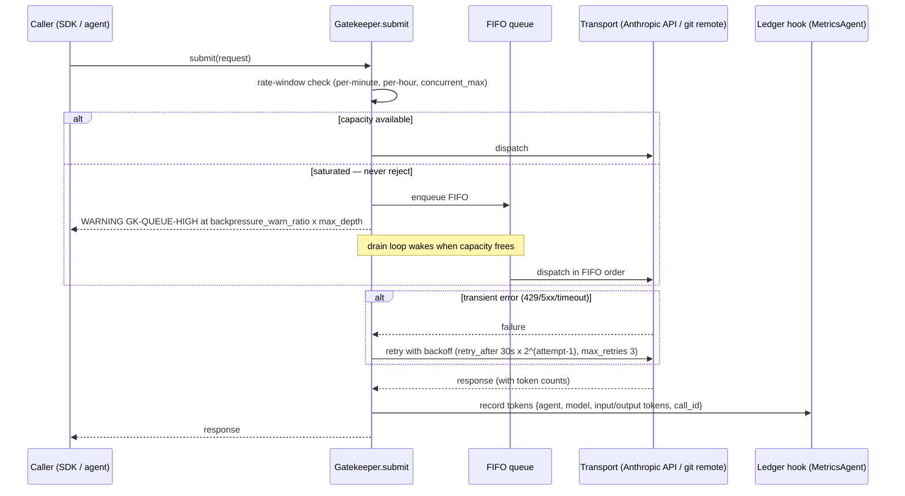

# PRD_api_gatekeeper.md — Specialized PRD: API Gatekeeper

Version: 1.00 | Status: Approved (lecturer sign-off 2026-06-14) | Course: AI Agent Orchestration — HW4 (EX04)

---

## 1. Document Control

| Field | Value |
|---|---|
| Document | PRD_api_gatekeeper.md (specialized PRD per central mechanism, Guidelines V3 §docs) |
| Project | ArchLens — multi-agent reverse-engineering system (package `archlens`, version 1.00) |
| Parent documents | docs/PRD.md (approved first), docs/PLAN.md, docs/TODO.md |
| Module owner | `src/archlens/gatekeeper/gatekeeper.py` |
| Source references | Submission Guidelines V3 §5 (API Gatekeeper and Rate Limiting), L07 §11 (EX04), Part A (token-cost reality check) |
| Approval gate | This document must be approved BEFORE development of the gatekeeper module starts |
| Change log | 1.00 — initial draft. Mechanism-team review 2026-06-14: version header confirmed; FR/NFR catalogue confirmed (37 FR-/NFR- references, exceeds the 8-ID bar); one fenced mermaid sequenceDiagram of the request lifecycle confirmed present; rate limits, retry policy, and FIFO never-reject queue behaviour all confirmed specified. **0 open findings.** |

---

## 2. Purpose and Scope

The API Gatekeeper is the **single chokepoint for every external call** made by ArchLens.
"External" means anything that leaves the process boundary toward a network service:

- Anthropic LLM API calls issued on behalf of any of the 7 agents (RepoAgent, GraphAgent,
  AnalystAgent, BugHunterAgent, RefactorAgent, QAAgent, MetricsAgent).
- Git remote operations (clone of the target repo from `config/setup.json`, fetch, ls-remote).
- Any other network I/O introduced later (HTTP downloads, package index queries).

**Hard rule (FR-GK-01):** no module outside `src/archlens/gatekeeper/` may import an HTTP/LLM
client or open a socket. The SDK (`src/archlens/sdk/sdk.py`) is the only caller of the
gatekeeper; agents call the SDK, the SDK calls the gatekeeper, the gatekeeper calls the network.
This is machine-checkable: a grep for `anthropic`, `httpx`, `requests`, `urllib`, `socket`
outside the gatekeeper package must return zero hits (enforced by a dedicated unit test).

Out of scope: business logic of any kind (analysis, graph operations, refactoring). The
gatekeeper transports, throttles, retries, logs, and accounts — nothing else.

---

## 3. Rate Limiting (config-driven)

All limits come from `config/rate_limits.json`. **No limit value may appear in code**
(no-hardcoded-values rule; access only via `cfg.get(...)`, defaults live in
`shared/constants.py` only as last-resort fallbacks).

### 3.1 Configuration schema

```json
{
  "rate_limits": {
    "version": "1.00",
    "services": {
      "default": {
        "requests_per_minute": 30,
        "requests_per_hour": 500,
        "concurrent_max": 5,
        "retry_after_seconds": 30,
        "max_retries": 3
      }
    },
    "queue": {
      "max_depth": 100,
      "backpressure_warn_ratio": 0.8
    }
  }
}
```

### 3.2 Requirements

- **FR-GK-02** — Enforce a sliding 60-second window: at most `requests_per_minute` (default 30)
  dispatches per service per minute.
- **FR-GK-03** — Enforce a sliding 3600-second window: at most `requests_per_hour` (default 500)
  dispatches per service per hour. Both windows are checked **before** every dispatch.
- **FR-GK-04** — Enforce at most `concurrent_max` (default 5) in-flight calls per service via a
  semaphore.
- **FR-GK-05** — Config-version validation: on startup the gatekeeper reads
  `rate_limits.version`; if the key is missing, malformed, or the major version is unsupported,
  the gatekeeper refuses to start with error `GK-CFG-001` (fail-fast at boot is allowed;
  crashing at request time is not).
- **FR-GK-06** — Per-service limits: lookup order is `services.<service_name>` then
  `services.default`. Service names: `anthropic`, `git`, `default`.

---

## 4. FIFO Overflow Queue

**Core requirement (FR-GK-07): when a rate limit or the concurrency cap is reached, the
gatekeeper NEVER rejects a request and NEVER crashes.** The request is appended to a FIFO queue
and the caller's future/handle blocks until the result is available.

- **FR-GK-08** — Queue discipline is strictly FIFO per service; ordering of enqueued requests is
  preserved at dispatch time.
- **FR-GK-09** — Maximum queue depth is read from `queue.max_depth` in `config/rate_limits.json`
  (config-driven, never hardcoded).
- **FR-GK-10 (backpressure)** — At `backpressure_warn_ratio` × `max_depth` the gatekeeper emits a
  WARNING log event `GK-QUEUE-HIGH` with current depth. At full depth, the *enqueue call itself
  blocks the producer* (backpressure propagates upstream to the SDK) — it still does not reject
  and does not drop. The system degrades to slower, never to broken.
- **FR-GK-11 (drain)** — A drain loop wakes whenever a rate window frees capacity or an in-flight
  call completes, and dispatches queued requests in FIFO order until limits are saturated again.
  Drain must be event-driven (condition variable), not busy-polling; idle CPU cost ~0.
- **FR-GK-12** — `get_queue_status()` returns `{depth, max_depth, in_flight, oldest_wait_s}` for
  monitoring and for the saturation/drain tests in §11.

### 4.1 Request lifecycle



---

## 5. Retry / Backoff Policy

- **FR-GK-13** — Transient failures (HTTP 429, 500, 502, 503, 529, connection reset, timeout) are
  retried up to `max_retries` (default 3) times.
- **FR-GK-14** — Backoff delay: server-provided `Retry-After` header when present; otherwise
  `retry_after_seconds` (default 30) × 2^(attempt−1), with ±10% jitter to avoid thundering herd.
- **FR-GK-15** — Non-transient failures (HTTP 400, 401, 403, 404, invalid request) are NOT
  retried; they surface immediately as a typed error (§9) to the SDK.
- **FR-GK-16** — A retried request keeps its original FIFO position semantics: it re-enters at
  the head of its service queue, not the tail, so retries cannot be starved.
- **FR-GK-17** — After `max_retries` exhaustion the gatekeeper returns
  `GatekeeperExhaustedError` to the caller — an error return, not an exception escaping to crash
  the LangGraph run; the supervisor decides whether to halt the iteration.

---

## 6. Per-Call Logging and Monitoring

- **FR-GK-18** — Every call (dispatched, queued, retried, failed) produces a structured log
  record via `config/logging_config.json` with at minimum: ISO-8601 enqueue/dispatch/complete
  timestamps, service, calling agent name, model id (for LLM calls), input tokens, output
  tokens, latency ms, attempt number, outcome, queue wait ms.
- **FR-GK-19** — Log records carry a monotonically increasing `call_id` so MetricsAgent can join
  ledger rows to log lines (source traceability — one of the 4 Part B before/after metrics).
- **FR-GK-20** — No secrets in logs: API keys (loaded from `.env`, which is git-ignored;
  `.env-example` carries dummy values) must never appear in any log record or error message.

---

## 7. Token Accounting Hooks (MetricsAgent ledger)

- **FR-GK-21** — On completion of every LLM call, the gatekeeper invokes a registered hook with
  `{agent, model, input_tokens, output_tokens, call_id, timestamp}`. MetricsAgent owns the
  ledger and the per-model cost tables (input/output tokens, $ cost) required for the token-
  economics deliverable (baseline naive run vs Graphify-assisted run, target ≥ 70% savings;
  written explanation required if not achieved — Part A reality check).
- **FR-GK-22** — Hooks are fire-and-forget for the caller path: a hook failure is logged
  (`GK-HOOK-001`) and never fails or delays the API call result.
- **FR-GK-23** — Accounting is per model **and** per agent, so MetricsAgent can attribute token
  spend to each of the 7 agents across the improvement loop's ≤ 5 iterations.

---

## 8. Mock Mode for Tests

- **FR-GK-24** — `Gatekeeper(transport=...)` accepts an injected transport. Tests inject a
  `MockTransport` returning canned responses with synthetic token counts and controllable
  latency/failure scripts. **No test in `tests/` may rely on an external service** — the test
  suite must pass with networking disabled.
- **FR-GK-25** — Mock mode exercises the real queue, rate windows, retry, and accounting logic;
  only the wire call is replaced. This keeps coverage of the gatekeeper itself ≥ 85%.
- **FR-GK-26** — A fake clock is injectable so rate-window tests run in milliseconds, not
  real minutes.

---

## 9. Thread Safety and Error Taxonomy

### 9.1 Thread safety

- **FR-GK-27** — All public methods are safe under concurrent invocation from multiple LangGraph
  agent nodes. Shared state (windows, queue, in-flight counter, ledger hooks) is guarded by a
  single internal lock + condition variable; the semaphore enforces `concurrent_max`.
- **FR-GK-28** — The gatekeeper is a process-wide singleton constructed once by the SDK; double
  construction raises `GK-INIT-001` (prevents two competing rate windows).

### 9.2 Error taxonomy (typed, in `shared/constants.py` enum `GatekeeperError`)

| Code | Name | Meaning | Caller action |
|---|---|---|---|
| GK-CFG-001 | ConfigVersionError | rate_limits.json missing/invalid version | fix config; boot refused |
| GK-CFG-002 | ConfigValueError | limit value missing/non-numeric | fix config; boot refused |
| GK-NET-001 | TransientUpstreamError | 429/5xx/timeout (internal; retried) | none — gatekeeper retries |
| GK-NET-002 | GatekeeperExhaustedError | max_retries exhausted | supervisor decides halt/skip |
| GK-REQ-001 | PermanentUpstreamError | 4xx non-retryable | fix request; not retried |
| GK-AUTH-001 | AuthError | missing/invalid API key from .env | fix .env; not retried |
| GK-HOOK-001 | AccountingHookError | metrics hook raised | logged only; call unaffected |
| GK-INIT-001 | DoubleInitError | second singleton construction | programming error; fail fast |

---

## 10. Non-Functional Requirements

- **NFR-GK-01 (latency overhead)** — Gatekeeper bookkeeping (window check, enqueue/dequeue,
  logging, accounting hook) adds ≤ 5 ms p95 per call when no throttling applies, measured by a
  benchmark test with the mock transport.
- **NFR-GK-02 (150-line split strategy)** — Every code file ≤ 150 lines (blank/comment lines
  excluded; applies to tests). The mechanism is split, never compressed, into:
  `gatekeeper/gatekeeper.py` (facade + singleton), `gatekeeper/rate_window.py` (sliding
  windows), `gatekeeper/fifo_queue.py` (queue + backpressure + drain), `gatekeeper/retry.py`
  (backoff policy), `gatekeeper/accounting.py` (hooks), `gatekeeper/transport.py`
  (real + mock transports), `gatekeeper/errors.py` (taxonomy re-exports).
- **NFR-GK-03 (quality gates)** — Coverage ≥ 85% (statement + branch + path, fail_under=85),
  Ruff 0 violations (line-length 100, target py310, select E,F,W,I,N,UP,B,C4,SIM, ignore E501).
- **NFR-GK-04 (tooling)** — uv ONLY. All commands run as `uv run ...`; pip/virtualenv/venv/
  `python -m` are forbidden everywhere including docs and CI. `pyproject.toml` + committed
  `uv.lock` are the single source of truth.
- **NFR-GK-05 (DRY)** — Retry wrapper is the project-wide shared try/except wrapper (the
  "same try/except in 3+ files" threshold resolves INTO the gatekeeper, not beside it).
- **NFR-GK-06 (TDD)** — Red-green-refactor; every public method gains its failing test first.

---

## 11. Test Plan

All tests live in `tests/gatekeeper/`, use `conftest.py` fixtures (mock transport, fake clock),
and run via `uv run pytest`. No network access anywhere.

| ID | Test | Method | Pass criterion |
|---|---|---|---|
| T-GK-01 | Overflow-queue saturation | Fire `max_depth` + 30/min worth of requests instantly with fake clock frozen | 0 rejections, 0 exceptions, depth == max_depth, producer blocks at full depth, `GK-QUEUE-HIGH` warned at 80% |
| T-GK-02 | Drain test | After saturation, advance fake clock past window resets | Queue drains to 0 in strict FIFO order; all callers receive results; drain is event-driven (no poll-loop CPU assertion via call count) |
| T-GK-03 | Rate-window rollover | 30 calls at t=0, 31st call, advance clock to t=60s+ε | 31st dispatches only after rollover; hourly window (500) independently enforced at t spanning 3600s |
| T-GK-04 | Concurrency test | 25 threads call simultaneously with slow mock responses | Never more than 5 in flight (probe inside mock transport); no deadlock; results match callers |
| T-GK-05 | Retry/backoff | Mock scripts 429, 429, 200 | 3 attempts, delays 30s/60s (fake clock) ±10% jitter, final success; retry re-enters at queue head |
| T-GK-06 | Retry exhaustion | Mock scripts 4 × 503 with max_retries=3 | `GatekeeperExhaustedError` returned, not raised through; logged with attempt count |
| T-GK-07 | Non-retryable | Mock scripts 401 | Exactly 1 attempt; `GK-AUTH-001`; no retry |
| T-GK-08 | Config-version validation | Load rate_limits.json without `version` | Boot refused with `GK-CFG-001` |
| T-GK-09 | Accounting hook | 5 LLM calls across 2 fake agents/2 models | Hook receives 5 records with correct per-agent/per-model token splits; hook raising does not affect call results |
| T-GK-10 | No-bypass guard | Static scan of `src/archlens/` excluding `gatekeeper/` | Zero imports of anthropic/httpx/requests/urllib/socket |
| T-GK-11 | Secret hygiene | Trigger every error path with a known dummy key | Key string absent from all log output |
| T-GK-12 | Latency budget | 1000 mock calls, no throttling | p95 overhead ≤ 5 ms (NFR-GK-01) |

---

## 12. Acceptance Criteria

The API Gatekeeper is DONE when ALL of the following hold:

1. T-GK-01 … T-GK-12 green under `uv run pytest`; suite passes with networking disabled.
2. Under any load pattern: zero rejected requests, zero crashes (FR-GK-07 demonstrated by
   T-GK-01/T-GK-02).
3. All limits, queue depth, and retry parameters are sourced from `config/rate_limits.json`
   (defaults 30/min, 500/hr, 5 concurrent, retry_after 30s, max_retries 3) with version
   validation; changing the JSON changes behavior with no code edit.
4. Every external call in a full ArchLens run (clone → Graphify → analysis → improvement loop)
   appears exactly once in the structured log with timestamps, model, and token counts, and
   exactly once in the MetricsAgent ledger — enabling the ≥ 70% token-savings comparison tables.
5. Coverage ≥ 85% for the gatekeeper package; Ruff 0 violations; every file ≤ 150 code lines
   per the NFR-GK-02 split.
6. T-GK-10 proves no module outside the gatekeeper touches the network.
7. Lecturer approval recorded; status field updated from Draft.

---

*End of PRD_api_gatekeeper.md — Version 1.00*
