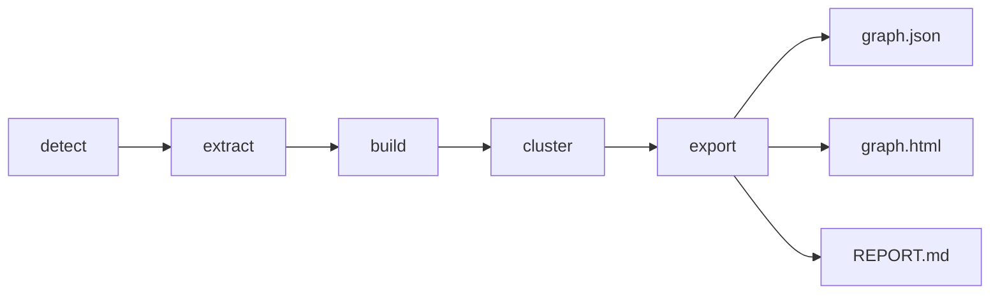

# PRD_graph_pipeline.md — Graphify Integration, Graph Analysis & Obsidian Vault Generation

Version: 1.00 | Status: Draft — awaiting lecturer approval | Course: AI Agent Orchestration — HW4 (EX04)

---

## 1. Document Control

| Field | Value |
|---|---|
| Document | PRD_graph_pipeline.md (specialized PRD — central mechanism: graph pipeline) |
| Parent document | docs/PRD.md (master PRD must be approved before this document is binding) |
| Project | ArchLens — multi-agent reverse-engineering system (package `archlens`, v1.00) |
| Owners | GraphAgent / AnalystAgent feature area; consumed by BugHunterAgent, RefactorAgent, MetricsAgent |
| Source references | Lecture 07 (sections 4–11), Part A (token economics), Part B (knowledge architecture), Part C (graph reading, pp. 5–27), Submission Guidelines V3 |
| Change log | 1.00 — initial draft for lecturer approval |

Workflow gate: per Guidelines V3, this document must be approved together with all docs/ artifacts **before** any development starts.

---

## 2. Purpose

ArchLens reverse-engineers an unfamiliar Python repository by converting it into a knowledge graph (Graphify), analyzing that graph (centrality, communities, bridges, bottlenecks, duplicates), and exposing the result to humans and agents through an Obsidian vault. This PRD specifies the three subsystems that implement that mechanism inside `src/archlens/graphops/` and `src/archlens/vault/`:

1. **Graphify CLI wrapper** — deterministic, restartable execution of the Graphify pipeline.
2. **Analysis engine** — graph-theory computations and evidence-aware interpretation rules (Part C).
3. **Obsidian vault generator** — `hot.md`, `index.md`, `wiki/`, `log.md` navigation layer (LLM Wiki, Part B).

All business logic is reachable **only** through `src/archlens/sdk/sdk.py`; any external API call (LLM-based semantic inference) goes **only** through `src/archlens/gatekeeper/gatekeeper.py` under the rate limits in `config/rate_limits.json` (30 req/min, 500 req/hr, 5 concurrent, FIFO overflow queue). No file in this subsystem may exceed 150 code lines (blank/comment lines excluded).

Out of scope here: agent orchestration graph (see PRD.md), refactoring policy (see PRD.md FR list for RefactorAgent), token cost tables (MetricsAgent PRD section in PRD.md).

---

## 3. Graphify CLI Wrapper

### 3.1 Pipeline stages

The wrapper (`graphops/pipeline.py` + helpers) runs the canonical Graphify pipeline as five ordered, individually resumable stages:



| Stage | Responsibility | Token cost |
|---|---|---|
| detect | Discover candidate files (code, docs, media) under the target repo root from `config/setup.json` | None |
| extract | Structural AST pass: imports, calls, class/function defs (L07 §4.1 — "almost free analysis") | None |
| build | Assemble nodes + edges; optional semantic inference layer adds INFERRED edges | Tokens only if semantic depth enabled |
| cluster | Community detection over the assembled graph | None |
| export | Emit `graph.json`, `graph.html`, `REPORT.md` into the run's artifact directory | None |

### 3.2 Configurable analysis depth (token control)

Per L07 §4.1, structural AST analysis is near-free while semantic inference costs tokens. The wrapper exposes `analysis_depth` in `config/setup.json` (read via `cfg.get`, never hardcoded):

| Depth | Behavior |
|---|---|
| `structural` | AST-only. Produces only EXTRACTED edges. Zero LLM calls. Default for iteration re-runs. |
| `semantic` | Adds LLM inference over docs/comments via the gatekeeper, producing INFERRED and AMBIGUOUS edges with confidence values. |
| `full` | `semantic` plus media transcription if media files are detected. |

Every run records its depth and token spend (gatekeeper counters) so MetricsAgent can attribute graph-scan cost in the before/after token accounting (Part A reality check: initial graph-scan cost is amortized over subsequent queries).

### 3.3 Operational requirements

- Invoked exclusively via `uv run` (pip/virtualenv/venv/`python -m` are forbidden everywhere, including docs and CI).
- Each run writes to a timestamped artifact directory; re-runs never overwrite prior outputs (needed for graph-diff, §8).
- Stage failure raises a typed error through the SDK; partial artifacts are marked invalid in `log.md`.

---

## 4. graph.json Data Model

### 4.1 Nodes

```json
{
  "id": "src/payments/checkout_service.py::CheckoutService.charge",
  "type": "code",
  "source_file": "src/payments/checkout_service.py"
}
```

- `id` (string, unique), `type` (enum: `code`, `doc`, `test`, `rationale`, `media`, `config`), `source_file` (repo-relative path; mandatory — every claim must be traceable to a source, Part C p6).
- Rationale nodes carry subtype `WHY` / `TODO` / `NOTE` (Part C p15) and connect to explained nodes via `rationale_for` edges. They are first-class nodes, not annotations.

### 4.2 Edges

```json
{
  "from": "docs/PRD_auth.md", "to": "src/auth/controller.py",
  "relation": "implements", "type": "INFERRED",
  "confidence": 0.82, "source_file": "docs/PRD_auth.md"
}
```

- **Relation vocabulary (closed set, enum in `shared/constants.py`):** `implements`, `imports`, `calls`, `uses`, `mentions`, `tested_by`, `rationale_for`, `semantically_similar_to`, `validates`, `writes_session`, `checks_policy`, `reads`, `defines`, `ambiguous`.
- **Evidence type (Part C p6):** `EXTRACTED` (direct source evidence — AST import/call), `INFERRED` (semantic hypothesis — requires validation), `AMBIGUOUS` (uncertain — mandatory manual review flag).
- **`confidence`:** float in **[0.55, 0.95]**. EXTRACTED edges are pinned at 0.95; values below 0.65 are treated as "requires validation" in all downstream reporting. Values outside the range are a schema violation.
- **`source_file`:** mandatory on every edge — the reading rule is always relation → confidence → source_file.

### 4.3 Communities, hyperedges

- `communities`: list of `{community_id, label, node_ids[], inter_community_edge_count}`. A community is a density pattern, **not** a folder (Part C p8) — the schema never derives community membership from paths.
- `hyperedges`: `{id, relation, member_node_ids[], source_file}` representing one group-level claim (e.g., PRD + module + test + WHY jointly validate a decision, Part C p22). Hyperedges must never be silently decomposed into pairwise edges.

### 4.4 Validation

`graphops/schema.py` validates every loaded `graph.json` (unknown relation, missing source_file, confidence out of range → typed validation error). The SDK refuses to hand an invalid graph to any agent.

---

## 5. Analysis Engine Requirements

Implemented in `graphops/analysis*.py`, consumed by AnalystAgent and BugHunterAgent. Every output finding carries the evidence triple (relation, confidence, source_file) and an evidence-ladder level (OBSERVED → INFERRED → EXTRACTED → VALIDATED).

### 5.1 Centrality

- Degree centrality (fan-in/fan-out separately) and betweenness centrality for every node.
- Output ranked tables; top-10 feeds `hot.md` (§7.1) and BugHunterAgent's god-node candidates.

### 5.2 Community detection

- Communities computed from edge density (modularity-based), with the explicit **COMMUNITY != FOLDER caveat** attached to every community report: membership may cross folder, layer, and technology boundaries (Part C p8). Reports must list, per community, the fraction of members outside the community's dominant folder.

### 5.3 Hub-vs-bottleneck classifier

A high-centrality node is **not** automatically a problem (Part C p11). Classification requires an **alternatives analysis**:

- **Healthy hub:** alternatives exist — removing the node leaves alternate paths between its neighbor communities; relation types indicate intentional shared abstraction.
- **Bottleneck:** the node is a mandatory path — a measurable share of shortest paths between communities pass through it and no alternate path exists. Only then may BugHunterAgent raise an architectural-bug claim, citing degree, betweenness, relation types, and source files.

### 5.4 Bridge detection — both course senses

The engine must detect and label bridges in **both** senses used in the course, and never conflate them:

1. **Redundant alternate path (L07 §10.1):** an edge/path providing fallback between two routes — an architectural *asset* (robustness) with a *cost* (duplication, consistency risk).
2. **Community connector (Part C p8):** a node sitting between communities through which inter-community knowledge flows — a focal point and potential architectural risk.

### 5.5 SPOF critical-path analysis

- Path-level analysis of entry-point flows, modeled on the auth example: UI → controller → `validates` → session store → `reads` DB, with `checks_policy` on the side (Part C p9; L07 §11 — "authentication as a path, not a word").
- Critical edges (e.g., `validates` / `writes_session` / `checks_policy` — all members of the §4.2 relation vocabulary) are verified individually; a node whose removal disconnects a critical path is flagged Single Point of Failure with the full path as evidence.

### 5.6 Duplicate triage

- Pairs linked by `semantically_similar_to` with similarity **>= 0.91** become *merge candidates* — never verdicts (Part C p13, p26).
- Triage checklist per pair: purpose, usage/consumers, neighbors, tests, source. Rule (hard, enforced in code and prompts): **never merge without manual check** — if any dimension differs significantly, the candidate is demoted to "leave / manual review". RefactorAgent may only merge candidates the triage marked VALIDATED.

### 5.7 Isolation findings

Isolated clusters are reported as *findings, not conclusions* (Part C p12), with the interpretation checklist (legacy / parser miss / semantic-only relation / intentional) attached for BugHunterAgent.

---

## 6. Reading API — Macro → Meso → Micro, and the Four Commands

The SDK exposes a reading API enforcing the Part C reading order: **macro** (whole graph: communities, bridges, isolated areas) → **meso** (one community: what holds it together) → **micro** (one node/edge: relation + confidence + source_file). Agents must not start at micro level; the API makes the macro summary the cheapest call (token-targeted retrieval, L07 §7.1).

Four commands (Part C p17), all via `sdk.py`:

| Command | Contract |
|---|---|
| `query(filters)` | Find nodes/edges by type, relation, label, confidence range, community. Turns a hunch into a research question. |
| `path(src, dst)` | Return evidence chains between two nodes (e.g., PRD REQ → `implements` → module → `tested_by` → test). Used for the PRD-vs-code traceability audit. |
| `explain(edge_or_node)` | Decompose one element: relation, direction, type, confidence, source_file, attached rationale nodes, hyperedge memberships. |
| `diff(run_a, run_b)` | Compare two Graphify runs (§8). Answers: did the structure change, or just the appearance? |

---

## 7. Obsidian Vault Generator

`vault/` renders the analyzed graph into an Obsidian vault (the project's LLM Wiki, Part B: raw/ → wiki/, hub-first reading, before/after measurement on source traceability, noise reduction, correct-file identification, correct-tool-at-the-right-time).

### 7.1 hot.md — specification fixed by this PRD

The course names `hot.md` but never defines its contents; **this PRD fixes the spec**. `hot.md` is the agent's first-read attention page and contains exactly three sections:

1. **Top-10 centrality nodes** — ranked by betweenness (degree as tiebreaker), each with one-line role, hub/bottleneck verdict, and wikilink to its community page.
2. **Entry points** — CLI mains, public APIs, UI endpoints (path-reading starts at user-facing nodes, Part C p9).
3. **Current anomalies needing review** — all AMBIGUOUS edges, confidence < 0.65 INFERRED edges, isolated clusters, and open duplicate candidates (>= 0.91), each with relation, confidence, source_file.

`hot.md` is regenerated on every Graphify run; budget <= 120 Markdown lines so it stays cheap to inject into any agent context.

### 7.2 index.md — hub page

The vault's navigation hub, read **first** by any agent, after which at most 2–3 linked pages are pulled (Part B reading protocol). Contains: project one-liner, link to `hot.md`, the community map (one wikilink per `wiki/` page), and the artifact list (graph.json / graph.html / REPORT.md locations).

### 7.3 wiki/ — one page per community

Each community gets `wiki/<community-label>.md` with YAML frontmatter:

```markdown
---
type: community
status: generated
project: archlens-target
---
# Community: payments
Members: [[checkout_service]] · [[billing_api]] · ...
Held together by: implements/tested_by density around PRD_payments.md
Bridges out: [[auth]] via SessionStore (community connector)
```

Requirements: frontmatter keys `type`, `status`, `project`; member list with `[[wikilinks]]`; what holds the community together (domain/layer/docs/rationale); bridge nodes out; folder-overlap stat (§5.2 caveat).

### 7.4 log.md — ingestion journal

Append-only journal: one entry per pipeline run with timestamp, analysis depth, stage outcomes, node/edge/community counts, token spend, anomalies opened/closed, and diff summary vs. previous run. This is the Part B ingestion log and the audit trail QAAgent checks.

### 7.5 Vault functional requirements

| ID | Requirement |
|---|---|
| FR-VAULT-01 | `hot.md` SHALL contain exactly three sections (top-N centrality, entry points, anomalies needing review) and stay within `HOT_MAX_LINES` (120) lines. |
| FR-VAULT-02 | `index.md` SHALL be the read-first hub: a read-first banner, 2–3 curated next-read wikilinks, and a full community map linking every `wiki/` page. |
| FR-VAULT-03 | `wiki/` SHALL hold one note per community, each with `type/status/project` frontmatter, a member list, bridge-out links, and back-links to `index.md` and `hot.md`. |
| FR-VAULT-04 | `raw/` SHALL hold verbatim, checksummed copies of `graph.json` and `REPORT.md`; no generator other than raw-ingest writes there. |
| FR-VAULT-05 | `log.md` SHALL be an append-only, ISO-8601-timestamped journal — existing content is never truncated. |
| FR-VAULT-06 | Every generated note SHALL carry the mandatory frontmatter keys and obey one-idea-per-note (a single H1). |
| FR-VAULT-07 | Every wikilink SHALL resolve to an existing note; a clean build SHALL report zero broken links and zero orphans (`index`/`log` excepted as hubs/journals). |
| FR-VAULT-08 | A rebuild SHALL be deterministic: `wiki/`, `hot.md`, and `index.md` byte-identical while `log.md` grows by exactly one entry. |

### 7.6 Obsidian-open smoke test (manual)

1. Run `uv run archlens vault <path/to/graph.json>` — **expected:** exit code 0 and the vault root path printed.
2. In Obsidian choose *Open folder as vault* on the printed root — **expected:** the vault opens with `index.md` listed.
3. Open the Graph view — **expected:** community clusters render with no parse errors.
4. Open the *Unresolved links* pane — **expected:** it is empty (zero unresolved links).
5. Navigate `index.md` → `hot.md` → any community page — **expected:** every target resolves within 2–3 hops.

After a successful manual pass, append a dated `PASS` line and the §7.4 knowledge-asset before/after table to `log.md`.

---

## 8. Re-run and Graph-Diff Support (Improvement Loop)

After every RefactorAgent change, GraphAgent re-runs Graphify (default depth `structural` to keep iteration cost near zero) and the engine computes `diff(before, after)` over the Part C p21 metrics:

| Diff metric | Stop-condition interpretation |
|---|---|
| Bottleneck dependencies | The bottleneck node actually **lost** dependencies — load not merely moved to a new node |
| Modularity | Fewer inter-community edges (clearer separation) |
| Isolation | No new isolated components; ideally isolated components gained links |
| Tests | All unit tests green after every change (QAAgent) |
| Lint | Ruff 0 violations |

The loop terminates when all conditions pass or at the hard cap of **5 iterations**. Diff output is machine-readable JSON plus a human section appended to `log.md`.

---

## 9. Functional Requirements

| ID | Requirement |
|---|---|
| FR-GP-01 | The wrapper SHALL run detect → extract → build → cluster → export and produce graph.json, graph.html, REPORT.md per run. |
| FR-GP-02 | The wrapper SHALL honor `analysis_depth` from config/setup.json; `structural` runs SHALL make zero LLM calls. |
| FR-GP-03 | All LLM-backed inference calls SHALL pass through gatekeeper.py under config/rate_limits.json (FIFO queue, never reject or crash). |
| FR-GP-04 | graph.json SHALL be schema-validated on load; violations (unknown relation, missing source_file, confidence outside 0.55–0.95) SHALL raise typed errors. |
| FR-GP-05 | The engine SHALL compute degree and betweenness centrality for all nodes and rank a top-10 list. |
| FR-GP-06 | The engine SHALL detect communities and report per-community folder-overlap, with the COMMUNITY != FOLDER caveat in every report. |
| FR-GP-07 | The hub-vs-bottleneck classifier SHALL require an alternatives analysis before labeling any node a bottleneck. |
| FR-GP-08 | Bridge detection SHALL label both senses (redundant alternate path; community connector) distinctly. |
| FR-GP-09 | SPOF analysis SHALL operate on full entry-point paths and verify each critical edge (e.g., validates / writes_session / checks_policy). |
| FR-GP-10 | Duplicate triage SHALL trigger at similarity >= 0.91 and SHALL NOT mark a pair mergeable without the manual-check rule passing. |
| FR-GP-11 | The SDK SHALL expose query, path, explain, and diff with macro → meso → micro reading order. |
| FR-GP-12 | The vault generator SHALL emit hot.md (per §7.1 spec, <= 120 lines), index.md, one wiki/ page per community with frontmatter (type, status, project) and wikilinks, and append to log.md. |
| FR-GP-13 | diff SHALL compute the Part C p21 metrics and report stop-condition status for the improvement loop (hard cap 5 iterations). |
| FR-GP-14 | Every finding emitted to agents SHALL cite relation → confidence → source_file and an evidence-ladder level. |

Non-functional: NFR-GP-01 every source file <= 150 code lines; NFR-GP-02 coverage >= 85% (fail_under=85) on graphops/ and vault/; NFR-GP-03 Ruff 0 violations; NFR-GP-04 no hardcoded values outside shared/constants.py; NFR-GP-05 all execution via `uv run` only.

---

## 10. Test Plan

TDD (red-green-refactor) with synthetic fixture graphs in `tests/fixtures/` — small hand-checkable graphs, no Graphify run needed:

1. **`star_5.json`** — known 5-node star (center C, leaves L1–L4). Hand-computed: degree(C)=4, betweenness(C)=1.0 normalized, leaves 0. Asserts exact centrality values and that C tops the hot.md ranking.
2. **`chain_5.json`** — 5-node path A–B–C–D–E. Hand-computed betweenness: C > B = D > A = E. C is a mandatory-path bottleneck (no alternatives); adding edge B–D in a variant fixture must flip C to healthy-hub → exercises the alternatives analysis (FR-GP-07).
3. **`two_communities.json`** — two 5-node cliques joined by one connector node whose members deliberately share folders across cliques → asserts community detection, connector-sense bridge labeling, and the folder-overlap stat (FR-GP-06, FR-GP-08).
4. **`spof_auth.json`** — UI → controller → validates → session → reads → DB, plus checks_policy edge; removing the controller must yield a SPOF finding with the full path cited (FR-GP-09).
5. **`dupes.json`** — pair at 0.93 with identical consumers/tests (mergeable) and pair at 0.92 with divergent consumers (must demote to manual review) (FR-GP-10).
6. **Schema negatives** — confidence 0.50 and 0.96, unknown relation `depends_on`, missing source_file → typed errors (FR-GP-04).
7. **Diff pair** — before/after fixtures replaying Part C p21 (hub loses edges, isolated node gains a link) → asserts all five stop-condition metrics (FR-GP-13).
8. **Vault snapshot tests** — generator output for `two_communities.json` compared against golden files (frontmatter keys, wikilinks, hot.md sections and line budget) (FR-GP-12).
9. **Gatekeeper/depth tests** — `structural` run with a mocked gatekeeper asserts zero outbound calls; `semantic` run asserts FIFO queueing under the 5-concurrent limit (FR-GP-02, FR-GP-03).

All tests run via `uv run pytest`; fixture and test files also obey the 150-line limit (split fixtures into separate JSON files, not inline literals).

---

## 11. Acceptance Criteria

The graph pipeline mechanism is DONE when, on the configured target repo:

1. `uv run` of the full pipeline produces graph.json, graph.html, REPORT.md and a valid Obsidian vault (hot.md per §7.1, index.md, wiki/ pages with frontmatter, log.md entry) with zero manual edits.
2. graph.json passes schema validation; spot-checking 10 random edges confirms relation, type, confidence in [0.55, 0.95], and a real source_file.
3. AnalystAgent's report contains centrality top-10, communities with folder-overlap stats and the COMMUNITY != FOLDER caveat, both bridge senses, at least one hub-vs-bottleneck verdict with alternatives evidence, and SPOF path findings — every claim citing relation → confidence → source_file.
4. A duplicate candidate at >= 0.91 exists in the report (or the report explicitly states none found) and no merge occurred without VALIDATED triage.
5. One full improvement-loop iteration runs: refactor → structural re-run → diff with all five stop-condition metrics evaluated → tests green; loop respects the 5-iteration cap.
6. Quality gates: coverage >= 85%, Ruff 0 violations, all files <= 150 code lines, no pip/venv/requirements.txt anywhere in code, docs, or CI.
7. MetricsAgent can read per-run token spend from log.md to compute the >= 70% savings claim (or the written amortization explanation if not achieved).

---

*End of PRD_graph_pipeline.md — Version 1.00. Approval by the lecturer is required before implementation of graphops/ and vault/ begins.*
