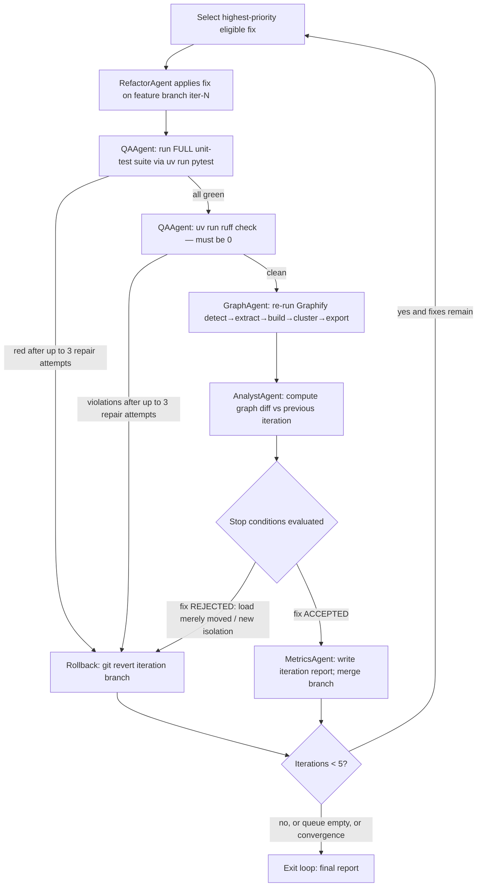

# PRD_improvement_loop.md — Specialized PRD: The Improvement Loop

Version: 1.00 | Status: Approved (lecturer sign-off 2026-06-14) | Course: AI Agent Orchestration — HW4 (EX04)

---

## 1. Document Control

| Field | Value |
|---|---|
| Document | PRD_improvement_loop.md (specialized PRD per central mechanism, Guidelines V3) |
| Project | ArchLens (`archlens` package, version 1.00) |
| Mechanism covered | Iterative improvement loop (EX04 Core Task 5, Lecture 07 section 11) |
| Parent documents | `docs/PRD.md` (must be approved first), `docs/PLAN.md`, `docs/TODO.md` |
| Source course material | L07 section 11; Part C p21 (graph diff metrics); Guidelines V3 sections 3.2, 6 |
| Owner agents | RefactorAgent (apply), QAAgent (verify), GraphAgent (re-graph), AnalystAgent (diff), MetricsAgent (report) |
| Approval gate | This PRD must be approved BEFORE development of the loop begins |
| Change log | 1.00 — initial draft for lecturer approval. Mechanism-team review 2026-06-14: "Version: 1.00" header confirmed present; FR catalogue confirmed (12 FR-IL IDs, FR-IL-01..12, exceeds the 8-ID bar); loop controller, P1-P5 fix taxonomy, the 5 stop conditions, and the rollback/evidence policy all confirmed specified. **0 open findings.** |

---

## 2. Purpose

EX04 Core Task 5 requires an improvement loop: **RefactorAgent applies a fix → Graphify is
re-run → graph metrics are diffed against stop conditions → unit tests run after EVERY
change**. This PRD specifies that loop precisely: which fixes are eligible, in what priority
order, how each iteration is executed and verified, the exact stop conditions, the rollback
policy, the evidence bar a fix must meet, and the per-iteration report format. The loop is
orchestrated by the ArchLens LangGraph supervisor and is hard-capped at **5 iterations**.

The guiding question (Part C p21) is: *did the structure change — or just the appearance?*
A fix that merely moves load from one node to another is a failed fix, even if all tests pass.

---

## 3. Scope

In scope: selection, application, verification, and reporting of architectural fixes on the
**target repository** cloned by RepoAgent (configured in `config/setup.json`). Out of scope:
initial bug detection (see `docs/PRD.md` BugHunterAgent requirements), Graphify internals,
token accounting methodology (MetricsAgent PRD sections in `docs/PRD.md`).

---

## 4. Fix Taxonomy and Priorities

Fixes are drawn from the BugHunterAgent findings queue and executed strictly in priority
order. Within a priority class, the fix with the highest evidence confidence is selected first.

| Priority | Fix class | Trigger condition | Action by RefactorAgent |
|---|---|---|---|
| **P1** | Single Point of Failure (SPOF) on a critical path | A node whose removal disconnects a critical execution path (bridge/articulation analysis by AnalystAgent) | Introduce redundancy or invert the dependency so the path no longer transits a single node |
| **P2** | Bottleneck god-node split | Node classified **bottleneck** by AnalystAgent's hub-vs-bottleneck classification — **never** applied to a healthy hub (a hub manages dependencies; a bottleneck concentrates risk and change) | Split responsibilities into cohesive modules; redistribute incoming/outgoing edges |
| **P3** | Module > 150 lines (code lines; blank/comment lines excluded) | File length audit on the target repo | Split — never compress — using one of the 5 splitting strategies (Guidelines V3 §3.2): extract helper functions, extract mixins, 50/50 split of two distinct logics, extract constants, extract models |
| **P4** | Validated duplicate logic | Similarity edge ≥ **0.91** AND the duplicate passed **manual triage** (consumers, tests, call sites, owners/SLA compared; similarity alone is never sufficient) | Merge into a shared module / base class / mixin per the DRY thresholds |
| **P5** | PRD-vs-code misalignment | Alignment audit found an unimplemented requirement or an orphan module | Implement the missing requirement stub-first, or quarantine the orphan with an ADR note (deletion requires human approval — see §10) |

Rules:

- A P4 fix is **never** scheduled before its manual check is recorded in the decision log.
- A P2 fix is **never** scheduled if the AnalystAgent classification is `hub` or `ambiguous`;
  only `bottleneck` qualifies.
- At most **one fix per iteration**, so every graph diff is attributable to exactly one change.

---

## 5. Loop Algorithm

Step detail (one iteration `N`, `N` ∈ 1..5):

1. **Select** — supervisor picks the top fix per §4 priorities.
2. **Apply** — RefactorAgent applies the fix on a dedicated feature branch
   `archlens/iter-<N>-<fix-id>`; the working tree is never modified on the main branch.
3. **Test gate** — QAAgent runs the **full** unit-test suite (`uv run pytest`).
   **On any red test, RefactorAgent attempts repair up to 3 times; if still red ⇒ revert**
   (§7). No fix is ever kept on red; no skipped tests.
4. **Lint gate** — `uv run ruff check` must report **0 violations**; on violations,
   RefactorAgent attempts repair up to 3 times; if still red ⇒ revert (§7).
5. **Re-graph** — GraphAgent re-runs the full Graphify pipeline
   (detect → extract → build → cluster → export), producing a fresh `graph.json`.
6. **Diff** — AnalystAgent computes the graph diff: per-node degree delta, betweenness
   centrality delta, inter-community edge count delta, connected-components delta.
7. **Evaluate** — stop conditions (§6) are evaluated. The fix is ACCEPTED or REJECTED.
8. **Iterate or exit** — exit when convergence is reached, the fix queue is empty, or the
   hard cap of **5 iterations** is hit, whichever comes first.

---

## 6. Stop Conditions (Exact — Part C p21 Diff Metrics)

A fix is ACCEPTED, and the loop may terminate as converged, only when **all** of the
following hold after re-running Graphify:

| # | Condition | Measurement |
|---|---|---|
| SC-1 | The bottleneck node **actually lost dependencies** — not merely moved its load to a new node | Compare **both** the degree delta **and** the betweenness centrality delta of the targeted node; additionally assert no other node's degree/betweenness rose to within 10% of the old bottleneck's pre-fix values (load-migration check) |
| SC-2 | **Improved modularity** | Count of inter-community edges strictly decreased (or unchanged for P3/P5 fixes that do not target coupling) |
| SC-3 | **No new isolated components** | Connected-component count did not increase; no node became degree-0 |
| SC-4 | **All unit tests green** | `uv run pytest` exit code 0, full suite |
| SC-5 | **Ruff clean** | `uv run ruff check` reports 0 violations |

Failure of SC-4 or SC-5 triggers rollback before the diff is even computed (loop steps 3-4).
Failure of SC-1, SC-2, or SC-3 marks the fix REJECTED and triggers rollback; the fix is
re-queued at most once with an amended strategy, then discarded with a decision-log entry.
Hard cap: the loop never exceeds **5 iterations**, converged or not.

---

## 7. Rollback Policy

- On red tests or ruff violations, RefactorAgent attempts repair up to **3 times**; if the
  gate is still red after the third attempt, the iteration is reverted. **No fix is ever
  kept on red.**
- Every iteration lives on its own feature branch (`archlens/iter-<N>-<fix-id>`).
- Rollback = `git revert` of the iteration branch commits (history-preserving; **never**
  `reset --hard` on shared history), then the branch is closed unmerged.
- The reverted state must be byte-identical to the pre-iteration baseline; QAAgent re-runs
  the test suite post-revert to prove the baseline is still green.
- A rolled-back iteration **still counts** toward the 5-iteration hard cap.
- Every rollback is recorded in the decision log with the failed condition (SC-x or test/lint
  gate) as the stated cause.

> **Implementation status (shipped `LoopController`).** The convenience loop assembled by
> `loop_wiring.build_loop_deps` realizes "no fix kept on red" by **branch isolation + SC-4
> rejection**, not by an automatic in-loop `git revert`: each iteration is applied on its own
> `archlens/iter-<N>-<fix-id>` feature branch (the undo path), the `TestGate` verdict feeds **SC-4**,
> and a red verdict fails SC-4 so the fix is never accepted/merged to baseline (the failing change
> stays isolated on its unmerged branch). The history-preserving `git revert` rollback
> (`shared/gitops.revert_commit`, wrapped by `agents/test_gate.gate_then_rollback`) **is implemented
> and unit-tested** (`tests/test_rollback.py`, `tests/test_red_gate_rollback.py`) for any iteration
> whose change was committed, but it is exercised by those tests rather than auto-invoked inside
> `loop_controller._apply_fix`. Net effect (no red fix reaches baseline) matches this policy; the
> mechanism is branch-isolation rejection rather than an automatic revert transition.

---

## 8. Evidence Requirement

Every applied fix must be justified at the **VALIDATED** level of the
BugHunterAgent evidence ladder (OBSERVED → INFERRED → EXTRACTED → VALIDATED).

- OBSERVED-, INFERRED-, or EXTRACTED-level findings may enter the queue but are **blocked
  from execution** until upgraded to VALIDATED by source-level verification.
- A fix is **never** applied on the strength of a similarity edge alone — a ≥ 0.91
  similarity score is a trigger for manual triage, not a justification (Part C: same wording,
  different context ⇒ do not merge before manual check).
- Each justification cites the full chain: `relation → confidence (0.55–0.95) → source_file`,
  consistent with the AnalystAgent edge triage classes (EXTRACTED / INFERRED / AMBIGUOUS).

---

## 9. Iteration Report Format

MetricsAgent writes `results/improvement_loop/iteration_<N>.md` after every iteration
(accepted or rolled back), containing:

1. **Header** — iteration number, fix id, priority class, branch name, evidence level cited.
2. **Before/after metrics table:**

   | Metric | Before | After | Delta | Stop condition |
   |---|---|---|---|---|
   | Target node degree | | | | SC-1 |
   | Target node betweenness | | | | SC-1 |
   | Max degree of any other node | | | | SC-1 (load-migration check) |
   | Inter-community edges | | | | SC-2 |
   | Connected components | | | | SC-3 |
   | Tests passed / total | | | | SC-4 |
   | Ruff violations | | | | SC-5 |
   | Files > 150 code lines | | | | P3 backlog |

3. **Diff summary** — nodes/edges added, removed, re-clustered (from Graphify export diff).
4. **Decision log** — ACCEPTED/REJECTED/ROLLED-BACK, which condition decided it, the
   evidence citation (`relation → confidence → source_file`), and any human approval recorded.

A final `results/improvement_loop/summary.md` aggregates all iterations for the submission.

---

## 10. Safety Guardrails

Aligned with the SKILL.md guardrail tiers (Part B knowledge-asset requirements):

| Operation class | Tier | Policy |
|---|---|---|
| Graph reads, diffs, reports | Read-only | Automatic, no approval needed |
| Refactors (split, extract, merge, move) | **Irreversible** | Require **explicit human approval per change** before execution, enforced via LangGraph `interrupt_before=[RefactorAgent]`; the feature branch + `git revert` (§7) remains the technical undo path, but approval is still required before applying; RefactorAgent must verify the branch exists before editing |
| Deletions (removing an orphan module, dropping a file, deleting a public API) | **Irreversible** | Require **explicit human approval** before execution; the approval (who/when) is recorded in the decision log; absent approval, the agent quarantines instead of deletes |

Additional guardrails: no fix may touch `config/` secrets or `.env`; the loop never operates
on the ArchLens codebase itself, only on the cloned target repo; all LLM calls made during
the loop go through `gatekeeper/gatekeeper.py` under `config/rate_limits.json` limits.

---

## 11. Functional Requirements

| ID | Requirement | Testable assertion |
|---|---|---|
| FR-IL-01 | The loop shall execute at most 5 iterations | Iteration counter never exceeds 5 in any run, including rolled-back iterations |
| FR-IL-02 | Exactly one fix shall be applied per iteration, on a dedicated feature branch | Each iteration's diff touches one fix-id; branch `archlens/iter-<N>-<fix-id>` exists |
| FR-IL-03 | The full unit-test suite shall run after every change; no fix is kept on a red test (shipped via branch-isolation + SC-4 rejection — see §7 Implementation status; `git revert` rollback is unit-tested for committed iterations) | `--loop` `TestGate` runs `uv run pytest` each iteration; a red verdict fails SC-4 so the fix is not merged to baseline; `tests/test_rollback.py` / `tests/test_red_gate_rollback.py` prove the `git revert` helper restores a green baseline |
| FR-IL-04 | Graphify shall be re-run (detect→extract→build→cluster→export) after every accepted test gate | Fresh `graph.json` timestamp per iteration |
| FR-IL-05 | SC-1 shall compare both degree and betweenness deltas and reject pure load migration | Fixture where load moves to a new node ⇒ fix REJECTED |
| FR-IL-06 | SC-2/SC-3 shall reject fixes that raise inter-community edges or create isolated components | Fixture producing a degree-0 node ⇒ fix REJECTED |
| FR-IL-07 | P2 splits shall only target nodes classified `bottleneck`, never `hub` | Hub-classified fixture node is never queued for P2 |
| FR-IL-08 | P4 merges shall require similarity ≥ 0.91 AND a recorded manual check | Missing manual-check record ⇒ fix blocked |
| FR-IL-09 | Every applied fix shall cite VALIDATED-level evidence with `relation → confidence → source_file` | Report parser finds the citation triple for every accepted fix |
| FR-IL-10 | Irreversible operations (deletions) shall require explicit human approval | Deletion without approval flag ⇒ operation refused, quarantine applied |
| FR-IL-11 | An iteration report shall be emitted for every iteration, accepted or rolled back | `iteration_<N>.md` exists for all N executed |
| FR-IL-12 | Rollback shall restore the pre-iteration baseline exactly | Post-revert tree hash equals pre-iteration tree hash; tests green |

Non-functional: NFR-IL-01 — loop code lives in `src/archlens/` (business logic only via
`sdk/sdk.py`), every file ≤ 150 code lines; NFR-IL-02 — coverage of loop modules ≥ 85%
(statement + branch + path), ruff 0; NFR-IL-03 — no hardcoded thresholds: 0.91, 150, 85
are read from `config/setup.json` / `shared/constants.py`, and the 5-iteration cap is read
exclusively from `shared/constants.py` as `MAX_LOOP_ITERATIONS`, never inlined.

---

## 12. Test Plan (TDD — red-green-refactor, `uv run pytest`)

Fixture: a small synthetic repository committed under `tests/fixtures/loop_target/` with
**planted defects**: (a) a SPOF node on the critical path, (b) one module of ~200 code lines,
(c) a duplicate function pair with similarity ≥ 0.91, (d) a deliberately failing test that is
activated only in the rollback scenario.

| Test | Scenario | Assertion |
|---|---|---|
| T-IL-01 | Full loop on fixture | Loop converges in ≤ 5 iterations; SPOF fixed first (P1 before P3/P4) |
| T-IL-02 | Convergence | Final diff satisfies SC-1..SC-5; summary report written |
| T-IL-03 | Rollback path | Activate planted failing test ⇒ revert executed, baseline green, iteration counted |
| T-IL-04 | Load-migration rejection | Mock diff where betweenness moves to a new node ⇒ REJECTED, rollback |
| T-IL-05 | Hub protection | Hub-classified node never receives a P2 split |
| T-IL-06 | Duplicate triage gate | 0.91 similarity without manual-check record ⇒ fix blocked |
| T-IL-07 | Hard cap | Endless-fix mock ⇒ loop halts at exactly 5 iterations |
| T-IL-08 | Irreversible gate | Deletion request without approval ⇒ refused and quarantined |
| T-IL-09 | Report integrity | Every iteration report contains the §9 metrics table and evidence citation |

External dependencies (Graphify runs, git, LLM calls) are mocked per Guidelines V3 §6; test
files ≤ 150 lines each; shared fixtures in `tests/conftest.py`.

---

## 13. Acceptance Criteria

The improvement-loop mechanism is DONE when all of the following hold:

1. All FR-IL-01..12 tests (T-IL-01..09) pass under `uv run pytest`; coverage of loop modules
   ≥ 85% with `fail_under=85`; `uv run ruff check` reports 0 violations.
2. A real run against the configured target repo produces ≥ 1 accepted fix with iteration
   reports proving SC-1..SC-5, or a documented rejection trail if no fix converges.
3. The decision log demonstrates: priority ordering respected, evidence citations present
   for every applied fix, no fix applied on a similarity edge alone, and every rollback
   traceable to a named condition.
4. No iteration exceeded the hard cap; no irreversible operation executed without recorded
   human approval.
5. This PRD was approved by the lecturer before loop development started (workflow gate,
   Guidelines V3 §2.5).

---

*References: Lecture 07 section 11 (EX04 core tasks); Part C p21 (graph diff: "did a central
node lose dependencies, or was the load just moved?"); Part C duplicate-triage rules;
Guidelines V3 §3.2 (150-line rule and the 5 splitting strategies), §6 (testing).*
