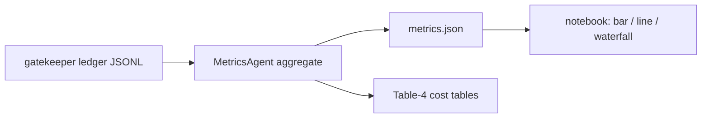

# PRD_token_metrics.md — Token Measurement & Cost Analysis (ArchLens)

Version: 1.00 | Status: Draft — awaiting lecturer approval | Course: AI Agent Orchestration — HW4 (EX04)

---

## 1. Document Control

| Field | Value |
|---|---|
| Document | PRD_token_metrics.md (specialized PRD — central mechanism: token economics) |
| Parent document | docs/PRD.md (must be approved before this document is actioned) |
| System | ArchLens — multi-agent reverse-engineering system (package `archlens`, v1.00) |
| Owner components | `src/archlens/metrics/` (MetricsAgent), `src/archlens/gatekeeper/gatekeeper.py` |
| Sources | Lecture 07 §11; Part A (reality check / amortization); Part B (knowledge-quality metrics, 5.1x report); Part C (graph diff metrics); Submission Guidelines V3 §11 (Table 4 cost analysis) |
| Approval gate | Per Guidelines V3 workflow: PRD approved first; ALL docs approved before development starts |
| Change log | 1.00 — initial draft. Mechanism-team review 2026-06-14: version header confirmed; FR catalogue confirmed (FR-TM-01..10, exceeds the 5-ID bar) plus NFR-TM-01..02; savings formula confirmed verbatim (`savings_pct = 100 × (T_baseline − T_assisted) / T_baseline`), with amortization and break-even formulas; ledger model and ≥70% target confirmed specified. **0 open findings.** |

---

## 2. Purpose

The course **requires** an empirical before/after proof that graph-assisted context (Graphify + LLM Wiki)
reduces LLM token consumption versus naive full-context prompting (L07 §11; Part B). ArchLens must:

1. Measure token usage of a **BASELINE** (naive) run and an **ASSISTED** (graph-targeted) run over an
   identical workload, instrumented at a single choke point (the gatekeeper).
2. Compute savings against the target of **>= 70%** (course cites a 70–95% range; community usage
   reports cite up to **5.1x fewer tokens** in code queries — Part B).
3. Produce cost tables per model (Guidelines V3, Table-4 style).
4. Score the four Part B knowledge-quality metrics before/after.
5. If the >= 70% target is **not** achieved, a **written explanation is mandatory** (Part A reality
   check: initial graph-scan cost must be amortized before savings are realized). Missing the target
   with an honest explanation is acceptable; missing the explanation is a submission failure.

---

## 3. Methodology

### 3.1 BASELINE run (naive, no graph)

- The answering agent receives the **10 standard questions** (§3.3) about the target repository.
- Context strategy: **raw-file context stuffing** — for each question, the relevant source files (or,
  when relevance is unknown, the full repository file listing plus the largest candidate files) are
  injected verbatim into the prompt up to the model context limit. No graph.json, no index.md, no
  wiki/ pages, no subgraph injection.
- Tool budget: file reads only; no Graphify artifacts may be consulted.
- Every LLM call passes through the gatekeeper and is tagged `run_id="baseline"`.

### 3.2 ASSISTED run (graph-targeted retrieval)

- The **same 10 questions**, same model(s), same temperature, same max-output settings.
- Context strategy (Part B LLM Wiki protocol): read **`index.md` first** (hub), then at most
  **2–3 wiki/ pages** selected via the hub, **or** inject a focused **subgraph** extracted from
  `graph.json` (nodes within 1–2 hops of the entities named in the question).
- Raw source files may be opened only when a wiki page or subgraph explicitly points to them
  (traceable retrieval), and only the cited files.
- Every LLM call is tagged `run_id="assisted"`.

### 3.3 Standard question set (Q1–Q10)

Both runs answer exactly these 10 questions, in order, one conversation per question (no carryover):

| # | Question | Probes |
|---|---|---|
| Q1 | List the top-level packages/modules of the target repo and their one-line responsibilities. | Structure |
| Q2 | Draw the dependency direction between the three most-connected modules. | Dependencies |
| Q3 | Which node is the strongest hub (highest degree centrality), and is it a hub or a bottleneck? | Hub vs bottleneck (Part C) |
| Q4 | Identify the Single Point of Failure: which node's removal disconnects the most components? | SPOF |
| Q5 | List all bridge edges and what each bridge connects. | Bridges |
| Q6 | Which two functions/classes are duplicate logic candidates (similarity >= 0.91), and where? | Duplication |
| Q7 | Which class inherits from / composes which? Sketch the OOP class schema for the core package. | OOP schema |
| Q8 | Which PRD/README-stated requirements have no implementing module (unimplemented requirements)? | PRD alignment |
| Q9 | Which modules are orphans (no incoming references from any documented requirement)? | Orphans |
| Q10 | Propose the single highest-value refactor and the files it would touch. | Synthesis |

Ground-truth answers are fixed once from Graphify output + manual review and used to grade **both**
runs for correctness, so savings are never claimed on degraded answer quality.

### 3.4 Controlled variables

Same model ID, same prompts (only the context block differs), same `config/setup.json` target repo
and commit hash, rate limits per `config/rate_limits.json` (30 req/min, 500 req/hr, 5 concurrent).
No values hardcoded — question file path, run tags, and prices come from config (`cfg.get`).

---

## 4. Instrumentation — Gatekeeper Ledger

ALL external API calls flow through `src/archlens/gatekeeper/gatekeeper.py` (mandatory architecture
rule), making it the single, complete measurement point. The gatekeeper appends one ledger record
per call:

```json
{
  "ts": "2026-06-12T10:30:00Z",
  "run_id": "baseline | assisted",
  "phase": "questions | graph_build",
  "question_id": "Q1..Q10 | null",
  "agent": "RepoAgent|GraphAgent|AnalystAgent|BugHunterAgent|RefactorAgent|QAAgent|MetricsAgent",
  "model": "<model id from config>",
  "input_tokens": 0,
  "output_tokens": 0,
  "cached_tokens": 0,
  "latency_ms": 0
}
```

- Token counts are taken from the provider's API response usage object (authoritative), not from a
  local tokenizer estimate.
- The ledger is an append-only JSONL file under `metrics/` output dir; MetricsAgent is the **only**
  reader/aggregator (SDK-mediated, per the single-SDK-entry-point rule).
- `phase="graph_build"` records the one-time Graphify/wiki construction cost — counted **honestly**
  and used in §8 amortization, never silently dropped.

---

## 5. Savings Formula and Target

```text
T_baseline  = Σ (input_tokens + output_tokens) over run_id=baseline, phase=questions
T_assisted  = Σ (input_tokens + output_tokens) over run_id=assisted, phase=questions
T_build     = Σ (input_tokens + output_tokens) over phase=graph_build  (LLM-assisted steps only)

savings_pct       = 100 × (T_baseline − T_assisted) / T_baseline
savings_ratio     = T_baseline / T_assisted          # comparable to the 5.1x community report
amortized_savings = 100 × (T_baseline − (T_assisted + T_build/N_queries_lifetime)) / T_baseline
```

- **Target: savings_pct >= 70%** (course-cited achievable range: 70–95%; Part B cites usage reports
  of up to 5.1x fewer tokens, i.e. ~80% savings, on code queries).
- Both `savings_pct` (marginal, per-question) and `amortized_savings` (build cost included) are
  reported. The headline claim uses `savings_pct`; the honesty check uses `amortized_savings`.
- Cost savings in $ are reported alongside token savings (they can differ if model mix differs).

---

## 6. Cost Model Tables (Guidelines V3 — Table-4 style)

Prices ($ per 1M tokens, input/output) live in `config/setup.json` under `pricing` — never hardcoded.
MetricsAgent renders, per run:

**Table 4 — API Token Cost Analysis (per run)**

| Model | Input Tokens | Output Tokens | $ / MTok In | $ / MTok Out | Total Cost ($) |
|---|---|---|---|---|---|
| (per configured model) | … | … | … | … | … |
| **Total** | … | … | — | — | … |

**Comparison table**

| Run | Total Tokens | Total Cost ($) | Savings vs Baseline (%) | Ratio |
|---|---|---|---|---|
| BASELINE | T_baseline | … | — | 1.0x |
| ASSISTED (marginal) | T_assisted | … | savings_pct | savings_ratio |
| ASSISTED (+ build amortized) | … | … | amortized_savings | … |

A per-agent breakdown table (7 rows, one per roster agent) is also emitted to expose which agent
consumes the budget.

---

## 7. Knowledge-Quality Metrics (Part B) — Rubric and Protocol

Four metrics, each scored **0–10**, measured **before** (baseline run answers) and **after**
(assisted run answers), over the same 10 questions. Score = mean across Q1–Q10, one decimal.

| Metric | What is scored per question | 0 | 5 | 10 |
|---|---|---|---|---|
| Source traceability | Does the answer cite relation -> confidence -> source_file (evidence-ladder style)? | No sources cited | Sources for ~half the claims, file-level only | Every claim cites file + relation + confidence |
| Noise reduction | Fraction of injected context tokens actually used in the answer (signal-to-noise, Part B) | <10% of context relevant | ~50% relevant | >90% relevant; no off-topic context injected |
| Correct-file identification | Are the files named in the answer the ground-truth files? (precision/recall vs answer key) | Wrong files | Right directory, wrong/extra files | Exact file set, no extras |
| Correct-tool-at-right-time | Did the agent pick the right retrieval move first (index.md hub -> wiki page / subgraph vs blind stuffing)? | Random full-repo stuffing | Right artifact found after detours | Hub-first, <= 3 targeted reads, no backtracking |

Protocol: a fixed scoring sheet (one row per question per metric) is filled by the grader
(human or QAAgent-driven LLM judge with the rubric embedded in the prompt); both runs are scored
blind to which run produced the answer. The before/after delta per metric is reported in the
final notebook and in `metrics.json`.

---

## 8. Amortization Analysis (Part A Reality Check)

The graph is not free: Graphify's detect -> extract -> build -> cluster -> export pipeline plus the
LLM Wiki construction (raw/ -> wiki/, index.md, log.md) costs `T_build` tokens up front. Part A is
explicit that initial scanning requires tokens and time **before** savings are realized, and that
the investment pays off for long-lived projects, not one-off queries.

```text
per_query_saving = (T_baseline − T_assisted) / N        # N = 10 standard questions
break_even_queries = ceil( T_build / per_query_saving )
```

Deliverables: `break_even_queries` value, and a statement of whether the EX04 workload (10 questions
+ improvement-loop iterations, hard cap 5) already crosses break-even. If it does not, that fact
goes verbatim into the §10 explanation template — the build cost is **never** excluded to make the
headline number look better.

---

## 9. Reporting Format

1. **`metrics.json`** (machine-readable, schema-validated in tests): `runs.{baseline,assisted}` with
   per-question token/cost entries, `savings` block (`savings_pct`, `savings_ratio`,
   `amortized_savings`, `break_even_queries`), `quality_metrics` block (4 metrics, before/after/delta),
   `pricing_snapshot`, `target_repo` (URL + commit).
2. **Notebook charts** (run via `uv run jupyter ...` only):
   - **Bar chart** — tokens per question, baseline vs assisted side by side (10 pairs).
   - **Line chart** — cumulative tokens vs query count, with `T_build` as the assisted curve's
     y-intercept; the crossing point visualizes break-even.
   - **Waterfall chart** — T_baseline -> minus context stuffing -> minus redundant reads ->
     plus subgraph injection -> plus build amortization -> T_assisted (effective).
3. **Table-4 cost tables** (§6) rendered as Markdown into the metrics report section of REPORT.md.



---

## 10. Explanation Template (mandatory if savings_pct < 70%)

```markdown
## Token Savings Shortfall Explanation
- Achieved: <X>% marginal savings (<ratio>x); amortized: <Y>%. Target: >= 70%.
- Primary cause(s): [ ] graph-build amortization not yet crossed (break-even = <N> queries,
  workload = <M>) [ ] small target repo — baseline stuffing already fits the context window,
  capping the achievable gap [ ] wiki pages over-broad (noise-reduction score <S>/10)
  [ ] question mix skewed to synthesis questions needing wide context (Q10-type)
- Evidence: per-question table reference in metrics.json; worst-3 questions listed with token deltas.
- Remediation: <concrete change — e.g., tighter subgraph radius (2 hops -> 1), split wiki pages,
  re-cluster Graphify communities> and projected savings after remediation.
- Honest conclusion per Part A: savings of this architecture accrue with repo size and query
  volume; figures above are reported without excluding build cost.
```

---

## 11. Functional Requirements

| ID | Requirement | Verification |
|---|---|---|
| FR-TM-01 | Gatekeeper SHALL append one ledger record per external API call with the §4 schema. | Unit test: mock call -> assert JSONL row fields |
| FR-TM-02 | MetricsAgent SHALL compute T_baseline, T_assisted, T_build, savings_pct, savings_ratio, amortized_savings, break_even_queries exactly per §5/§8 formulas. | Unit test with fixture ledger; hand-computed expected values |
| FR-TM-03 | Both runs SHALL use the identical Q1–Q10 set loaded from a config-referenced file (no hardcoded questions). | Test: question file hash equal across runs |
| FR-TM-04 | ASSISTED run SHALL enforce hub-first retrieval: index.md, then <= 3 wiki pages or one subgraph, per question. | Test: retrieval trace inspection |
| FR-TM-05 | BASELINE run SHALL be denied access to graph.json, wiki/, index.md (guard in SDK retrieval path). | Test: access attempt raises/blocks and is logged |
| FR-TM-06 | MetricsAgent SHALL render Table-4 cost tables per model using prices from config only. | Snapshot test; grep proves no literal prices in code |
| FR-TM-07 | metrics.json SHALL validate against the committed JSON schema. | Schema validation test |
| FR-TM-08 | The 4 knowledge-quality metrics SHALL be recorded 0–10 before/after with per-question rows. | Test: scoring sheet completeness check |
| FR-TM-09 | If savings_pct < 70, the system SHALL emit the §10 explanation file pre-filled with measured values and refuse to mark the metrics phase "passed" without it. | Test: forced low-savings fixture |
| FR-TM-10 | Notebook SHALL produce the bar, line (with break-even point), and waterfall charts from metrics.json. | Smoke test: `uv run` notebook execution, artifacts exist |
| NFR-TM-01 | Ledger writes add < 5 ms p95 overhead per call and never raise into the calling agent (failure -> log + continue). | Perf/unit test |
| NFR-TM-02 | All metrics code obeys global standards: <= 150 lines/file, Ruff 0, coverage >= 85%, uv-only. | CI gates |

---

## 12. Test Plan

TDD (red-green-refactor) order, all via `uv run pytest`:

1. **Ledger unit tests** — record schema, append-only behavior, tagging (`run_id`, `phase`,
   `question_id`, `agent`), cached-token field, fault tolerance (NFR-TM-01).
2. **Aggregation tests** — fixture JSONL of 12 synthetic calls -> assert every §5/§8 value; edge
   cases: zero assisted calls, T_assisted > T_baseline (negative savings), division guards.
3. **Run-isolation tests** — FR-TM-05 guard; FR-TM-04 retrieval-budget enforcement.
4. **Cost-table tests** — pricing from config, multi-model totals, rounding to 4 decimal $ places.
5. **Quality-rubric tests** — scoring sheet I/O, mean computation, blind-label shuffling.
6. **Reporting tests** — metrics.json schema validation; explanation-template trigger at 69.9% vs
   pass at 70.0%; notebook smoke run.
7. **Integration test** — miniature 2-question end-to-end on a toy repo fixture, asserting the full
   ledger -> metrics.json -> tables chain (LLM mocked at the gatekeeper boundary).

Coverage target >= 85% (fail_under=85) including branch coverage of the threshold logic.

---

## 13. Acceptance Criteria

- [ ] Ledger captures 100% of external API calls (verified by mocked-transport audit test).
- [ ] BASELINE and ASSISTED runs completed on the configured target repo over Q1–Q10; both answer
      sets graded against the ground-truth key.
- [ ] savings_pct, savings_ratio, amortized_savings, break_even_queries published in metrics.json
      and REPORT.md; savings_pct >= 70 **or** the §10 explanation file is present and pre-filled.
- [ ] Table-4 cost tables present per model + comparison table + per-agent breakdown.
- [ ] All 4 Part B knowledge-quality metrics scored 0–10 before/after with per-question evidence.
- [ ] Bar, line (break-even), and waterfall charts generated by the notebook from metrics.json.
- [ ] FR-TM-01..10 and NFR-TM-01..02 each have at least one passing test; suite green, Ruff 0,
      coverage >= 85%, every command executed through `uv run`.
- [ ] Lecturer approval recorded before dependent development begins (Guidelines V3 gate).
