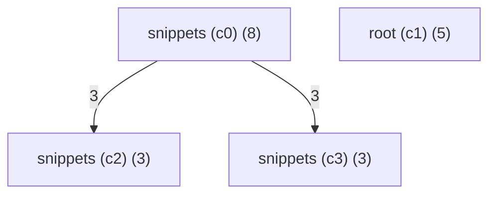
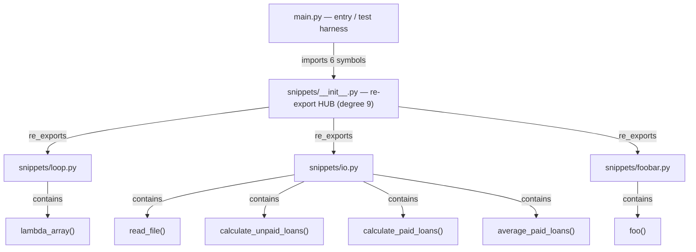

# Reverse Engineering — Diagrams of andela/buggy-python (EX04 §5.2)

Two diagrams of the **chosen target** (not of ArchLens), extracted from its Graphify graph
(`../artifacts/buggy-python-graph.json`, 19 nodes / 28 edges). Committed and tracked.

## 1. Block architecture diagram (communities + flow)

Generated by `sdk.generate_block_diagram(graph)` — one block per Graphify community, weighted
inter-block edges:

## 2. Module / call-structure diagram (OOP-level view)

> **Note (honest):** `buggy-python` is **procedural** — it has **no classes** (only functions), so a
> UML class diagram is empty (`sdk.extract_class_schema` returns 0 classes). The engineering-structure
> view that the spec's "OOP diagram" asks for is therefore the **module + function dependency
> structure**, extracted from the graph's `imports` / `re_exports` / `contains` edges:

**Engineering reading.** The architecture is a thin entry harness (`main.py`) over a single package
fronted by a **re-export hub** (`snippets/__init__.py`) that fans out to three independent leaf
modules. The hub is the structural choke point (every imported symbol routes through it), which is why
it is both the highest-centrality node and the localized defect site for the import failure — see
[[localization]] and [[suspects]].
